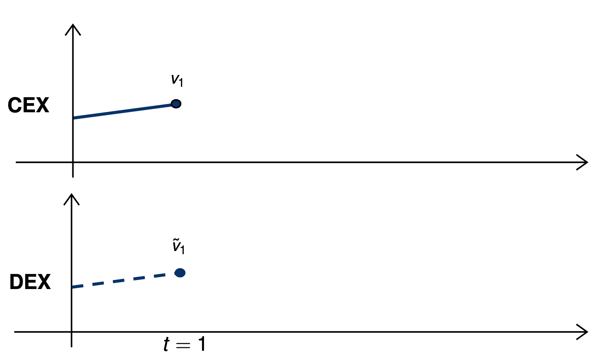
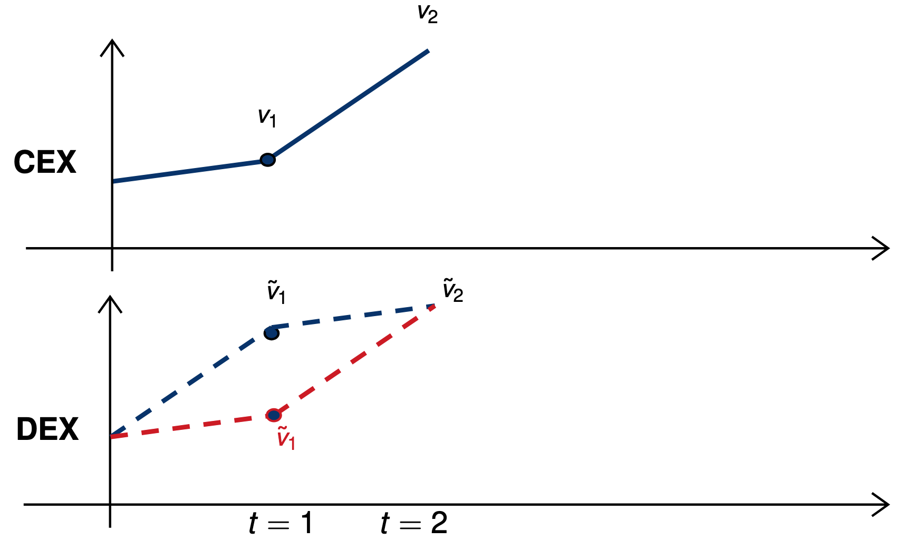
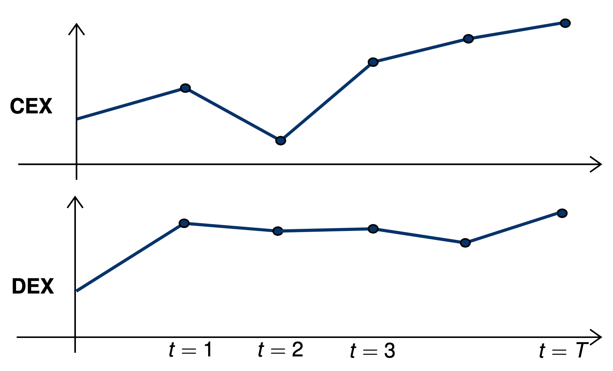

# Price Formation in Memory Pools

Alvaro Cartea, Agostino Capponi, **Fayçal Drissi**

*University of Oxford*

**6 January 2025**

---

# Table of Contents
 

1. [Price formation in DeFi](#defi)
 

2. [Priority Gas Auctions](#PGA)  
<!---    1. [Sub paragraph](#subparagraph1)--->
3. [Proof-Of-Stake blockchains](#paragraph2) 

4. [Proof-Of-Work blockchains](#paragraph2)

---

      

<h1>
Price formation in DeFi </h1>

---

# Price formation in blockchains: two levels
 

### Decentralised exchanges

* Liquidity supply and price of liquidity

 
 

### Blockchains and memory pools

* Information dissemination and infrastructure costs

---

# Decentralised Exchanges
 

### Trading venues *running* on blockchains

* Extremely expensive to run LOBs.
* Solution: Automated Market Makers (AMMs).
 
 

---

# Decentralised Exchanges
 

### Trading venues *running* on blockchains

* Extremely expensive to run LOBs.
* Solution: Automated Market Makers (AMMs).
 
 

### Automated Market Makers

* A liquidity pool for Security $X$ and $Y$.
* Available liquidity of *reserves*: $x$ and $y$.
* Two types of participants: liquidity takers (LTs) and liquidity providers (LPs).

---

# Decentralised Exchanges
 

### Liquidity takers trade with the pool

---

# Decentralised Exchanges
 

### Liquidity providers *deposit* assets in the pool or *withdraw* assets from the pool

---

## Blockchains
 

### Memory pools
* Memory pool: a repository for unconfirmed transactions
* After an agent initiates a new transaction, it is broadcast to the network and stored in the mempools of various nodes
* Transactions wait to be selected by a miner and included in a block

---

## Blockchains
 

### Memory pools
* Memory pool: a repository for unconfirmed transactions
* After an agent initiates a new transaction, it is broadcast to the network and stored in the mempools of various nodes
* Transactions wait to be selected by a miner and included in a block
 
 

### Trading frictions and gas fees (EIP-1559, Ethereum London fork)
* **Base fee**: based on congestion. prerequisite for inclusion
    * burned
* **Tip (priority fee)**: to incentivise a miner / encourage special treatment
    * transferred to miner

---

## Memory pools

* **Block time**: window during which users submit to transactions before a miner is chosen to create the block

---

## Consequences
 

### Pre-trade transparency
* Agents observe pending but unconfirmed transactions
* Competitive agents enter “priority gas auctions” (PGAs)
    * Traders submit/revise priority gas fees to obtain better prices.

---

## Consequences
 

### Pre-trade transparency
* Agents observe pending but unconfirmed transactions
* Competitive agents enter “priority gas auctions” (PGAs)
    * Traders submit/revise priority gas fees to obtain better prices.
 
 

### Price discovery
* Prices are irrelevant in the memory pool
* Vehicle for price discovery in blockchains:  priority fees

---

# Illustration of trading mechanisms

---

# Illustration of trading mechanisms

---

# Illustration of trading mechanisms

---

# Research questions
   

1. What is the impact of pre-trade transparency on price discovery ?  
2. What are the effects on infrastructure costs ?  
3. Are current memory pools a good design for markets ? Can we improve price efficiency and reduce infrastructure costs ?

---

      

<h1>
Priority Gas Auctions: a first model </h1>

---

## Assumptions and market
* Trading is conducted in an AMM for a pair of securities $X$ and $Y$ 
    * Trading function $\Phi$
    * Initial liquidity supply $y_0$

## Execution prices
* For a volume $\delta$, the execution price is
$$
\tilde V(\delta) = \frac{\Phi(y_0-\delta)-\Phi(y_0)}{\delta}
$$
* Marginal price
$
\qquad \qquad \qquad \qquad V_0 = \lim_{\delta\rightarrow 0}\tilde V(\delta) = -\Phi'(y_0)
$
* Slippage
$$
\tilde V(\delta)-V_0 =  \frac{\Phi(y_0-\delta)-\Phi(y_0)}{\delta} + \Phi'(y_0) \approx \frac12 \,\delta\, \Phi''(y_0) = k\,\delta
$$

---

## Execution prices
  

* Following a trade with volume $\delta$, the price impact on the marginal price is
$$
-\Phi'(y_0-\delta) + \Phi'(y_0)  \approx 2\,\delta\, k.
$$
* Execution price for a subsequent trade with volume $\delta$
$$
V_0 + 2\,k + k = V_0 +3\, k
$$
 

---

## Competition for execution priority
 

#### Assumptions on the market

* Two informed traders $i$ and $j$ compete to buy $Y$
* They receive private information $v_i>0$ and $v_j>0$ about the liquidation value $V = V(v_i,v_j)$
* They wish to buy volumes $\delta_i = \delta(v_i)$ and $\delta_j = \delta(v_j)$
* The demand function $\delta$ is continuously differentiable and increasing.
* They submit priority fees $\varphi_i$ and $\varphi_j$ **per unit of security traded** at the end of block time
* They employ price limits: if denied priority, priority fee is zero
  

---

## Competition for execution priority
 

#### Assumptions on information
* The signals are independently drawn from an interval $[0, \overline{v}]$ according to a density $f$.
* The volumes $\delta_i$ are drawn from $[\delta(0),\delta(\overline v)]=[\underline \delta,\overline \delta]$ according to  $g(x) = f\left(\delta^{-1}\left(x\right)\right)\Big/\delta^{'}\left(\delta^{-1}\left(x\right)\right).$
  

#### Competition
* The order of the trader with priority in the block is executed at a price $V_0 + k\,\delta$
* The order of the other trader will be executed at a price $V_0 + 3\,k\,\delta$

---

## Competition for execution priority
  

* If trader $i$ wins the auction, i.e., if $\varphi_{i}>\varphi_j$, their wealth is
$$
W_{i}\left(\text{win}\right)=-\delta_{i}\,\varphi_{i}\,\underbrace{-\delta_{i}\,\left(V_{0}+k\,\delta_{i}\right)}_{\text{initial trade}}\underbrace{+\delta_{i}\,V}_{\text{liquidation value}}
=-\delta_{i}\,\varphi_{i}\,-k\,\delta_{i}^{2}+\delta_{i}\,V
$$
  

* If trader $i$ loses the auction, i.e., if $\varphi_{i}<\varphi_j$, their wealth is
$$
W_{i}\left(\text{lose}\right)=\underbrace{-\delta_{i}\,\left(v_{0}+3\,k\,\delta_{i}\right)}_{\text{initial trade}}\ \underbrace{+\delta_{i}\,V}_{\text{inventory value}}
 =-3\,k\,\delta_{i}^{2}+\delta_{i}\,V
$$

---

## Competition for execution priority
  

* Let $V_i = V(v_i)$ denote the expected value of $V$ from the perspective of trader $i$.
* The expected wealth is 
$$
\mathbb{E}\left[W_{i}\right]= P_{i}\,\mathbb E[W_{i}\left(\text{win}\right)] + (1-P_{i})\,\mathbb E[W_{i}\left(\text{win}\right)] = P_{i}\,\delta_i\,\left(-\varphi_{i}+2\,k\,\delta_{i}\right)-3\,k\,\delta_{i}^{2}+\delta_{i}\,V_{i}
$$
* where $P_i=\mathbb E_i\left[\varphi_i>\varphi_j\right]$
  

* The optimisation problem of trader $i$
$$
U_{i}=\sup_{\varphi_{i}}\left\{ P_{i}\,\left(-\varphi_{i}+2\,k\,\delta_{i}\right)\right\} \,,
$$
  

---

## Competition for execution priority
  
* The equilibrium priority fee 
$$
\varphi^\star_i=2\,k\,\left(\delta_{i}-\frac{\int_{\underline{\delta}}^{\delta_{i}}G\left(x\right)\,dx}{G\left(\delta_{i}\right)}\right)=2\,k\,\left(\delta\left(v_{i}\right)-\frac{\int_{0}^{v_{i}}\delta^{'}\left(x\right)\,F\left(x\right)\,dx}{F\left(v_{i}\right)}\right)\,
$$
 

* Priority fees are increasing in  
the signal value and the trading volume
{style="transform: translate(-10%, 10%); width: 600px"}

* For fixed demand functions,   priority fees are decreasing in the liquidity  supply
  

---

## Trading volume of informed traders

* The trading volume solves the problem
$$
J_{i}=\sup_{\delta_{i}}\Bigg\{P_{i}\,\left(-\delta_{i}\,\varphi_{i}^\star+2\,k\,\delta_{i}^{2}\right)-3\,k\,\delta_{i}^{2}+\delta_{i}\,V_{i}\Bigg\}\,.
$$
* In equilibrium, the volume is
$$
\delta^\star\left(v_{i}\right)=\frac{V\left(0\right)\sqrt{3}+6\,\int_{0}^{v_{i}}\frac{V(x)}{\sqrt{3-2\,F(x)}}dx}{6\,k\,\sqrt{3-2\,F(v_{i})}}\,
$$
{style="transform: translate(-10%, 25%); width: 500px"}
 
* The trading volume is **increasing** in   the **signal** and  in **the liquidity supply**  (similar to traditional markets)

---

## Total priority fees of informed traders
  

* The total priority fee is 
$$
\delta_{i}^{\star}\times\varphi_{i}^{\star}=2\,k\,\left(\delta^{\star}\left(v_{i}\right)^{2}-\delta^{\star}\left(v_{i}\right)\frac{\int_{0}^{v_{i}}\delta^{'}\left(x\right)\,F\left(x\right)\,dx}{F\left(v_{i}\right)}\right)
$$
$$
\partial_{k} \{\delta_{i}^{\star}\times\varphi_{i}^{\star}\}<0.
$$
 

* The depth of liquidity drives market frictions of informed traders upward

---

## When signals are uniform and $V=v_i + v_j$
  

* The trading volume

$$
\delta^{\star}\left(v_{i}\right)=\frac{\overline{v}}{2\,k}\left(\frac{7\sqrt{3\,\overline{v}}}{6\sqrt{3\,\overline{v}-2\,v_{i}}}-1\right)\in\left[\frac{\overline{v}}{12},\frac{\overline{v}}{2}+0.01\,\overline{v}\right]
$$

* The total priority fee

$$
\delta^{\star}\left(v_{i}\right)=\frac{\overline{v}^{2}}{2\,k}+\frac{7\,\overline{v}^{2}}{24\,k\,v_{i}}\left(\frac{\sqrt{3\,\overline{v}}}{\sqrt{3\overline{v}-2\,v_{i}}}\left(13\overline{v}-6v_{i}\right)-13\,\overline{v}\right)
$$

* The total priority fee is **increasing in the signal variance**
* The total priority fee is **increasing in the liquidity supply**

---

      

<h1>
Liquidity supply </h1>

---

# A general model
 

### Assumptions

*  Three types of agents
    * a representative liquidity supplier 
    * two informed liquidity takers (traders)
        * Traders know whether $V>V_0$ or $V<V_0$ and become both either buyers or sellers
        * They receive signals $v_i$ and $v_j$ where $|v_i|$ is drawn from $[0,\overline v]$ according to the density $f$
    * noise liquidity takers
        * they do not compete strategically and bid the base fee
* The liquidity supplier assigns a probability $1/2$ to $V>V_0$ and $1/2$ to $V<V_0$

---

      

<h1>
Priority fees in Proof-of-Stake blockchains </h1>

---

# A general model
 

### The game

1. The liquidity supplier chooses the liquidity supply by balancing fee revenue from noise LTs and adverse selection costs from informed traders.
    * In the block preceding that of traders
2. Informed traders receive  information about the liquidation value $V$ of the asset
    * At the start of the block time
3. The informed traders determine their priority fee bidding strategies and trading volumes
    *  Two-round two-trader game under uncertainty

4. A new block is created and the final liquidation value of the security is realised

### **The equilibrium of this game is solved using backward induction**

---

# The game

---

# The Priority Gas Auction
 

---

      

<h1>
Priority fees in Proof-of-Work blockchains </h1>

---
layout: end
---

[gerdm.github.io/posts/bone-slides](https://gerdm.github.io/posts/bone-slides)  
[arxiv.org/abs/2411.10153](https://arxiv.org/abs/2411.10153)