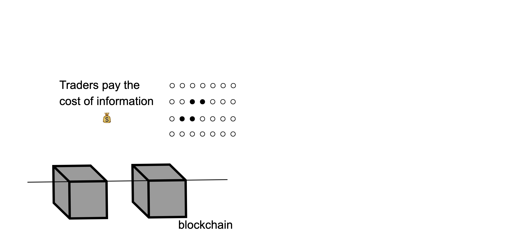
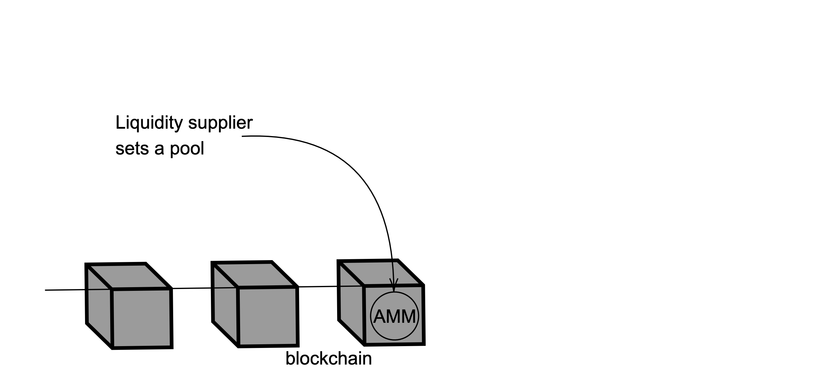
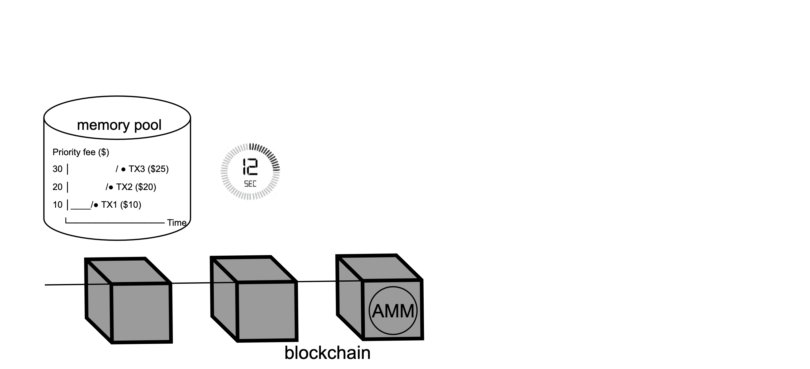
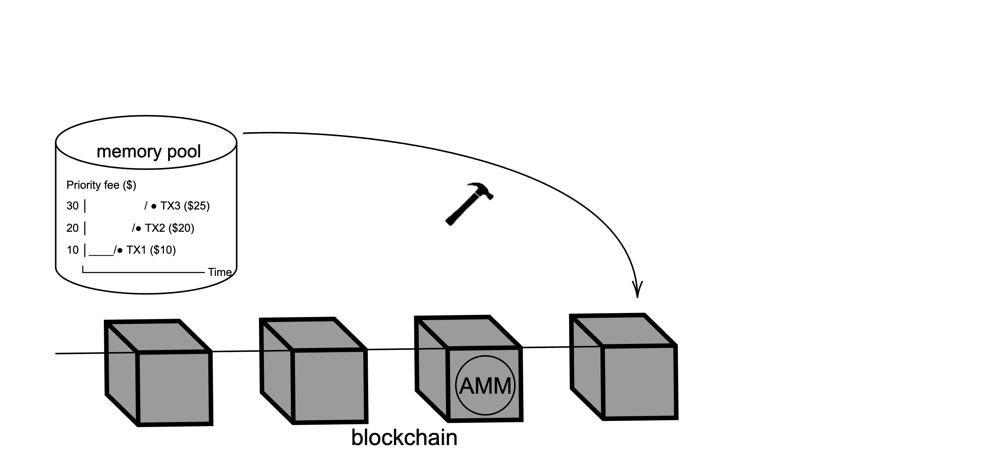
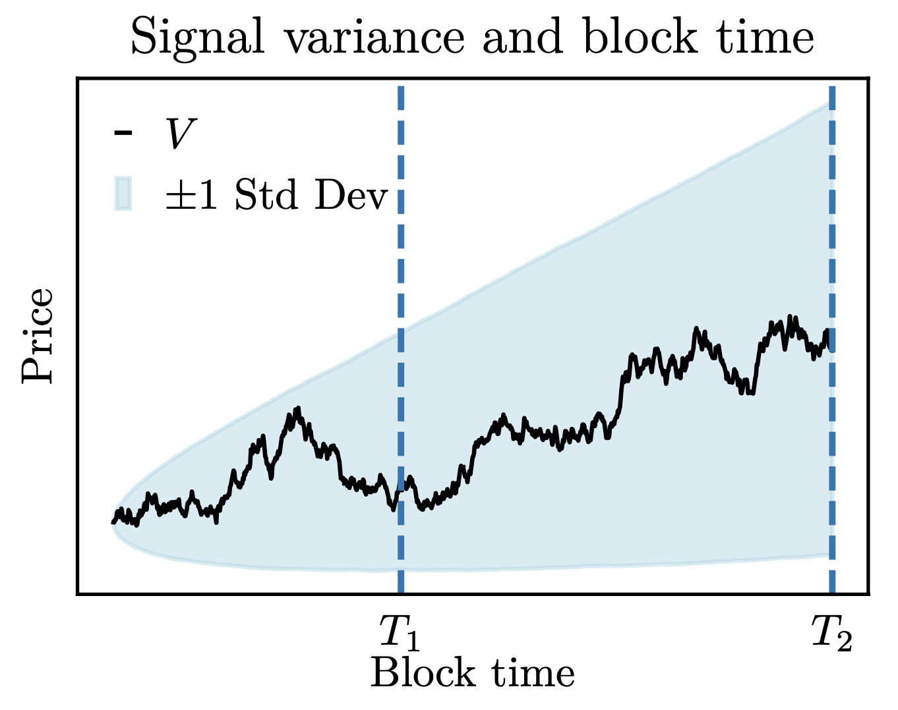
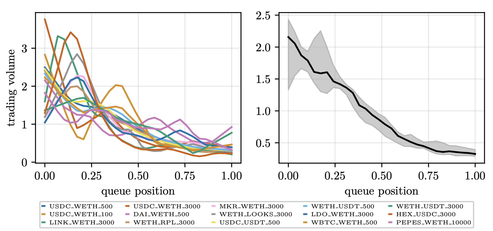
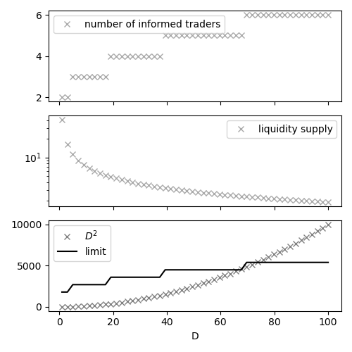
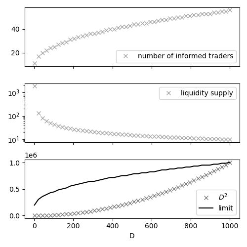
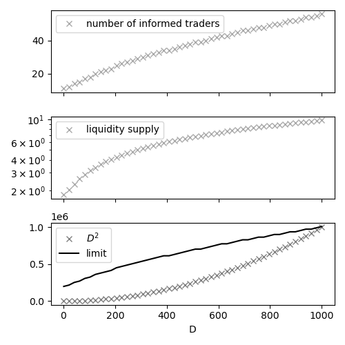

## Do Longer Block Times Impair Market Efficiency in Decentralized Markets?

Agostino Capponi, Álvaro Cartea, Fayçal Drissi

*University of Oxford, Columbia University*

 

These slides: [https://www.faycaldrissi.com/mempools-talk](https://www.faycaldrissi.com/mempools-talk)

<!--[my scholar](https://scholar.google.com/citations?user=njvyriQAAAAJ&hl=fr), 
[my website](https://www.faycaldrissi.com/), [my github](https://github.com/FDR0903)-->

---

# Motivation

- Significant volumes on Decentralized Exchanges (DEXs): ($7.383 billion in 24 hours) as of 7 May 2025

- DEX efficiency actively influences discussions on blockchain design

---

# Motivation: the blockchain protocol
The blockchain protocol determines the lifecycle of transactions and adds new cost structures

---

# Motivation: the blockchain protocol
The blockchain protocol determines the lifecycle of transactions and adds new cost structures

* Transactions are sent to the network continuously, and stored in a memory pool
   

{style="transform: translate(20%, 0%); width: 680px"}

---

# Motivation: the blockchain protocol
The blockchain protocol determines the lifecycle of transactions and adds new cost structures

* Transactions are sent to the network continuously, and stored in a memory pool
* At each Epoch, with length block time, a validator is chosen
  

{style="transform: translate(20%, 3%); width: 680px"}

<!---

#  Decentralised Exchanges

* Liquidity supply and price of liquidity
* Price dynamics-->

---

# Motivation: the blockchain protocol
The blockchain protocol determines the lifecycle of transactions and adds new cost structures

* Transactions are sent to the network continuously, and stored in a memory pool
* At each Epoch, with length block time, a validator is chosen
* The validator creates a new block with transactions from the memory pool

{style="transform: translate(20%, 0%); width: 680px"}

---

# Motivation: the blockchain protocol

### Gas fees (EIP-1559)
* **Base fee**: based on congestion, prerequisite for inclusion
* **Priority fee**: incentivise validators to prioritise a transaction in the block

---

# Motivation: the blockchain protocol

### Gas fees (EIP-1559)
* **Base fee**: based on congestion. prerequisite for inclusion
* **Priority fee**: incentivise validators to prioritise a transaction in the block

{style="transform: translate(25%, 0%); width: 580px"}

---

# Blockchain protocol: consequences

#### Pre-trade transparency
* Agents observe pending and unconfirmed transactions

 

#### Priority gas auctions
* Agents submit/revise priority fees to compete for queue priority

---

# Existing research 

studies AMMs in isolation
* Lehar and Parlour (2021); Capponi and Jia (2021); Barbon and Ranaldo (2021); Cartea, Drissi, and Monga (2022); John, Kogan, and Saleh (2023)

studies empirics of blockchain infrastrcuture
* Capponi, Jia and Yu (2024)

studies specific aspects of blockchain infrastrcture
* private and public order flow: Capponi, Jia, and Wang (2024)
* Just-in-time liquidity attacks: Capponi, Jia, and Zhu (2024)

---

# Contribution

A model to describe the microstructure of DEXs within **blockchains**
1. price efficiency
2. informativeness of prices
3. cost of liquidity  
4. trading volumes

 

We charaterise the economic effects of **block time** and **priority fees** 

---

      

<h1>
Results </h1>

---

# Results: price discovery

### Slow Information Dissemination in Blockchains

- Information is disseminated at the end of block time, when markets clear  
- In contrast to continuous information flow in traditional exchanges  
  _(Kyle, 1985; Huddart, Hughes, and Levine, 2001)_

---

# Results: block time and market efficiency

* Longer block time increases speculative rewards
   *  incentive to acquire private information $\implies$ prices are more efficient

---

# Results: block time and market efficiency

* Longer block time increases speculative rewards
   *  incentive to acquire private information $\implies$ prices are more efficient
   * more adverse selection costs for liquidity suppliers $\implies$ defensive liquidity supply

---

# Results: block time and market efficiency

* Longer block time increases speculative rewards
   *  incentive to acquire private information $\implies$ prices are more efficient
   * more adverse selection costs for liquidity suppliers $\implies$ defensive liquidity supply
    * increased number of informed traders $\implies$ increased competition in PGAs $\implies$ mitigation of adverse selection costs and liquidity improves

---

# Results: block time and market efficiency

* Longer block time increases speculative rewards
   *  incentive to acquire private information $\implies$ prices are more efficient
   * more adverse selection costs for liquidity suppliers $\implies$ defensive liquidity supply
    * increased number of informed traders $\implies$ increased competition in PGAs $\implies$ mitigation of adverse selection costs and liquidity improves
* There is a threshod for block time beyond which adverse selection costs outweigh the benefits of priority fees $\implies$ liquidity freeze
    * Unless uninformed liquidity demand aggregates with block time

---

      

<h1>
The model </h1>

---

# General features

- A DEX for a risky security $Y$ and a reference security $X$

---

# General features

- A DEX for a risky security $Y$ and a reference security $X$
- Marginal price in the AMM: $V_0 = 0$
- Future liquidation value in the AMM: $V$

---

# General features

- A DEX for a risky security $Y$ and a reference security $X$
- Marginal price in the AMM: $V_0 = 0$
- Future liquidation value in the AMM: $V$
- Liquidity supply in the AMM: $\kappa$

---

# General features

- Liquidity supply in the AMM: $\kappa$
    - Cost to trade a quantity $\delta$: $\quad \delta / \kappa + \pi$
    - Impact on DEX price for a trade with quantity $\delta$: $\quad 2\,\delta / \kappa$ 

---

# General features

- Liquidity supply in the AMM: $\kappa$
    - Cost to trade a quantity $\delta$: $\quad \delta / \kappa + \pi$
    - Impact on DEX price for a trade with quantity $\delta$: $\quad 2\,\delta / \kappa$ 
.png){style="transform: translate(10%, 0%); width: 700px"}

---

# General features

- Three types of agent
    1. A liquidity supplier 
    2. $L>2$ informed traders
    3. Uninformed traders with elastic demand

---

# The model
We model strategic interactions between takers and suppliers of liquidity as a three-stage game
- **stage 0**: $M<L$ traders acquire information for a fixed cost $C$
  
{style="transform: translate(10%, 9%); width: 700px"}

---

# The model
We model strategic interactions between takers and suppliers of liquidity as a three-stage game
- **stage 0**: $M<L$ traders acquire information for a fixed cost $C$
- **stage 1**: liquidity suppliers sets the AMM’s reserves ($\equiv$ setting $\kappa$)
 
{style="transform: translate(10%, 9%); width: 700px"}

---

# The model
We model strategic interactions between takers and suppliers of liquidity as a three-stage game
- **stage 0**: $M<L$ traders acquire information for a fixed cost $C$
- **stage 1**: liquidity suppliers sets the AMM’s reserves ($\equiv$ setting $\kappa$)
- **stage 2**: $M$ informed traders compete with priority fees (only revised upward)
{style="transform: translate(10%,0%); width: 700px"}

---

# The model
We model strategic interactions between takers and suppliers of liquidity as a three-stage game
- **stage 0**: $M<L$ traders acquire information for a fixed cost $C$
- **stage 1**: liquidity suppliers sets the AMM’s reserves ($\equiv$ setting $\kappa$)
- **stage 2**: $M$ informed traders compete with priority fees (only revised upward)
{style="transform: translate(10%, 0%); width: 700px"}

---

      

<h1>
The model is solved by backward induction </h1>

---

      

<h1>
Stage two  
priority fees and trading volumes </h1>

---

# Stage two: assumptions

* Number of traders $M$ and liquidity supply $\kappa$ are known

---

# Stage two: assumptions

* Number of traders $M$ and liquidity supply $\kappa$ are known
* Traders are risk-neutral

---

# Stage two: assumptions

* Number of traders $M$ and liquidity supply $\kappa$ are known
* Traders are risk-neutral
* Only informed traders compete for queue priority

---

# Stage two: assumptions
* Number of traders $M$ and liquidity supply $\kappa$ are known
* Traders are risk-neutral
* Only informed traders compete for queue priority

---

# Stage two: assumptions
* **Informed traders all are either buyers or sellers**

---

# Stage two: assumptions

* Informed traders observe dynamic private information sources throughout the Epoch

---

# Stage two: assumptions

* Informed traders observe dynamic private information sources throughout the Epoch
* Block time provides traders with  opportunities to observe signals and gather information 

$\implies$ variance of competitors' signals increases with block time
{style="transform: translate(70%, 10%); width: 350px"}

---

# Stage two: competition

* Throughout block time, informed traders can submit instructions to the memory pool with priority fees
* Let $T$ be block time

---

# Stage two: competition

* Throughout block time, informed traders can submit instructions to the memory pool with priority fees
* Let $T$ be block time
* Competition throughout $[0, T]$
    * online auction with a hard close (traders only revise  bids upward)

---

# Stage two: competition

* Throughout block time, informed traders can submit instructions to the memory pool with priority fees
* Let $T$ be block time
* Competition throughout $[0, T]$
    * online auction with a hard close (traders only revise  bids upward)
* At $T$
    * final opportunity to update (upward) the priority fee and trading volumes $\rightarrow$ first-price sealed-bid auction (FPSB)

---

# Stage two: FPSB auction

* Let $\widetilde{\varphi}$ be the largest bid from the online auction

---

# Stage two: FPSB auction

* Let $\widetilde{\varphi}$ be the largest bid from the online auction
* Let $v_i$ be the signal of trader $i$ at the end of blocktime
* $v_i$ is drawn from the CDF $F$ over the interval $[\underline v, \overline v]$

---

# Stage two: FPSB auction

* Let $\widetilde{\varphi}$ be the largest bid from the online auction
* Let $v_i$ be the signal of trader $i$ at the end of blocktime
* $v_i$ is drawn from the CDF $F$ over the interval $[\underline v, \overline v]$
* Each signal is an independent and noisy realisation of the liquidation value
$$
v_i = \mathbb{E}_{i}\left[V\right]= \mathbb{E}\left[V\mid v_{i}\right]
$$

---

# Stage two: FPSB auction

* Let $\widetilde{\varphi}$ be the largest bid from the online auction
* Let $v_i$ be the signal of trader $i$ at the end of blocktime
* $v_i$ is drawn from the CDF $F$ over the interval $[\underline v, \overline v]$
* Each signal is an independent and noisy realisation of the liquidation value
$$
v_i = \mathbb{E}_{i}\left[V\right]= \mathbb{E}\left[V\mid v_{i}\right]
$$
* Let $\varphi_i$ be the priority fee of trader $i$
* Let $\delta_{i}$ be the trading volume of trader $i$

---

# Stage two: FPSB auction

* Let $\widetilde{\varphi}$ be the largest bid from the online auction
* Let $v_i$ be the signal of trader $i$ at the end of blocktime
* $v_i$ is drawn from the CDF $F$ over the interval $[\underline v, \overline v]$
* Each signal is an independent and noisy realisation of the liquidation value
$$
v_i = \mathbb{E}_{i}\left[V\right]= \mathbb{E}\left[V\mid v_{i}\right]
$$
* Let $\varphi_i$ be the priority fee of trader $i$
* Let $\delta_{i}$ be the trading volume of trader $i$

In equilibrium: traders set the priority fee $\varphi_i$ and the trading volume $\delta_i$ 

---

# Stage two: the final FPSB auction

* All informed traders are either buyers or sellers $\implies$ signals share the same sign (positive in this talk)

---

# Stage two: the final FPSB auction

* All informed traders are either buyers or sellers $\implies$ signals share the same sign (positive in this talk)
* Trader $i$ competes in the PGA against $M-1$ other informed traders
* If trader $i$ wins the auction, i.e., if $\varphi_{i}>\varphi_{-i}$, the buy order is executed at $V_0 + \delta_i/\kappa + \pi$
$$
\mathbb E_i[W_{i}\left(\text{win}\right)]=-\varphi_{i}-\underbrace{\delta_{i}\,\left(\delta_{i}/\kappa + \pi\right)}_{\text{initial trade}}\ \ \ +\underbrace{\delta_{i}\,\mathbb E_i[V]}_{\text{inventory}}-\underbrace{C}_{\text{information cost}}
$$

---

# Stage two: the final FPSB auction

* All informed traders are either buyers or sellers $\implies$ signals share the same sign (positive in this talk)
* Trader $i$ competes in the PGA against $M-1$ other informed traders
* If trader $i$ wins the auction, i.e., if $\varphi_{i}>\varphi_{-i}$, the buy order is executed at $V_0 + \delta_i/\kappa + \pi$
$$
\mathbb E_i[W_{i}\left(\text{win}\right)]=-\varphi_{i}-\underbrace{\delta_{i}\,\left(\delta_{i}/\kappa + \pi\right)}_{\text{initial trade}}\ \ \ +\underbrace{\delta_{i}\,\mathbb E_i[V]}_{\text{inventory}}-\underbrace{C}_{\text{information cost}}
$$
* If trader $i$ loses, the order is placed randomly among the $M-1$ losing bids
$$
\mathbb E_i[W_{i}\left(\text{lose}\right)]=-\underbrace{\delta_{i}\,\left(\frac{M-1+1}{2}\cdot\frac{2\,\delta_{i}}{\kappa} + \delta_{i}/\kappa + \pi\right)}_{\text{initial trade}}\ \ \ +\underbrace{\delta_{i}\,\mathbb E_i[V]}_{\text{inventory}}-\underbrace{C}_{\text{information cost}}
$$

---

# Stage two: the final FPSB auction

* Trader $i$ does not observe the bids of competitors
* They can estimate the probability to win
$$
p_i = \mathbb P_i[\varphi_i > \varphi_{-i}]
$$

---

# Stage two: the final FPSB auction

* Trader $i$ does not observe the bids of competitors
* They can estimate the probability to win
$$
p_i = \mathbb P_i[\varphi_i > \varphi_{-i}]
$$
* The expected utility of the risk-neutral trader is
$$\begin{split}
\mathbb{E}_i\left[W_{i}\right]= \mathbb E_i\left[ W_{i}\left(\text{lose}\right) \right]  + \,p_{i}(\underbrace{-\varphi_{i}+M\,\delta_{i}^{2}/\kappa}_{\text{surplus}})
\,,
\end{split}$$

---

# Stage two: the final FPSB auction

* Trader $i$ does not observe the bids of competitors
* They can estimate the probability to win
$$
p_i = \mathbb P_i[\varphi_i > \varphi_{-i}]
$$
* The expected utility of the risk-neutral trader is
$$\begin{split}
\mathbb{E}_i\left[W_{i}\right]= \mathbb E_i\left[ W_{i}\left(\text{lose}\right) \right]  + \,p_{i}(\underbrace{-\varphi_{i}+M\,\delta_{i}^{2}/\kappa}_{\text{surplus}})
\,,
\end{split}$$
* Trader $i$ solves the problem
$$
\sup_{\delta_i}\,\sup_{\varphi_i}\mathbb{E}_i\left[W_{i}\right]
$$
* The objective function is a bounded real-valued function $\implies$ interchange of the order in which one computes the suprema with respect to $\delta_i$ and $\varphi_i$

---

# Stage two: the final FPSB auction

*  $\partial_{\delta_{i}v_{i}}\mathbb{E}_{i}\left[W_{i}\right]\ne 0 \implies$ the optimal trading volume is a function of the signal $v_i$

* $\partial_{\varphi_{i}v_{i}}\mathbb{E}_{i}\left[W_{i}\right]\ne 0 \implies$ the priority fee is a function of the signal $v_i$

* In equilibrium 
$$
\delta_i = \delta(v_i) \quad \text{and} \quad \varphi_i = \varphi(v_i)
$$

* Let $g$ and $G$ denote the PDF/CDF of $\delta_i$ over $[\underline \delta, \overline \delta]$ (pinned down in equilibrium)
$$
g(x) = f\left(\delta^{-1}\left(x\right)\right)\Big/\delta^{'}\left(\delta^{-1}\left(x\right)\right).
$$

---

# Stage two: the final FPSB auction

* Fix $\delta_i$, trader $i$ solves 
    $$
    \sup_{\varphi_{i}}\left\{ p_{i}\,\left(-\varphi_{i}+M\,\delta_{i}^2/\kappa\right)\right\} \,
    $$
    * Tradeoff: decreasing priority fees increases profits but reduces the probability of obtaining queue priority

---

# Stage two: the final FPSB auction

* Fix $\delta_i$, trader $i$ solves 
    $$
    \sup_{\varphi_{i}}\left\{ p_{i}\,\left(-\varphi_{i}+M\,\delta_{i}^2/\kappa\right)\right\} \,
    $$
    * Tradeoff: decreasing priority fees increases profits but reduces the probability of obtaining queue priority
* The probability of obtaining queue priority in the block is 
$$
p_i = \mathbb{P}_i\left[\varphi_i > \varphi_{-i}\right]= \mathbb{P}_i\left[\varphi_i > \varphi_{(M-1)}\right] = \mathbb{P}_i\left[\varphi^{-1}\left(\varphi_i\right) > \delta_{(M-1)}\right] = G\left(\varphi^{-1}\left(\varphi_i\right)\right)^{M-1}\,,
$$
* Denote $h$ and $H$ as the PDF/CDF of the second largest volume

---

# Stage two: the final FPSB auction

* The Bayesian-Nash equilibrium priority fees are 
    $$
    \varphi(\delta_i)=\frac{M}{\kappa}\bigg(\delta_{i}^{2}-\underbrace{2\,\frac{\int_{\widetilde{\delta}}^{\delta_{i}}x\,G\left(x\right)^{M-1}dx}{G\left(\delta_{i}\right)^{M-1}}}_{\text{discount}}\bigg)\,\mathbf 1_{\delta_{i} \geq \widetilde{\delta}}\,,
    $$
* The priority fee is increasing in the trading volume $\delta_i$ 
* The priority fee is decreasing in the liquidity depth $\kappa$
* For a fixed volume $\delta$, the priority fee is increasing in the number of informed traders $M$

---

# Stage two: the online auction

* The priority fee is increasing in the reservation PF $\widetilde \varphi$
$$
\partial_{\widetilde{\varphi}}\varphi_i=\frac{4\,\widetilde{\delta}}{\kappa}\,\frac{H\left(\widetilde{\varphi}\right)}{H\left(\delta_{i}\right)} > 0\,
$$
* The expected payoff is decreasing in the reservation PF $\widetilde\varphi$ 
$$
\partial_{\widetilde{\varphi}}\mathbb E[W_i]=-\frac{4\,\widetilde{\varphi}}{\kappa}\,H\left(\widetilde{\varphi}\right) < 0\,
$$

---

# Stage two: the online auction

* Non-zero bids decrease expected terminal wealth

$\implies$ no trader has incentive to bid early in the online auction
* In equilibrium: traders delay bidding until the last moment

---
layout: two-cols-header
---

# Price formation

* Information is disseminated to the market with the same periodicity as that of the creation of blocks 

* In contrast to the continuous rate of information dissemination in traditional exchanges: Kyle (1985b); Huddart, Hughes, and Levine (2001)
---
layout: two-cols-header
---

# Stage two: the online auction

* Late bidding is observed in practice: large priority fee instructions are submitted to the memory pool shortly before the end of each blockchain slot
    * large priority fees are typically associated with informed trading  (Capponi, Jia, Yu 2023)
::left::

{style="transform: translate(40%, -10%); width: 280px"}
$\qquad\quad$ Number of transactions.  
$\qquad\quad$ Ethereum memory pool transaction data  $\qquad\quad$ $10-16$ December $2022$ 

::right::

{style="transform: translate(40%, -10%); width: 280px"}
$\qquad\qquad$ Level of priority fees. 
$\qquad\qquad$ Ethereum transaction data  $\qquad\qquad$ $10-16$ December $2022$ 

---

# Stage two: the online auction

* Our results are related to pre-opening and closing auctions
    * Preopening sessions are uniform price auctions (clearing prices maximise trading volume) 
    * Blockchains: discriminatory pricing subject to queue ordering

---

# Stage two: the online auction

* Our results are related to pre-opening and closing auctions
    * Preopening sessions are uniform price auctions (clearing prices maximise trading volume) 
    * Blockchains: discriminatory pricing subject to queue ordering
* Our findings support the *pure-noise hypothesis* of Biais, Hillion, and Spatt (1999)
* Empirical support
    * No information before the FPSB auction: Medrano and Vives (2001), Cao, Ghysels, and Hatheway (2000); Davies (2003)
    * Late bidding: Roth and Ockenfels (2002); Yang and Kahng (2006)

---

      

<h1>
Stage two  
trading volumes </h1>

---

# Stage two: trading volumes

Substitute the priority fee, trader $i$ solves
$$
\sup_{\delta_{i}}\Bigg\{F\left(v_i\right)^{M-1}\,\left(-\varphi_{i}+M\,\delta_{i}^{2}/\kappa\right)-(1+M)\,\delta_{i}^2/\kappa^{2}+\delta_{i}\,\left(v_i-\pi\right)\Bigg\}
$$

The linear-quadratic programme is interpreted as follows 
* Trading costs increase with trading volume 
    1. the execution cost $-\delta_i^2/\kappa$, 
    2. the price impact cost $M\,\delta_i^2 \left(1 - F\left(v_i\right)^{M-1}\right)/\kappa$
    3. The AMM's proportional transaction fee $\pi\,\delta_i$. 
* Inventory: incentive for trader $i$ to increase  holdings $\delta_i$ 

---

# Stage two: trading volumes

In equilibrium, trader $i$ transacts a volume
$$
\delta(v_i)=\kappa\,\tilde{\delta}(v_i)=\kappa\,\frac{v_i-\pi}{2\,\left(1+M\left(1-F\left(v_{i}\right)^{M-1}\right)\right)}\,
$$
* Trader $i$'s  volume $\delta_i$ is a fraction $\tilde\delta(v)$ of the liquidity supply $\kappa$

---

# Stage two: trading volumes

In equilibrium, trader $i$ transacts a volume
$$
\delta(v_i)=\kappa\,\tilde{\delta}(v_i)=\kappa\,\frac{v_i-\pi}{2\,\left(1+M\left(1-F\left(v_{i}\right)^{M-1}\right)\right)}\,
$$
* Trader $i$'s  volume $\delta_i$ is a fraction $\tilde\delta(v)$ of the liquidity supply $\kappa$
* The fraction $\tilde\delta_i$ increases in the  signal
    1. the signal $v_i$ is the expected liquidation value
    2. likelihood of winning the auction at lower cost increases

---

# Stage two: trading volumes

In equilibrium, trader $i$ transacts a volume
$$
\delta(v_i)=\kappa\,\tilde{\delta}(v_i)=\kappa\,\frac{v_i-\pi}{2\,\left(1+M\left(1-F\left(v_{i}\right)^{M-1}\right)\right)}\,
$$
* Trader $i$'s  volume $\delta_i$ is a fraction $\tilde\delta(v)$ of the liquidity supply $\kappa$
* The fraction $\tilde\delta_i$ increases in the  signal
    1. the signal $v_i$ is the expected liquidation value
    2. likelihood of winning the auction at lower cost increases
* For fixed $v_i$, $\tilde\delta_i$ decrease in competitors' signal dispersion
    * signal dispersion increases the probability $1-F(v_i)^{M-1}$ to lose the auction

---

# Stage two: trading volumes

In equilibrium, trader $i$ transacts a volume
$$
\delta(v_i)=\kappa\,\tilde{\delta}(v_i)=\kappa\,\frac{v_i-\pi}{2\,\left(1+M\left(1-F\left(v_{i}\right)^{M-1}\right)\right)}\,
$$
* $\delta(v_i)$ decreases to zero when $M\rightarrow\infty$
* The equilibrium priority fee $\varphi(\delta(v))$, **accounting for strategically adjusted trading volumes** is
    $$
    \varphi(\delta_i) = \varphi(\delta(v_i))
    $$
    * $\varphi(\delta(v_i))$ decreases to zero when $M\rightarrow\infty$

---

# Stage two: trading volumes

- Higher values of private signals correspond to larger trading volumes

- They are also associated with higher priority fees and better queue positions. 

{style="transform: translate(20%, 0%); width: 600px"}

Average absolute trading volume of transactions across multiple Uniswap v3 pools as a function of their queue position within the block

---

      

<h1>
Stage one: liquidity supply </h1>

---

# Stage one: liquidity supply -- assumptions

- A risk-neutral liquidity supplier sets the supply $\kappa$ with rational expectations over behaviour of informed traders. They balance
    1. losses to informed traders 
    2. fee revenue earned from uninformed liquidity traders

---

# Stage one: liquidity supply -- assumptions

Uninformed liquidity traders transact a net volume that sums to zero but an absolute volume $N$ which is elastic.
- liquidity demanded by buyers $\frac{N}{2}\,\left(1-\theta/\kappa\right)\,,$
- liquidity demanded by buyers $-\frac{N}{2}\,\left(1-\theta/\kappa\right)\,,$

Elasticity: increasing the ask $1/\kappa$ by $s$ reduces demand by $\theta\,s \,N/2$

Standard framework: Garman (1976); Ho and Stoll (1981); Hendershott and Menkveld (2014)

---

# Stage one: liquidity supply -- assumptions

- The liquidity supplier assumes that with probability $1/2,$ informed traders are buyers, and with probability $1/2,$ they are sellers
- From the perspective of the supplier, total trading volume of informed traders $\Delta$ is a random variable with mean zero.

---

# Stage one: liquidity supply -- assumptions

- The liquidity supplier assumes that with probability $1/2,$ informed traders are buyers, and with probability $1/2,$ they are sellers
- From the perspective of the supplier, total trading volume of informed traders $\Delta$ is a random variable with mean zero.
- Expected losses to informed traders
$$
-  \mathbb E\left[\Delta^2\right] / \kappa   = - M\, \mathbb{V}\left[{\delta}_{i}\right] \big/\kappa   =  - M\, \mathbb{V}[\tilde{\delta}_{i}]\,.
$$

- Fee revenue
$$
\pi\,{N}\,\left(1-\theta/\kappa\right)\,.
$$

---

# Stage one: liquidity supply

The equilibrium supply of liquidity is 
$$
\kappa=\sqrt{\frac{\pi\,N\,\theta}{M\,\mathbb{V}[\tilde{\delta}_i]}}
$$
Recall
$$
\tilde\delta(v_i)=\frac{v_i-\pi}{2\,\left(1+M\left(1-F\left(v_{i}\right)^{M-1}\right)\right)}
$$

* The liquidity supply increases in the profitability of the uninformed trading flow
* The liquidity supply decreases in the variance of signals

---

# Stage one: liquidity supply

- The liquidity supply **increases in the number of competing informed traders**
$$
\lim_{M\rightarrow \infty} \mathbb E[\Delta] = (\mathbb E[v_i]-\pi)/2
$$
$$
\lim_{M\rightarrow \infty} M\,\mathbb{V}[\tilde{\delta}_i] = 0
$$

---

# Stage one: liquidity supply

- The liquidity supply **increases in the number of competing informed traders**
$$
\lim_{M\rightarrow \infty} \mathbb E[\Delta] = (\mathbb E[v_i]-\pi)/2
$$
$$
\lim_{M\rightarrow \infty} M\,\mathbb{V}[\tilde{\delta}_i] = 0
$$
* The equilibrium payoff of liquidity provision
$$\pi\,N-2\,\sqrt{M\,\pi\,N\,\theta\,\mathbb{V}[\tilde{\delta}_{i}]} \underset{M\rightarrow\infty}{\longrightarrow} \pi\,N$$
* For fixed signal variance, there exists $\overline M$ such that for all $M>\overline M$, markets do not shut down

---

# Stage one: liquidity supply
The equilibrium supply of liquidity is 
$$
\kappa=\sqrt{\frac{\pi\,N\,\theta}{M\,\mathbb{V}[\tilde{\delta}_i]}}
$$

Block time has two opposing effects
1. volatile trading signals drive liquidity levels down 
2. liquidity demand accumulates $\rightarrow$ drive liquidity levels up

---

# Stage one: liquidity supply

The equilibrium payoff of liquidity provision

$$\pi\,N-2\,\sqrt{M\,\pi\,N\,\theta\,\mathbb{V}[\tilde{\delta}_{i}]}$$

* For fixed liquidity demand $N$, there is a limit to block time above which markets shut down (Glosten and Milgrom (1985))
$$
M\,\mathbb{V}[\tilde{\delta}_{i}] \le \frac{\pi\,N}{4\,\theta}\,.
$$

---

      

<h1>
Stage zero  information acquisition </h1>

---

# Stage zero: information acquisition
The number of informed traders is determined endogenously

---

# Stage zero: information acquisition
The number of informed traders is determined endogenously
- Price efficiency is directly related to the number of informed traders who pay the cost of acquiring information
$$
\mathbb V[\hat V \mid \{v_1, \dots, v_M\}] = \frac{L - M}{L^2}\, \mathbb V[v] + \sigma^2,
$$  
- Similar goal to that in Grossman and Stiglitz (1980) for traditional markets

---

# Stage zero: information acquisition
* The number of traders is constrained by the profitability of informed trading and the cost $C$
* The equilbrium $M$ is the integer part of the solution to
$$
C=H(M)=\underbrace{\sqrt{\frac{\pi\,N\,\theta}{M\,\mathbb{V}[\tilde{\delta}\left(v_{i}\right)]}}\,\left(\frac1M \left(\mathbb{E}_{0}\left[M\, \tilde{\delta}\left(v_{(M)}\right)^{2}\right]-\mathbb{E}_{0}\left[M\,\tilde{\delta}\left(v_{(M-1)}\right)^{2}\right]\right)\right)}_\text{trading profits net of execution costs and priority fees}
$$
* The function $H$ decreases to zero as $M$ goes to infinity

---

# Stage zero: information acquisition

* The equilbrium $M$ is the integer part of the solution to
$$
C=H(M)=\underbrace{\sqrt{\frac{\pi\,N\,\theta}{M\,\mathbb{V}[\tilde{\delta}\left(v_{i}\right)]}}\,\left(\frac1M \left(\mathbb{E}_{0}\left[M\, \tilde{\delta}\left(v_{(M)}\right)^{2}\right]-\mathbb{E}_{0}\left[M\,\tilde{\delta}\left(v_{(M-1)}\right)^{2}\right]\right)\right)}_\text{trading profits net of execution costs and priority fees}
$$
* The function $H$ decreases to zero as $M$ goes to infinity
* If $H(2) > C$ 
    * $M \geq 2$
    * $M$ increases in the blockchain validation reward $R$
    * $M$ increases in the size $N$ and elasticity $\theta$ of uninformed liquidity demand
    * $M$ decreases in the  information cost $C$ 

---

# Stage zero: information acquisition

* As $M$ grows
    1. (weak-form) price efficiency improves
    2. prices are more informative, and uninformed traders trade at prices closer to the fundamental price
$$
\text{price impact = } 2\,\mathbb{E}\left[\Delta\right]/\kappa =M\,\mathbb{E}\left[\frac{v_{i}-\pi}{1+M\left(1-F\left(v_{i}\right)^{M-1}\right)}\right] \underset{M\rightarrow\infty}{\longrightarrow} \mathbb E[v_i] - \pi   \,,
$$

---

# Effect of block time and priority fees

* Consider the case where $\tilde G$, the CDF of $\tilde\delta$, is uniform over $[0, D/M]$ with probability $1/2$ and $[-D/M, 0]$ with probability $1/2$

* $D$ is proportional to signal dispersion
    * Longer block times $\equiv$ larger values of $D$

---

# Effect of block time and priority fees

* The equilibrium number of informed traders is such that
$$
C = \frac{\sqrt{24\,\pi\,\theta\,N\,M}}{M\left(2 + 3\,M + M^{2}\right)}\, D + \frac{\beta}{M}\,R \implies M(D) \sim D^{2/5}
$$
* The condition for markets to remain open is
$$
D^2 \leq \underbrace{\frac{3\,\pi\,N\,M}{\theta}}_{\sim D^{2/5}}\,
$$
* The equilibrium liquidity supply is
$$
\kappa^{\star}=\frac{12}{D}\,\pi\,M\,N\,\theta \sim D^{-3/5}
$$

---

# Illiquid markets, expensive information
* $N = \$ 10000,  \pi =  0.3\%, \theta=0.1, \beta=1, R = \$ 10, C = \$ 10$

{style="transform: translate(50%, 0%); width: 400px"}

---

# Liquid markets, cheap information
* $N = \$ 100000,  \pi =  0.3\%, \theta=0.05, \beta=1, R = \$ 10, C = \$ 5$

{style="transform: translate(50%, 0%); width: 400px"}

---

# Effect of block time and priority fees

* If $N$ grows linearly with block time (i.e. with $D$)
* The equilibrium number of informed traders is such that
$$
C = \frac{\sqrt{24\,\pi\,\theta\,N\,M}}{M\left(2 + 3\,M + M^{2}\right)}\, D + \frac{\beta}{M}\,R \implies M(D) \sim D^{2/3}
$$
* The condition for markets to remain open is
$$
D^2 \leq \underbrace{\frac{3\,\pi\,N\,M}{\theta}}_{\sim D^{5/3}}\,
$$
* The equilibrium liquidity supply is
$$
\kappa^{\star}=\frac{12}{D}\,\pi\,M\,N\,\theta \sim D^{2/5}
$$

---

# Effect of block time and priority fees
* If $N$ grows linearly with block time (i.e. with $D$)
{style="transform: translate(50%, 0%); width: 400px"}

---
layout: end
---
Thank you !

[faycaldrissi.com](https://www.faycaldrissi.com/)

---

      

<h1>
Market frictions in  
automated market makers </h1>

---

# Automated Market Makers

* A liquidity pool for securities $X$ and $Y$
* Available *reserves* $x$ and $y$

{style="transform: translate(165%, 20%); width: 200px"}

---

# Automated Market Makers

### Two types of participants

* **Liquidity takers (LTs)** trade with the pool

{style="transform: translate(30%, 50%); width: 500px"}

---

# Automated Market Makers
### Two types of participants
* **Liquidity providers (LPs)** *deposit* assets in the pool or *withdraw* assets from the pool

{style="transform: translate(31.5%, 51%); width: 500px"}

---

# Automated Market Makers
### Economic principle: bonding curves

*  Iso-liquidity curve or indifference curve (points of same level of liquidity)
$$
\qquad
$$

{style="transform: translate(18%, 10%); width: 630px"}

---

# Automated Market Makers
### Liquidity takers

* To buy a quantity $\Delta y$, one pays
$$
\frac{\Delta x}{\Delta y} = \frac{\Phi(y-\Delta y) - \Phi(y)}{\Delta y}
$$

{style="transform: translate(18%, 10%); width: 630px"}

---

# Automated Market Makers
### Liquidity takers

* To sell a quantity $\Delta y$, one receives
$$
\frac{\Delta x}{\Delta y} = \frac{\Phi(y) - \Phi(y+\Delta y)}{\Delta y}
$$

{style="transform: translate(18%, 10%); width: 630px"}

---

# Automated Market Makers
### Liquidity takers
* Let $\{x, y\} = \{\Phi(y), y\}$ be the state of the pool.
* **Marginal Price** and **slippage**
$$
\underbrace{\frac{\Phi(y)-\Phi(y+\Delta y)}{\Delta y}
    }_{\text{Price to sell }\Delta y}  \xrightarrow{\Delta y \longrightarrow 0} \underbrace{Z=-\Phi'(y) }_{\text{marginal price}}\xleftarrow{0\longleftarrow \Delta y} \underbrace{\frac{\Phi(y-\Delta y)-\Phi(y)}{\Delta y}}_{\text{Price to buy }\Delta y}
$$

---

# Automated Market Makers
### Liquidity takers
* Let $\{x, y\} = \{\Phi(y), y\}$ be the state of the pool.
* **Marginal Price** and **slippage**
$$
\underbrace{\frac{\Phi(y)-\Phi(y+\Delta y)}{\Delta y}
    }_{\text{Price to sell }\Delta y}  \xrightarrow{\Delta y \longrightarrow 0} \underbrace{Z=-\Phi'(y) }_{\text{marginal price}}\xleftarrow{0\longleftarrow \Delta y} \underbrace{\frac{\Phi(y-\Delta y)-\Phi(y)}{\Delta y}}_{\text{Price to buy }\Delta y}
$$
* **Price impact**
$$
-\Phi'(y+\Delta y)
    \xleftarrow{\text{after a sell}}  \underbrace{Z=-\Phi'(y) }_{\text{marginal price}}\xrightarrow{\text{after a buy}} -\Phi'(y-\Delta y)
$$

---

# Automated Market Makers
### Liquidity takers
* Let $\{x, y\} = \{\Phi(y), y\}$ be the state of the pool.
* **Marginal Price** and **slippage**
$$
\underbrace{\frac{\Phi(y)-\Phi(y+\Delta y)}{\Delta y}
    }_{\text{Price to sell }\Delta y}  \xrightarrow{\Delta y \longrightarrow 0} \underbrace{Z=-\Phi'(y) }_{\text{marginal price}}\xleftarrow{0\longleftarrow \Delta y} \underbrace{\frac{\Phi(y-\Delta y)-\Phi(y)}{\Delta y}}_{\text{Price to buy }\Delta y}
$$
* **Price impact**
$$
-\Phi'(y+\Delta y)
    \xleftarrow{\text{after a sell}}  \underbrace{Z=-\Phi'(y) }_{\text{marginal price}}\xrightarrow{\text{after a buy}} -\Phi'(y-\Delta y)
$$
* Approximations
$$
\begin{cases}
\text{slippage} & \approx \frac12 \Phi''(y) \Delta y  \\
\text{impact} & \approx  \Phi''(y) \Delta y
\end{cases}
$$

---

# Automated Market Makers
### Liquidity takers
.png){style="transform: translate(30%, 0%); width: 600px"}

Scatter plots of the execution cost and the price impact of 2.622 million LT transactions against approximations. The transactions  are between January 2023 and December 2023 in 38 different Uniswap v3 pools.

---

# Automated Market Makers
### Transaction costs

* Change in wealth of LPs
$$
-\left(\Phi(y) - \Phi(y-\Delta y) - \Phi'(y)\,\Delta y\right) \approx - \frac12\, \Phi''(y)\, \Delta y^2
$$

* LPs earn proportional fees $\pi$

---

# Automated Market Makers
### Transaction costs

* Convexity determines transaction costs

* Convexity is inversely proportional to the size of the pool

$$ \kappa = 2 / \Phi''(y) $$

* Liquidity providers set the size of the pool

$$ \text{Slippage } = \delta /\kappa  $$

$$  \ \ \ \, \  \text{Impact }= 2 \, \delta /\kappa  $$

$$ \quad \ \ \, \text{LP loss } = - \delta^2 / \kappa  $$

---
layout: end
---
Thank you !

[faycaldrissi.com](https://www.faycaldrissi.com/)

