## Price Formation in Memory Pools

Álvaro Cartea, Agostino Capponi, Fayçal Drissi

*University of Oxford*

[scholar](https://scholar.google.com/citations?user=njvyriQAAAAJ&hl=fr), 
[website](https://www.faycaldrissi.com/), [github](https://github.com/FDR0903)

--- 

# Decentralised exchanges: two components
 

### Automated market makers

* Define the rules of interactions
* Price of liquidity

 
 

### Blockchains

* Lifecycle of transactions
* Infrastructure costs

---

      

<h1>
Market frictions in  
automated market makers </h1>

---

# Automated Market Makers
### Liquidity pool
* A liquidity pool for securities $X$ and $Y$
* Available *reserves* $x$ and $y$

{style="transform: translate(165%, 20%); width: 200px"}

---

# Automated Market Makers

### Two types of participants

* **Liquidity takers (LTs)** trade with the pool

{style="transform: translate(30%, 50%); width: 500px"}

---

# Automated Market Makers
### Two types of participants
* **Liquidity providers (LPs)** *deposit* assets in the pool or *withdraw* assets from the pool

{style="transform: translate(31.5%, 51%); width: 500px"}

---

# Automated Market Makers
### Economic principle: bonding curves

*  Indifference curve; points of same level of liquidity

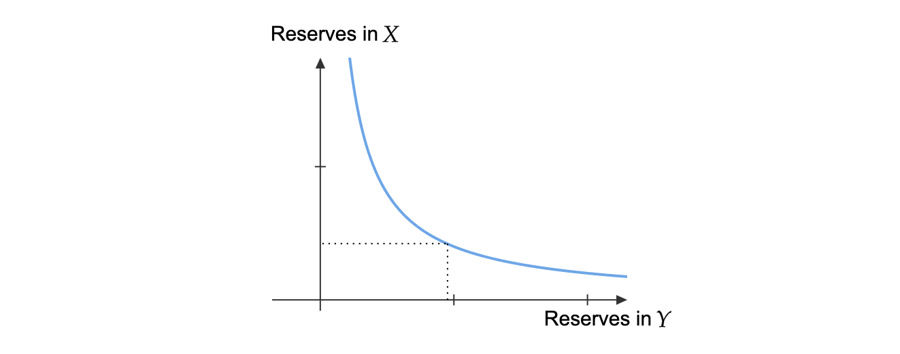{style="transform: translate(18%, 10%); width: 630px"}

---

# Automated Market Makers
### Transaction costs

* To buy a quantity $\Delta y$, one pays
$$
\frac{\Delta x}{\Delta y} = \frac{\Phi(y-\Delta y) - \Phi(y)}{\Delta y}
$$

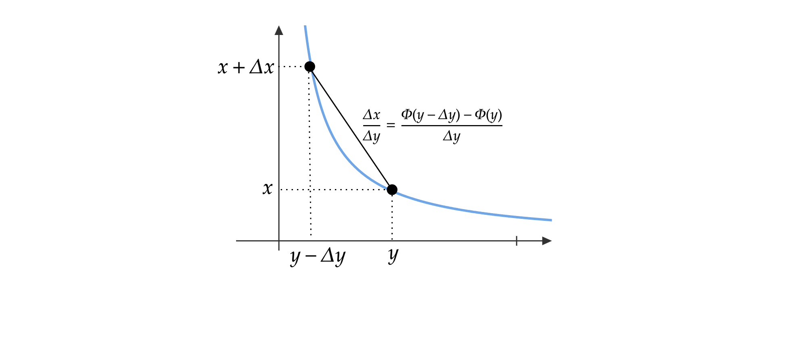{style="transform: translate(18%, 10%); width: 630px"}

---

# Automated Market Makers
### Transaction costs

* To sell a quantity $\Delta y$, one receives
$$
\frac{\Delta x}{\Delta y} = \frac{\Phi(y) - \Phi(y+\Delta y)}{\Delta y}
$$

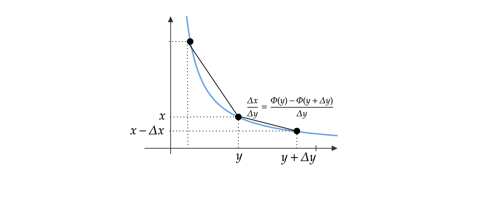{style="transform: translate(18%, 10%); width: 630px"}

---

# Automated Market Makers
### Transaction costs

* Marginal price
$$
\underbrace{\frac{\Phi(y)-\Phi(y+\Delta y)}{\Delta y}}_{\text{price to sell }\Delta y}
    \xrightarrow{\Delta y \longrightarrow 0}  \underbrace{Z=-\Phi'(y) }_{\text{marginal price}}\xleftarrow{0\longleftarrow \Delta y} \underbrace{\frac{\Phi(y-\Delta y)-\Phi(y)}{\Delta y}}_{\text{price to buy }\Delta y}
$$

---
layout: two-cols-header
---

# Automated Market Makers
### Transaction costs

* Slippage (spread)
$$
\underbrace{Z - \frac12 \Phi''(y) \,\Delta y}_{\text{price to sell }\Delta y}
     \ \ \le \ \   \underbrace{Z=-\Phi'(y) }_{\text{marginal price}}\ \ \le \ \  
\underbrace{Z + \frac12 \Phi''(y) \,\Delta y}_{\text{price to buy }\Delta y} 
$$

::left::

::right::

---
layout: two-cols-header
---

# Automated Market Makers
### Transaction costs

* Slippage (spread)
$$
\underbrace{Z - \frac12 \Phi''(y) \,\Delta y}_{\text{price to sell }\Delta y}
     \ \ \le \ \   \underbrace{Z=-\Phi'(y) }_{\text{marginal price}}\ \ \le \ \  
\underbrace{Z + \frac12 \Phi''(y) \,\Delta y}_{\text{price to buy }\Delta y}
$$

::left::

 

Scatter plot of transaction costs  and the approximation for all transactions in the  ETH/USDC pool:   $6.76 \times 10^6$ transactions between *5 May 21* and *31 December 23* 1

 

<Footnotes separator>
<Footnote :number=1>
<a href="https://arxiv.org/abs/2307.03499">Cartea, Á., Drissi, F., & Monga, M. (2023). Decentralised finance and automated market making: Execution and speculation </a>
</Footnote>
</Footnotes>

::right::

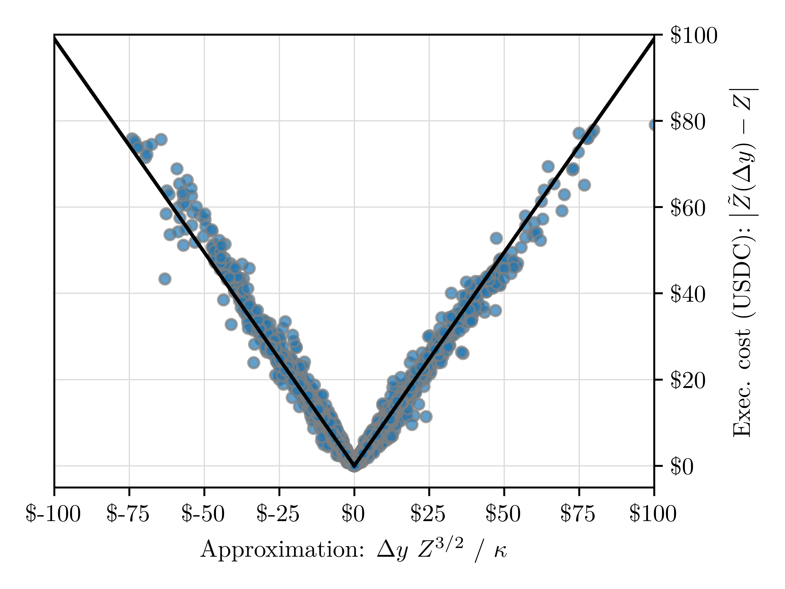{style="transform: translate(0%, -10%); width: 350px"}

---

# Automated Market Makers
### Transaction costs

* Price impact

$$
-\Phi'(y+\Delta y)
    \xleftarrow{\text{following a sell }\Delta y}  \underbrace{Z=-\Phi'(y) }_{\text{marginal price}}\xrightarrow{\text{following a buy }\Delta y} -\Phi'(y-\Delta y)
$$

---
layout: two-cols-header
---

# Automated Market Makers
### Transaction costs

* Price impact

$$
Z - \Phi''(y) \, \Delta y
    \xleftarrow{\text{following a sell }\Delta y}  \underbrace{Z=-\Phi'(y) }_{\text{marginal price}}\xrightarrow{\text{following a buy }\Delta y} Z + \Phi''(y) \, \Delta y
$$

::left::

 

Scatter plot of price impact and the approximation for all transactions in the  ETH/USDC pool:   $6.76 \times 10^6$ transactions between *5 May 21* and *31 December 23* 1

 

::right::

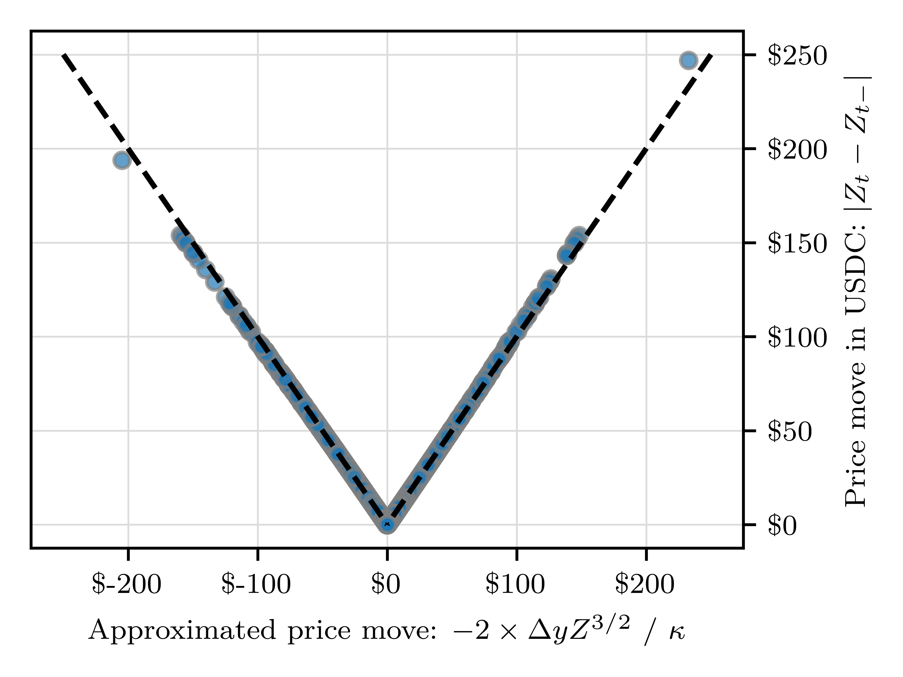{style="transform: translate(0%, -10%); width: 350px"}

---

# Automated Market Makers
### Transaction costs

* Change in wealth of LPs
$$
-\left(\Phi(y) - \Phi(y-\Delta y) - \Phi'(y)\,\Delta y\right) \approx - \frac12\, \Phi''(y)\, \Delta y^2
$$

* LPs earn proportional fees $\pi$

---

# Automated Market Makers
### Transaction costs

* Convexity determines transaction costs

* Convexity is inversely proportional to the size of the pool

$$ \kappa = 2 / \Phi''(y) $$

* Liquidity providers set the size of the pool

$$ \text{Slippage } = \delta /\kappa  $$

$$  \ \ \ \, \  \text{Impact }= 2 \, \delta /\kappa  $$

$$ \quad \ \ \, \text{LP loss } = - \delta^2 / \kappa  $$

---

      

<h1>
Market frictions in  
blockchains </h1>

---

# Blockchain protocol

* Transactions are sent to the network continuously, and stored in a memory pool
   

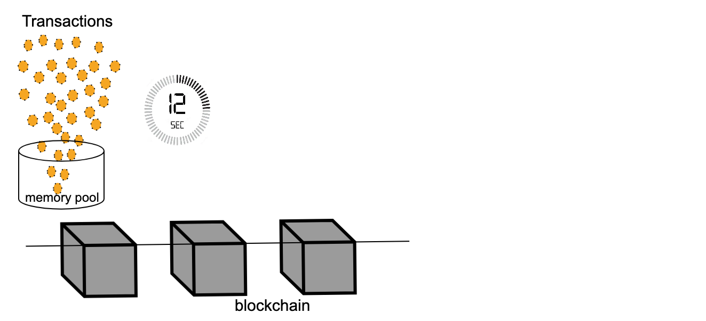{style="transform: translate(20%, 0%); width: 680px"}

---

# Blockchain protocol

* Transactions are sent to the network continuously, and stored in a memory pool
* At each Epoch, with length block time, a validator is chosen
  

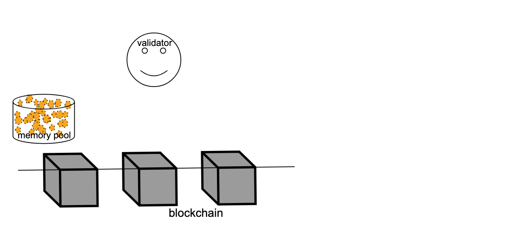{style="transform: translate(20%, 3%); width: 680px"}

<!---

#  Decentralised Exchanges

* Liquidity supply and price of liquidity
* Price dynamics-->

---

# Blockchain protocol

* Transactions are sent to the network continuously, and stored in a memory pool
* At each Epoch, with length block time, a validator is chosen
* The validator creates a new block with transactions from the memory pool

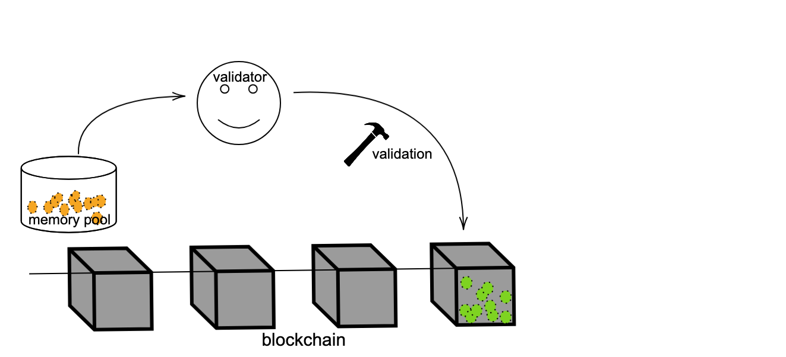{style="transform: translate(20%, 0%); width: 680px"}

---

# Blockchain protocol

### Gas fees (EIP-1559, Ethereum London fork)
* **Base fee**: based on congestion, prerequisite for inclusion
* **Priority fee**: incentivise validators to prioritise a transaction in the block

---

# Blockchain protocol

### Gas fees (EIP-1559, Ethereum London fork)
* **Base fee**: based on congestion. prerequisite for inclusion
* **Priority fee**: incentivise validators to prioritise a transaction in the block

{style="transform: translate(25%, 0%); width: 580px"}

---

# Blockchain protocol

## Consequences
 

#### Pre-trade transparency

* Agents observe pending and unconfirmed transactions

 

#### Priority gas auctions
* Competitive agents submit/revise priority gas fees to obtain better prices

 

#### Price discovery
* Additional vehicle for price discovery in blockchains:  priority fees

<!--
# Blockchain protocol
### Illustration of trading mechanisms
 
{style="transform: translate(5%, 5%); width: 780px"}
# Blockchain protocol
### Illustration of trading mechanisms
 
{style="transform: translate(5%, 5%); width: 780px"}
# Blockchain protocol
### Illustration of trading mechanisms
 
{style="transform: translate(5%, 5%); width: 780px"}
-->

---

      

<h1>
The microstructure of decentralised exchanges </h1>

---

# Research questions and contributions
   

* Describe the **microstructure** of decentralised exchanges under **pre-trade transparency** and **priority gas auctions**
    1. Infrastructure costs
    2. Price of liquidity
    3. Price efficiency

* Are current memory pools a good design for markets ?
    1. **Design features** to improve price efficiency and reduce infrastructure costs

---

# The model
### The market

* Trading is in an AMM with trading function $\Phi$
* Two *risk-neutral* informed traders $i$ and $j$ compete to *buy* $Y$
* They submit transactions **simultaneously** 
* They pay priority fees $\varphi_i$ and $\varphi_j$ only if given priority
* They pay a proportional transaction fee $\pi$

---

# The model
### The information
* Traders have private information $v_i>0$ and $v_j>0$ about the liquidation value $V$
$$
V_i = \mathbb E[V - \pi | v_i]
$$
* The signals are independently drawn from an interval $[0, \overline{v}]$ according to a density $f$

---

# The model
### The trading volumes
* Traders wish to buy volumes 
$$\delta_i = \delta(v_i)  \qquad \textrm{and} \qquad \delta_j = \delta(v_j)$$
* The volume function $\delta$ is continuously differentiable and increasing
* The volumes $\delta_i$ are drawn from $[\delta(0),\delta(\overline v)]=[\underline \delta,\overline \delta]$ according to
$$g(x) = f\left(\delta^{-1}\left(x\right)\right)\Big/\delta^{'}\left(\delta^{-1}\left(x\right)\right)$$

---

# The model

### Competition for queue priority
* With queue priority, the **slippage** for a volume $\delta$ is
$$
\delta / \kappa
$$
* The price impact is
$$
2\,\delta / \kappa 
$$
* Without queue priority, the **slippage** for a volume $\delta$ is
$$
\underbrace{2\,\delta / \kappa}_{\text{impact}} + \underbrace{\delta/\kappa}_{\text{slippage}}
$$

---

# The model

### The liquidity supply

* A risk-neutral LP sets the **pool size** $\kappa$ before the priority gas auction
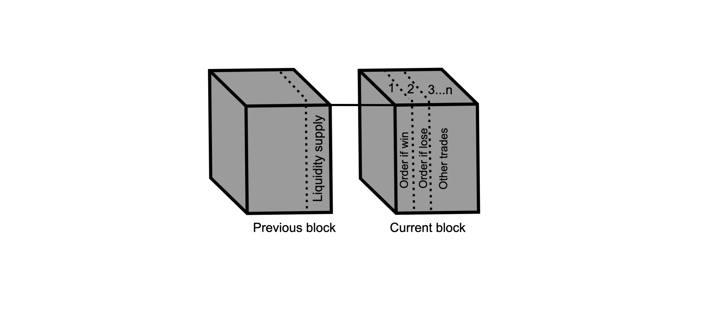{style="transform: translate(40%, -2%); width: 500px"}
<!-- A risk-neutral liquidity supplier sets a pool with size $\kappa$ A risk-neutral LP balances losses to informed traders from adverse selection with fee revenue from liquidity demand The fee rate in the pool is $\pi$ Price-sensitive liquidity demanders submit transactions with an absolute total volume $N$ which nets to zero The LP balances losses to informed traders from adverse selection with fee revenue from liquidity demand -->
* The LP balances **losses to informed traders**
$
\qquad\quad\ \ \ \text{L} = -  \mathbb E_\text{LP}[( \delta_i +  \delta_j)^2] \Big / \kappa
$
* with **revenue from liquidity demand**1, 2, 3
$
\qquad\qquad\quad\text{E}=\pi\,N\,(1-\theta/\kappa)
$

<Footnotes separator>
<Footnote :number=1>
Ho, T., & Stoll, H. R. (1981). Optimal dealer pricing under transactions and return uncertainty.  Journal of  Financial economics, 9(1), 47-73.
</Footnote>
<Footnote :number=2>
Hendershott, T., & Menkveld, A. J. (2014). Price pressures.  Journal of Financial economics
</Footnote>
<Footnote :number=3>
Capponi, A., J. Menkveld, A., & Zhang, H. (2025). Large orders in small markets: execution with endogenous   liquidity supply. Review of Finance
</Footnote>
</Footnotes>

---

# The model

### The equilibrium
Solved by backward induction
* Informed traders determine their strategies for fixed pool size $\kappa$
    1. Priority fees
    2. Trading volumes
* The liquidity supplier determines $\kappa$ with rational expectations over priority fees and trading volumes

---

# The model

### The equilibrium: stage 2
* If trader $i$ **wins** the auction, i.e., if $\varphi_{i}>\varphi_j$, their wealth is
$$
W_{i}\left(\text{win}\right)=-\underbrace{\varphi_{i}}_{\text{priority fee}}\,-\underbrace{\delta_{i}\,\left(V_{0}+\delta_{i}/\kappa - \pi\right)}_{\text{price and slippage}}+\underbrace{\delta_{i}\,V}_{\text{liquidation value}}
=\,-\varphi_{i}\,-\delta_{i}^{2}/\kappa+\delta_{i}\,(V-\pi)
$$
 

* If trader $i$ **loses** the auction, i.e., if $\varphi_{i}<\varphi_j$, their wealth is
$$
W_{i}\left(\text{lose}\right)=-\delta_{i}\,\left(V_{0}+3\,\delta_{i}/\kappa- \pi\right) +\delta_{i}\,V
 =-3\,\delta_{i}^{2}/\kappa+\delta_{i}\,(V-\pi)
$$
 

* The expected wealth of informed traders 
$$
\mathbb{E}\left[W_{i}\right] = \mathbb P_i\left[\varphi_i>\varphi_j\right]\,\left(-\varphi_{i}+2\,\delta_{i}^2/\kappa\right)-3\,\delta_{i}^{2}/\kappa+\delta_{i}\,V_{i}
$$

---

# The model

### The equilibrium: stage 2

* The optimisation problem for priority fees
$$
\sup_{\varphi_{i}}\left\{\mathbb P_i\left[\varphi_i>\varphi_j\right]\,\left(-\varphi_{i}+2\,k\,\delta_{i}\right)\right\} 
$$
 

* The optimisation problem for trading volumes
$$
\sup_{\delta_{i}}\mathbb P_i\left[\varphi^\star_i>\varphi^\star_j\right]\,\left(-\varphi^\star_{i}+2\,\delta_{i}^2/\kappa\right)-3\,\delta_{i}^{2}/\kappa+\delta_{i}\,V_{i}
$$
 

---

# The model
### The equilibrium: stage 1

* The optimisation problem for liquidity supply
$$
\sup_{\kappa}\left\{ \pi\,N\,\left(1-\theta/\kappa\right)-\mathbb{E}_\text{LP}\left[\left(\delta^\star\left(v_{i}\right)+\delta^\star\left(v_{j}\right)\right)^{2}\right] \Big / \kappa\right\}
$$
 

---

# Equilibrium properties

### Stage 2: the priority fees

* Priority fees for *fixed volumes and liquidity depth*
    * Increasing in the reward and decreasing in liquidity supply
$$
\varphi^\star_i=\frac{2}{\kappa}\left[\delta_{i}^{2}-2\,\frac{\int_{\underline{\delta}}^{\delta_{i}}x\,G\left(x\right)dx}{G\left(\delta_{i}\right)}\right]
$$
 

{style="transform: translate(0%, -10%); width: 500px"}
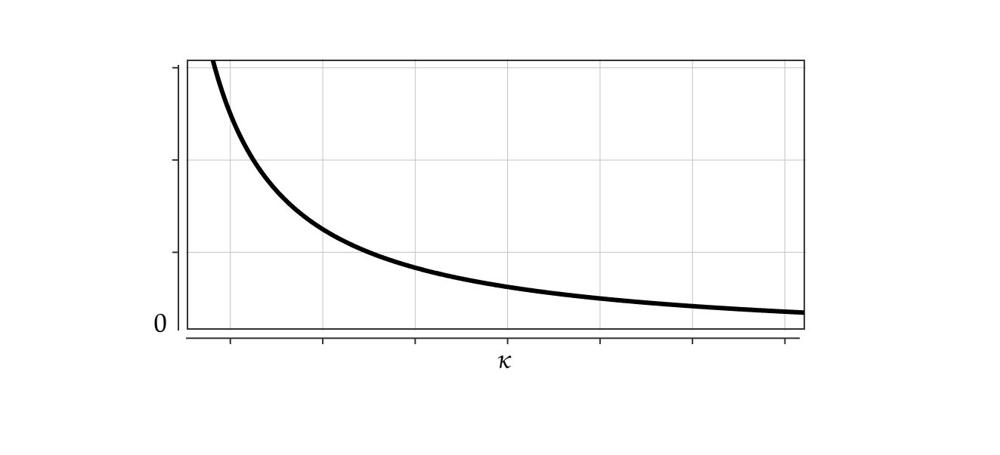{style="transform: translate(90%, -110%); width: 500px"}

---

# Equilibrium properties
### Stage 2: the trading volumes

* Trading volumes for *fixed liquidity depth*
    * Increasing in the signal and in liquidity supply
$$
\delta_{i}^{\star}=\kappa\,\tilde{\delta}_{i}^{\star}=\kappa\,\frac{V_{i}}{2\,\left(3-F\left(v_{i}\right)\right)}
$$
 

---

# Equilibrium properties
### Stage 1: the liquidity supply
* Decreasing in the variance of trading volumes, and increasing in liquidity demand
$$
\kappa^{\star}=\sqrt{\frac{\pi\,N\,\theta}{\mathbb{E}_{\text{LP}}\left[\left(\tilde{\delta}^{\star}\left(v_{i}\right)+\tilde{\delta}^{\star}\left(v_{j}\right)\right)^{2}\right]}}
$$
* Other things being equal, the liquidity supply is larger in DEXs because of infrastructure costs (without MEV)

---

# Equilibrium properties
### Overall (Uniform case and $V = v_i + v_j + \epsilon$)
* Liquidity supply
$$
\kappa^\star = 4 \, \frac{\sqrt{\pi\,N\,\theta}}{\overline v}
$$

* Priority fees (rent extracted by validators)
$$
\mathbb E[\varphi^\star_i+\varphi^\star_j] = \frac{4}{\kappa^\star}\mathbb E\left[\delta_{i}^{2}-2\,\frac{\int_{\underline{\delta}}^{\delta_{i}}x\,G\left(x\right)dx}{G\left(\delta_{i}\right)}\right] = \frac15 \,\sqrt{\pi\,N\,\theta}\,\overline v^2
$$

---

# Equilibrium properties
### Overall (Uniform case and $V = v_i + v_j + \epsilon$)
* Liquidity supply
$$
\kappa^\star = 4 \, \frac{\sqrt{\pi\,N\,\theta}}{\overline v}
$$

* Priority fees (rent extracted by validators)
$$
\mathbb E[\varphi^\star_i+\varphi^\star_j] = \frac{4}{\kappa^\star}\mathbb E\left[\delta_{i}^{2}-2\,\frac{\int_{\underline{\delta}}^{\delta_{i}}x\,G\left(x\right)dx}{G\left(\delta_{i}\right)}\right] = \frac15 \,\sqrt{\pi\,N\,\theta}\,\overline v^2
$$

* **In practice:** Block time $T$ is long 
    1. Large price fluctuations $\implies$ large priotiy fees
    2. Large liquidity demand $\implies$ large priotiy fees

<!--* Trading volumes
$$
\mathbb E[\delta^\star_i+\delta^\star_j] = 2\kappa^\star \mathbb E\left[\frac{V_{i}}{2\,\left(3-F\left(v_{i}\right)\right)}\right]=\frac{9}{10}\,\sqrt{\pi\,N\,\theta}\,\overline v
$$-->

---

# The model
### When there is a first round to bid early

{style="transform: translate(40%, 0%); width: 500px"}

---
layout: two-cols-header
---
# Equilibrium properties

::left::
 
 

* In equilibrium, traders submit transactions at the end of block time

           

::right::

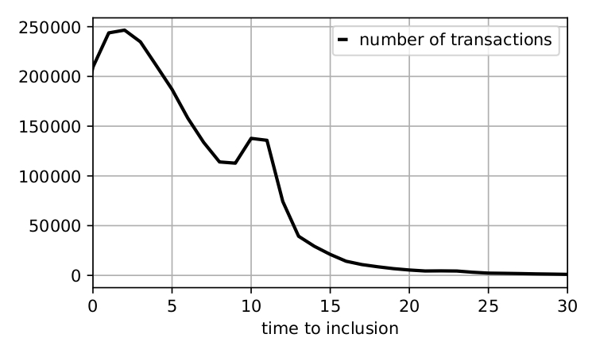{style="transform: translate(40%, -10%); width: 280px"}
$\qquad\quad$ Ethereum memory pool transaction data  
$\qquad\qquad\qquad$ $10-16$ December $2022$

 

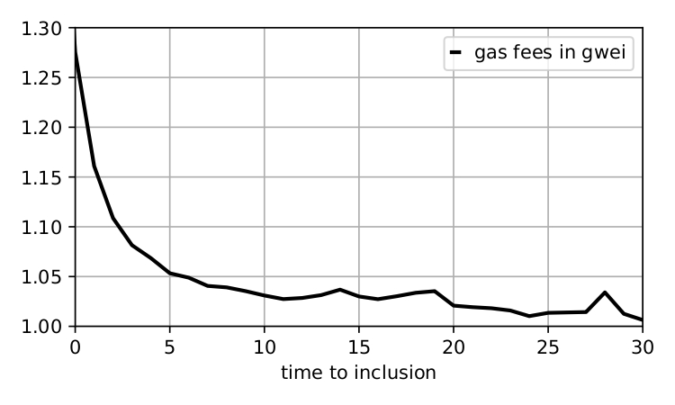{style="transform: translate(40%, -10%); width: 280px"}

---

# Equilibrium properties

* Price efficiency is hindered
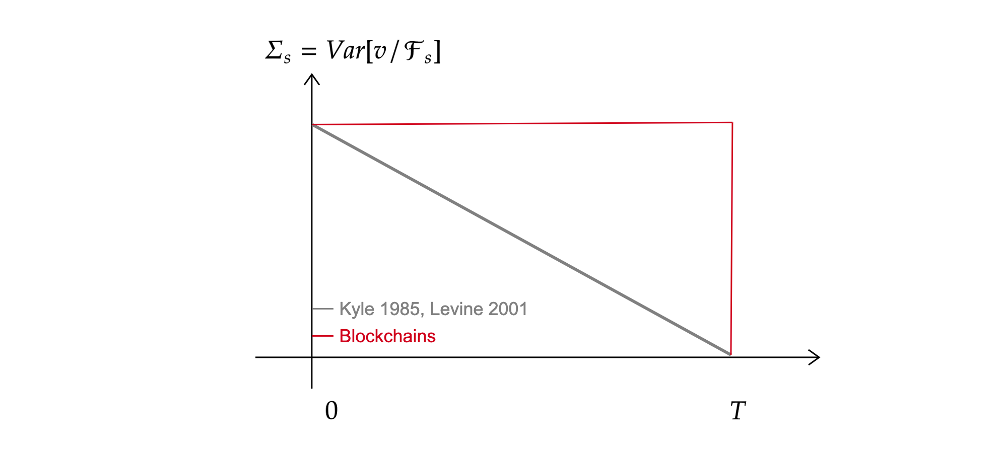{style="transform: translate(10%, 0%); width: 650px"}

--- 

      

<h1>
Can we do better ? </h1>

<!--- # A general model
 

### The game

1. The liquidity supplier chooses the liquidity depth by balancing fee revenue from noise LTs and adverse selection costs from informed traders.
    * In the block preceding that of traders
2. Informed traders receive  information about the liquidation value $V$ of the asset
    * At the start of the block time
3. The informed traders determine their priority fee bidding strategies and trading volumes
    *  Two-round two-trader game under uncertainty

4. A new block is created and the final liquidation value of the security is realised--->

---

# When traders know each other's information

* If trader $i$ has a higher valuation
$$\varphi_i^p = 2\,\delta_{j}^{2}\Big/\kappa \quad \text{and} \quad \varphi_j^p = 0$$

* Trading volumes are
$$\delta_i^p =\kappa\frac{V_{i}}{2}  \quad \text{and} \quad \delta_j^p =\kappa\frac{V_{j}}{6} \qquad \left(\delta^{\star}=\kappa\,\frac{V_{i}}{2\,\left(3-F\left(v_{i}\right)\right)}\right) $$

* Expected wealth increases
$$
\mathbb E[U_i^p]  > \mathbb E[U_i^\star]
$$

<!--
# When traders know each other's information
### Equilibrium properties (Uniform case and $V = v_i + v_j + \epsilon$)
* Priority fees decrease
$$
\mathbb E[\varphi^p_i+\varphi^p_j] < \mathbb E[\varphi^\star_i+\varphi^\star_j]
$$
* *Proportional trading volumes* increase
$$
\mathbb E[\tilde \delta^p_i+\tilde \delta^p_j] > \mathbb E[\tilde \delta^\star_i+\tilde \delta^\star_j]
$$
# When traders know each other's information
### Equilibrium properties 
* Priority fees decrease
$$
\mathbb E[\varphi^p_i+\varphi^p_j] < \mathbb E[\varphi^\star_i+\varphi^\star_j]
$$
* *Proportional trading volumes* increase
$$
\mathbb E[\tilde \delta^p_i+\tilde \delta^p_j] > \mathbb E[\tilde \delta^\star_i+\tilde \delta^\star_j]
$$
* Expected wealth increases
$$
\mathbb E[U_i^p]  < \mathbb E[U_i^\star]
$$
* However, liquidity supply decreases
$$
\mathbb E[\kappa^p]  < \mathbb E[\kappa^\star]
$$
-->

---

# Random block time

{style="transform: translate(60%, 0%); width: 400px"}

* There exists $\overline \tau < 1$, such that whenever $\tau > \overline\tau$, bidding in both rounds holds in equilibrium

---

# Random block time
### Two outcomes

* Traders do not bid in round one, the payoff is
$$J_{i}^\text{nb}=\left(1-\tau\right)\,U_{i}^\star\,.$$

* Traders bid in round one, the payoff is
$$J_{i}^\text{b}=\tau \, U_i^\star + \left(1-\tau\right)\,U_{i}^p\,.$$

* For any value $\tau$, it's more profitable to bid in round one

---

# Random block time
### When traders do not bid in round one

* When traders do not bid in round one, the payoff is
$$J_{i}^\text{nb}=\left(1-\tau\right)\,U_{i}^\star\,.$$

* Deviation: bid in round one
$$\tau\left(-\delta_{i}^{2}/\kappa+\delta_{i}\,V_i\right)+\underbrace{\left(1-\tau\right)\,U_{i}^-}_\text{informational disadvantage}$$

* For all values
$$\tau  > \max_{v_{i}}\frac{1}{1+\frac{U_{i}^{\text{win}}}{U_{i}-U_{i}^{-}}}$$
it is profitable to deviate on average

---

# Random block time
### When traders bid in round one

* When traders bid in round one, the payoff is
$$J_{i}^\text{b}=\tau \, U_i^\star + \left(1-\tau\right)\,U_{i}^p\,.$$

* Deviation: conceal in round one
$$\underbrace{\left(1-\tau\right)\,U_{i}^+}_\text{informational advantage}$$

* For all values 
$$\tau  > \max_{v_{i}}\frac{1}{1+\frac{U_{i}}{U_{i}^{+}-U_{i}^{p}}}$$
it is **not** profitable to deviate on average

---

# Random block time
### New equilibrium properties

* Priority fees **decrease**
$$
E[\varphi_i^{\tau,\star}]  < \mathbb E[\varphi_i^{\star}] 
$$

  

<!-- \kappa^\star \, \mathbb{E}\left[\int_{0}^{v_{i}}\delta\left(x\right)^{2}\,f\left(x\right)\,dx\right] -->

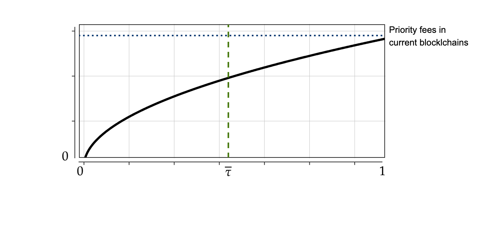{style="transform: translate(40%, 0%); width: 500px"}

---

# Random block time
### New equilibrium properties

* Price efficiency **improves**

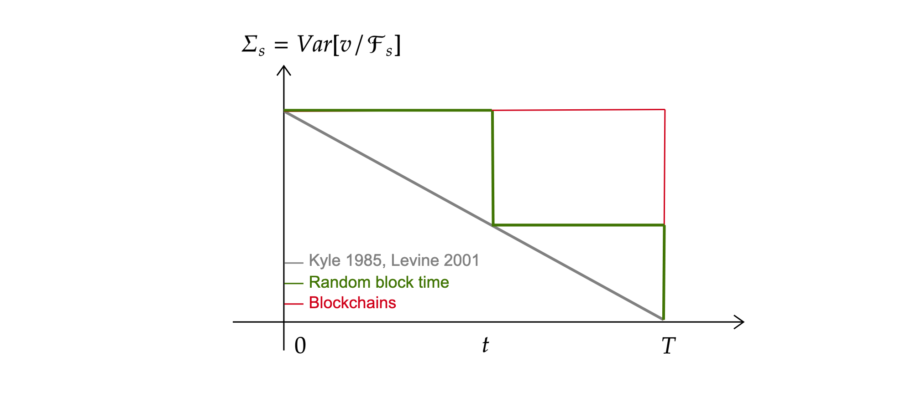{style="transform: translate(0%, 0%); width: 800px"}

---

# Random block time
### When traders bid in round one

* Proportional volumes **increase**
$$
\mathbb E[\tilde \delta_i^{\tau,\star}] = \frac{V_{i}}{2\left(3- (2-\tau) F\left(v_{i}\right)\right)} \ge \mathbb E[\tilde \delta_i^{\star}]
$$

---

# Random block time
### New equilibrium properties

* Liquidity supply **decreases**
$$
\kappa^{\tau,\star}=\sqrt{\pi\,N\,\theta\Big / \mathbb{E}\left[\left(\tilde\delta_i^{\tau,\star}+\tilde\delta_j^{\tau,\star}\right)^{2}\right]} < \kappa^{\star}
$$

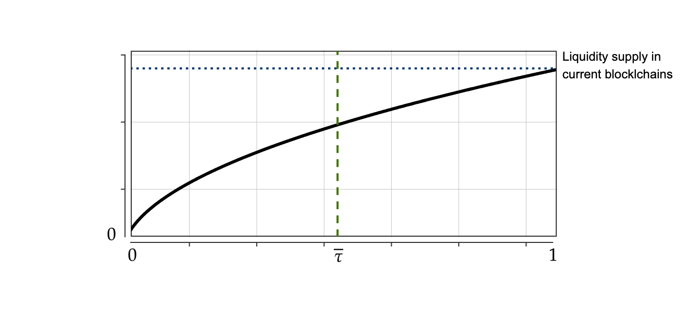{style="transform: translate(40%, 0%); width: 500px"}

---

# Random block time
### New equilibrium properties

* Total trading volumes   
$$
\kappa^{\tau,\star} \times \mathbb E[\tilde \delta_i^{\tau,\star}]
$$

* When signals are uniform, and $V = v_i + v_j + \epsilon$, trading volumes **decrease**

<!--* In practice, signal variance at round one is lower than that of round two $\implies$ -->

---

# Random block time

* **In practice**, $\overline v^\tau < \overline v$ 

* Variance of signals decreases 

* Profitability of trading decreases
$$
V_i = \mathbb E[V \mid v_i] = \int \mathbb E[V,v_i,v_j=x] \, f(x) \,dx
$$

* Variance of volumes decrease

* Liquidity supply increases

---

      

<h1>
Literature on random ending of trading auctions </h1>

---

# Literature on random ending of trading auctions

<!-- and Medrano and Vives (2001).-->

### <cite>Biais, Hillion and Spatt (1999). Journal of Political Economy</cite>
* Three hypotheses for the informativeness of preopening prices
    * *Full-information hypothesis*: preopening prices reflect full information
    * *Pure-noise hypothesis*: preopening prices do not contain any new information. Strategies may obstruct price discovery
    * *Learning hypothesis*: preopening price discovery is a learning process; information content of prices increases steadily

---

# Literature on random ending of trading auctions
### <cite>Medrano and Vives (2001). RAND Journal of Economics</cite>
* Study price discovery in opening call auctions with random preopening period ending
<!--
, in markets with and without manipulation
*  they show that strategic informed traders have an incentive to manipulate the market from the beginning
of the preopening period
* The reason is that keeping the price uninformative from the beginning of the period allows them to trade more aggressively later, when the market is
likely to open. They predict that bj,t is always bounded below one, because 
manipulators
prevent the full revelation of information no matter how long the preopening period is.
-->
* Evidence of manipulation at the start of the call auction
* Most volume concentrates close to the first time at which the market can close
* Information revelation accelerates close to the end, and market price approaches the fundamental value

<!--* Prediction: in a market with no manipulation, preopening prices converge to their full information values.-->

--- 

# Literature on random ending of trading auctions

### <cite>Bommel, Hoffmann (2011).</cite> 

* Study transparency and ending times of call auctions in Euronext and Xetra
    * The French Euronext
        1. disclose five levels of limit orders 
        2. have fixed ending times
    * The German Xetra
        1. only disclose the virtual clearing price and volume
        2. have random ending times
* Euronext auctions are more liquid
* Euronext auctions contribute more to price discovery

<!--* Both exchanges see significant reversals after their auctions, implying positive expected profits for liquidity suppliers. -->

---

# Literature on random ending of trading auctions
### <cite> Hauser, Kamara, Shurki (2012).  Journal of Financial Markets</cite> 

* Study the effects of randomising opening time on the performance of a stock market
* Derivatives settle in cash at opening prices $\implies$ incentives to manipulate
* Euronext, Xetra, TASE exchanges randomise opening time. They find randomisation has significantly
    * reduced manipulation from derivatives trading
    * improved price discovery

<Footnotes separator>
<Footnote :number=1>
Other papers: Stoll and Whaley (1990), Cao, Ghysels, and Hatheway (2000), Davies (2003), and Barclay and Hendershott (2008).
</Footnote>
</Footnotes>

---
layout: end
---
Thank you !

[faycaldrissi.com](https://www.faycaldrissi.com/)

