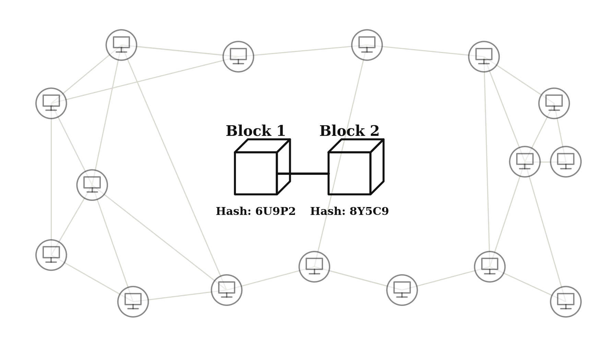
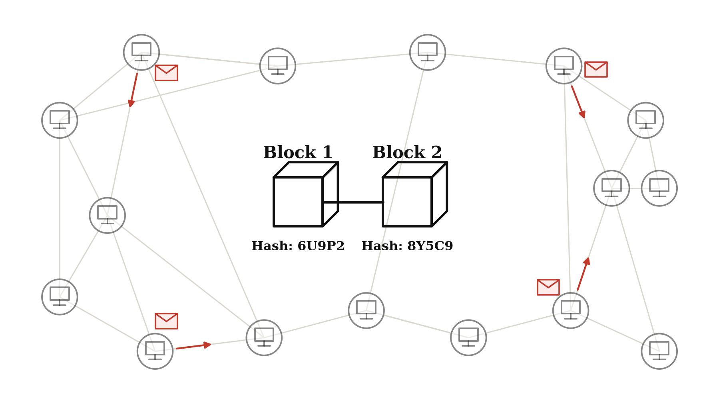
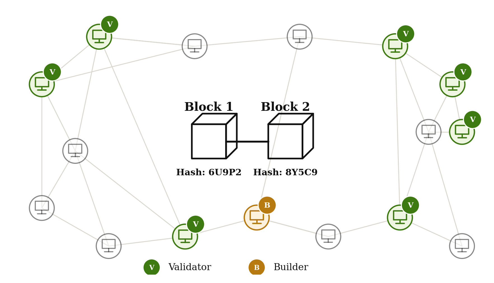
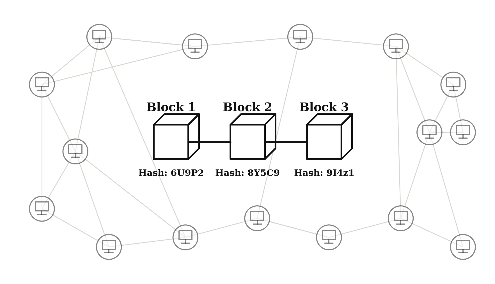
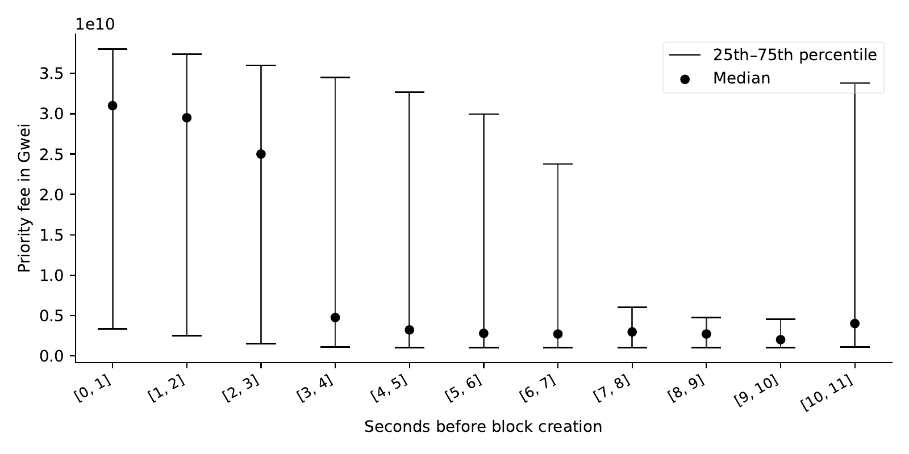
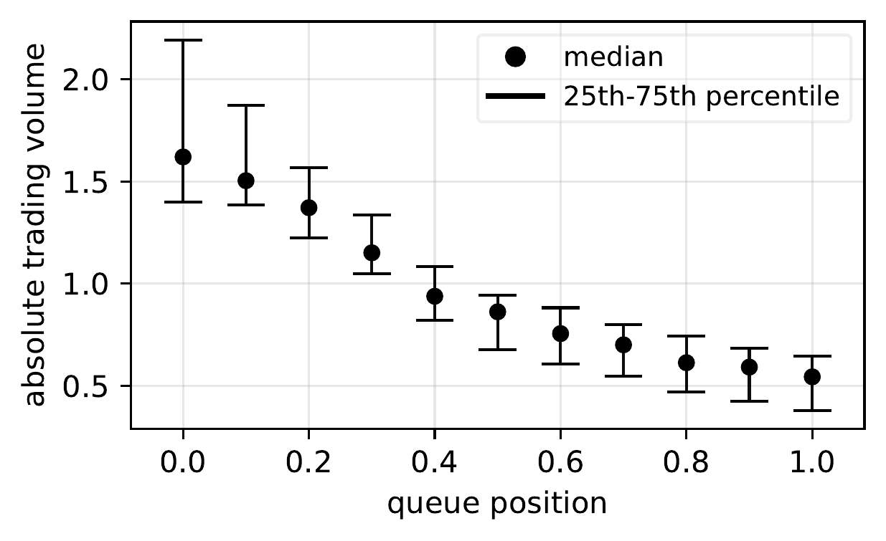
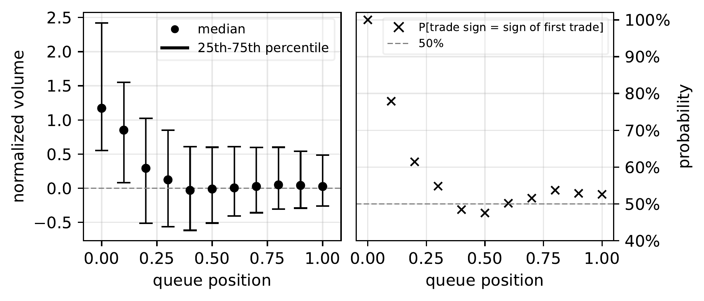

# Viability of blockchain markets

 
 

### Agostino Capponi, Álvaro Cartea, Fayçal Drissi
#### University of Oxford, Columbia University

  

##  NBER Summer Institute 2026 -- Financial Market Structure 

  

#### [https://www.faycaldrissi.com/mempools-talk](https://www.faycaldrissi.com/mempools-talk)

---
section: Blockchain markets
layout: two-cols-header
---

# Blockchains

::left::

### A distributed, digital, permissionless ledger 
- stores and executes transactions

 

<v-click>

### Promise to coordinate economic activity, at scale, without intermediaries

- financial markets are a fundamental test

<v-click>

- the role of DEXs is likely to grow
    1. **tokenization** $\$$ 5.5T by 2030 (Citi)
    2.  **stablecoins** $\$$ 310B today
    3. **FX cross-border settlement**

  

<v-click>

$\implies$ important to study

</v-click>
</v-click>
</v-click>

::right::

 

{style="height: 250px;"}

---
layout: two-cols-header
---

# How the blockchain executes transactions

### Without central authority
### With *algorithmic consensus*

::left::

<v-click at="1">

 
 
 

#### **Blockchain round**
- orders collect, no execution
</v-click>
<v-click at="2">

- network communications, cryptographic work
</v-click>
<v-click at="3">

- block created, transactions executed
</v-click>
<v-click at="4">

$\implies$ consensus requires **time** ($\approx$ 12s)
</v-click>

::right::

<v-switch at="-1">
<template #1>

{style="height: 250px;"}

</template>
<template #2>

{style="height: 250px;"}

</template>
<template #3>

{style="height: 250px;"}

</template>
<template #4>

{style="height: 250px;"}

</template>
<template #5>

{style="height: 250px;"}

</template>
<template #6>

{style="height: 250px;"}

</template>
</v-switch>

  

---

# Priority fees

### Block clears orders sequentially, according to **priority fees**

<svg viewBox="0 0 540 108" style="width:600px; max-width:100%; height:auto; display:block;">
  <rect x="0" y="0" width="540" height="108" fill="#ffffff"/>
  <defs><marker id="s3time" markerUnits="userSpaceOnUse" markerWidth="11" markerHeight="11" refX="8" refY="4" orient="auto"><path d="M0,0 L8,4 L0,8 z" fill="#000000"/></marker></defs>
  <rect x="97" y="10" width="66" height="36" rx="5" fill="#ffffff" stroke="#334155" stroke-width="1.4"/>
  <text x="130" y="33" text-anchor="middle" style="font-size:16px;" fill="#1e293b">$2</text>
  <rect x="237" y="10" width="66" height="36" rx="5" fill="#ffffff" stroke="#334155" stroke-width="1.4"/>
  <text x="270" y="33" text-anchor="middle" style="font-size:16px;" fill="#1e293b">$1</text>
  <rect x="377" y="10" width="66" height="36" rx="5" fill="#ffffff" stroke="#334155" stroke-width="1.4"/>
  <text x="410" y="33" text-anchor="middle" style="font-size:16px;" fill="#1e293b">$5</text>
  <line x1="46" y1="62" x2="494" y2="62" stroke="#000000" stroke-width="1.2" marker-end="url(#s3time)"/>
  <line x1="130" y1="59" x2="130" y2="65" stroke="#64748b" stroke-width="1"/>
  <line x1="270" y1="59" x2="270" y2="65" stroke="#64748b" stroke-width="1"/>
  <line x1="410" y1="59" x2="410" y2="65" stroke="#64748b" stroke-width="1"/>
  <path d="M48 76 L48 82 L266 82 L270 87 L274 82 L492 82 L492 76" fill="none" stroke="#334155" stroke-width="1.3" stroke-linejoin="round" stroke-linecap="round"/>
  <text x="270" y="102" text-anchor="middle" style="font-size:13px;" fill="#334155">blockchain round</text>
</svg>

  

<svg viewBox="0 0 540 120" style="width:600px; max-width:100%; height:auto; display:block;">
  <rect x="0" y="0" width="540" height="120" fill="#ffffff"/>
  <defs><marker id="s3exec" markerUnits="userSpaceOnUse" markerWidth="11" markerHeight="11" refX="8" refY="4" orient="auto"><path d="M0,0 L8,4 L0,8 z" fill="#000000"/></marker></defs>
  <rect x="68" y="22" width="404" height="48" rx="7" fill="#ffffff" stroke="#334155" stroke-width="1.7"/>
  <rect x="86" y="15" width="46" height="14" fill="#ffffff"/>
  <text x="109" y="26" text-anchor="middle" style="font-size:12px;" fill="#64748b">block</text>
  <rect x="97" y="28" width="66" height="36" rx="5" fill="#ffffff" stroke="#334155" stroke-width="1.4"/>
  <text x="130" y="51" text-anchor="middle" style="font-size:16px;" fill="#1e293b">$5</text>
  <rect x="237" y="28" width="66" height="36" rx="5" fill="#ffffff" stroke="#334155" stroke-width="1.4"/>
  <text x="270" y="51" text-anchor="middle" style="font-size:16px;" fill="#1e293b">$2</text>
  <rect x="377" y="28" width="66" height="36" rx="5" fill="#ffffff" stroke="#334155" stroke-width="1.4"/>
  <text x="410" y="51" text-anchor="middle" style="font-size:16px;" fill="#1e293b">$1</text>
  <line x1="97" y1="84" x2="445" y2="84" stroke="#000000" stroke-width="1.2" marker-end="url(#s3exec)"/>
  <text x="130" y="102" text-anchor="middle" style="font-size:11px;" fill="#64748b">executed first</text>
  <text x="410" y="102" text-anchor="middle" style="font-size:11px;" fill="#64748b">executed last</text>
</svg>

---

# Are blockchain markets different ? 

### Yes: price updates are mechanical

1\. liquidity provider deposits liquidity in a smart contract

<svg width="90" height="90" viewBox="0 0 90 90" style="display:block; margin:0 auto;">
  <circle cx="45" cy="45" r="37" fill="#eef2f6" stroke="#334155" stroke-width="2"/>
  <circle cx="36" cy="41" r="5.5" fill="#3b6fb5"/>
  <circle cx="54" cy="38" r="5.5" fill="#3b6fb5"/>
  <circle cx="45" cy="54" r="5.5" fill="#3b6fb5"/>
</svg>

smart contract

2\. block transactions are cleared sequentially against the smart contract

&ndash; price impact between trades is <b>mechanical</b>, set by the smart-contract code

<svg viewBox="0 0 600 88" preserveAspectRatio="none" style="width:100%; height:82px; display:block;">
  <text x="4" y="12" style="font-size:9px;" fill="#444">price</text>
  <g>
    <path d="M 0 80 L 75 80 M 75 64 L 150 64" stroke="#334155" stroke-width="1.8" fill="none" vector-effect="non-scaling-stroke"/>
    <line x1="75" y1="80" x2="75" y2="64" stroke="#dc2626" stroke-width="2" vector-effect="non-scaling-stroke"/>
  </g>
  <g v-click="3">
    <path d="M 150 64 L 225 64 M 225 48 L 300 48" stroke="#334155" stroke-width="1.8" fill="none" vector-effect="non-scaling-stroke"/>
    <line x1="225" y1="64" x2="225" y2="48" stroke="#dc2626" stroke-width="2" vector-effect="non-scaling-stroke"/>
  </g>
  <g v-click="4">
    <path d="M 300 48 L 375 48 M 375 32 L 450 32" stroke="#334155" stroke-width="1.8" fill="none" vector-effect="non-scaling-stroke"/>
    <line x1="375" y1="48" x2="375" y2="32" stroke="#dc2626" stroke-width="2" vector-effect="non-scaling-stroke"/>
  </g>
  <g v-click="5">
    <path d="M 450 32 L 525 32 M 525 16 L 600 16" stroke="#334155" stroke-width="1.8" fill="none" vector-effect="non-scaling-stroke"/>
    <line x1="525" y1="32" x2="525" y2="16" stroke="#dc2626" stroke-width="2" vector-effect="non-scaling-stroke"/>
  </g>
</svg>

block

  
txn 1

  
txn 2

  
⋯

  
txn N

---

# Are blockchain markets different ?

<u>Electronic markets</u>

<u>Blockchain markets</u>

**Continuous** trading

<svg viewBox="0 0 200 96" style="width:150px; max-width:100%; height:auto; display:block; margin:2px auto 0;">
  <defs><marker id="wbdC" markerUnits="userSpaceOnUse" markerWidth="9" markerHeight="9" refX="6.5" refY="3.5" orient="auto"><path d="M0,0 L7,3.5 L0,7 z" fill="#334155"/></marker></defs>
  <line x1="24" y1="84" x2="190" y2="84" stroke="#334155" stroke-width="1.1" marker-end="url(#wbdC)"/>
  <line x1="24" y1="84" x2="24" y2="12" stroke="#334155" stroke-width="1.1" marker-end="url(#wbdC)"/>
  <polyline points="28.0,17.9 29.7,22.8 31.5,28.0 33.2,24.2 34.9,19.4 36.6,22.9 38.4,27.0 40.1,31.8 41.8,24.5 43.5,21.2 45.3,28.4 47.0,31.0 48.7,36.9 50.4,37.6 52.2,33.6 53.9,31.4 55.6,42.7 57.3,36.0 59.1,31.2 60.8,27.9 62.5,31.9 64.2,34.2 66.0,33.5 67.7,34.7 69.4,36.9 71.1,40.0 72.9,43.3 74.6,41.4 76.3,32.5 78.0,39.2 79.8,33.7 81.5,36.7 83.2,32.9 84.9,37.7 86.7,36.9 88.4,41.0 90.1,56.1 91.8,49.1 93.6,50.0 95.3,41.6 97.0,42.5 98.7,47.2 100.5,46.4 102.2,48.3 103.9,48.4 105.6,44.0 107.4,49.0 109.1,45.7 110.8,55.8 112.5,50.7 114.3,53.7 116.0,52.5 117.7,56.2 119.4,51.7 121.2,56.7 122.9,54.5 124.6,59.7 126.3,59.6 128.1,57.8 129.8,53.5 131.5,58.3 133.2,59.5 135.0,65.3 136.7,59.7 138.4,61.5 140.1,62.3 141.9,62.1 143.6,62.0 145.3,62.1 147.0,59.2 148.8,56.4 150.5,58.1 152.2,63.3 153.9,69.8 155.7,70.8 157.4,71.8 159.1,71.5 160.8,71.3 162.6,69.3 164.3,71.2 166.0,76.6 167.7,70.5 169.5,66.5 171.2,76.1 172.9,73.6 174.6,75.8 176.4,76.7 178.1,68.9 179.8,80.7 181.5,83.5 183.3,78.4 185.0,78.9" fill="none" stroke="#1e293b" stroke-width="1.4" stroke-linejoin="round"/>
</svg>

**Discrete** trading

<svg viewBox="0 0 200 96" style="width:150px; max-width:100%; height:auto; display:block; margin:2px auto 0;">
  <defs><marker id="wbdD" markerUnits="userSpaceOnUse" markerWidth="9" markerHeight="9" refX="6.5" refY="3.5" orient="auto"><path d="M0,0 L7,3.5 L0,7 z" fill="#334155"/></marker></defs>
  <line x1="24" y1="84" x2="190" y2="84" stroke="#334155" stroke-width="1.1" marker-end="url(#wbdD)"/>
  <line x1="24" y1="84" x2="24" y2="12" stroke="#334155" stroke-width="1.1" marker-end="url(#wbdD)"/>
  <polyline points="28,24 72,24 72,44 118,44 118,60 162,60 162,74 184,74" fill="none" stroke="#1e293b" stroke-width="1.7" stroke-linejoin="round"/>
</svg>

Price discovery is **continuous**

Price discovery is **delayed**

price impact is **Bayesian**

price impact is **mechanical**

**Large** action space  
trade anytime

**Restricted** action space  
one trade per blockchain round

Time priority

 
Time + paid-priority

**Uniform** pricing (model)

Model requires **discriminatory** pricing

<v-click at="7">

Are these differences good or bad for markets?

</v-click>

---

# Reasons to worry

### Blockchain amplifies price moves
- One-block return volatility, on-chain vs off-chain

<table class="overshoot-tbl" style="font-size:0.82em;">
<thead>
<tr>
<th style="text-align:left;">Asset</th>
<th class="cmid">Blockchain volatility (bp)</th>
<th class="cmid">Binance volatility (bp)</th>
</tr>
</thead>
<tbody>
<tr><td>ETH/BTC</td><td><b>7.72</b></td><td>6.00</td></tr>
<tr><td>ETH</td><td><b>8.71</b></td><td>6.87</td></tr>
<tr><td>BTC</td><td><b>24.94</b></td><td>17.83</td></tr>
<tr><td>LINK</td><td><b>27.35</b></td><td>13.45</td></tr>
<tr><td>UNI</td><td><b>29.41</b></td><td>18.29</td></tr>
<tr><td>APE</td><td><b>36.34</b></td><td>28.63</td></tr>
<tr><td>MATIC</td><td><b>43.07</b></td><td>18.77</td></tr>
<tr><td>1INCH</td><td><b>84.11</b></td><td>34.84</td></tr>
</tbody>
</table>

Volatility of absolute one-block returns in bp (1 Jan 2021 – 31 Dec 2023).  &nbsp;<b>Data</b>: 8 assets priced both on-chain (Uniswap v3) and on Binance.

---

# Contribution

 

### This paper

- can the blockchain host *viable* markets?
<v-click>    

- we argue it can't: the features of blockchains (decentralization) distort price formation

<v-click>

- how ? a model of a **blockchain trading round**

</v-click>
</v-click>

---

# Literature

Blockchain &amp; DEX microstructure

<b style="color:#1e293b;">Equilibrium liquidity provision</b>

Park (2023, <i>MS</i>) · Malinova–Park (2024) · Hasbrouck–Rivera–Saleh (2026, <i>MS</i>) · Lehar–Parlour (2025, <i>JF</i>)

<b style="color:#1e293b;">LP losses &amp; other markets</b>

Milionis et al. (2022) · Hasbrouck–Rivera–Saleh (2023) · Cartea–Drissi–Monga (2023, 2024, <i>SIAM</i>)

<b style="color:#1e293b;">Informed liquidity provision</b>

Klein et al. (2023)

<b style="color:#1e293b;">Blockchain infrastructure (gas fees)</b>

Capponi–Jia–Yu (2024, <i>RFS</i>)

<b style="color:#1e293b;">Others</b>

Angeris–Evans–Chitra (2021) · Capponi–Iyengar–Sethuraman (2023, <i>F&amp;T</i>)

Classical microstructure

<b style="color:#1e293b;">Information monopolist</b> — Kyle (1985, <i>Econometrica</i>)

<b style="color:#1e293b;">Competition on information</b> — Holden–Subrahmanyam (1992, <i>JF</i>), Foster–Viswanathan (1996, <i>JF</i>)

<b style="color:#1e293b;">Multi-stage inventory models</b> — Biais (1993, <i>JF</i>), De Frutos–Manzano (2002, <i>JF</i>)

<b style="color:#1e293b;">Compete for queue position (not speed)</b> — O'Hara (1998, <i>book</i>)

<b style="color:#1e293b;">Information processing costs</b> — Grossman–Stiglitz (1980, <i>AER</i>), Verrecchia (1982, <i>Econometrica</i>), Kyle (1989, <i>RES</i>), Baldauf–Mollner (2020, <i>JF</i>)

<b style="color:#1e293b;">DEX ≈ parametrized price schedule in electronic markets</b> — Glosten (1994, <i>JF</i>), Biais–Martimort–Rochet (2000, <i>Econometrica</i>)

<b style="color:#1e293b;">Dealer markets / market making</b> — Ho–Stoll (1983, <i>JF</i>), Glosten–Milgrom (1985, <i>JFE</i>)

Political contests (multi-prize)

<b style="color:#1e293b;">Multi-prize contests</b>  — Lazear–Rosen (1981, <i>JPE</i>), Hillman–Riley (1989), Barut–Kovenock (1998), Klose–Kovenock (2015)

<b style="color:#1e293b;">Multi-prize contests with a fixed prize vector</b> — Moldovanu–Sela (2001, <i>AER</i>)

 

Periodic auctions for markets
 

<b style="color:#1e293b;">Uniform-price batch auctions</b> — Madhavan (1992, <i>JF</i>), Budish–Cramton–Shim (2015, <i>QJE</i>); we use discriminatory pricing, LP absent

 

Opening / closing auctions

<b style="color:#1e293b;">Information revelation accelerates toward the close</b> — Medrano–Vives (2001, <i>RAND J. Econ</i>)

<b style="color:#1e293b;">Transparency &amp; ending times of call auctions</b> — Van Bommel–Hoffmann (2011)

<b style="color:#1e293b;">Preopening price discovery &amp; learning (pure-noise hypothesis)</b> — Biais–Hillion–Spatt (1999, <i>JPE</i>)

---
section: Model

---

# Smart contract

### Trade size $Q$, liquidity $L$

- <u>**Mechanical price update rule**</u>: after the trad, price updates by

$$\underbrace{2\,Q/L}_\text{price impact}$$

  

- <u>**Revenue to liquidity provider**</u>: 
$$\pi\times Q$$

- <u>**Price schedule**</u>: 
$$Q\times\Big(\underbrace{Q/L}_{\text{marginal price}}\Big)$$

---

# Why compete ?

- Trader 1 buys $Q_1$ first, then trader 2 buys $Q_2$

block

<b>Trader 1</b> buys Q1

<b>Trader 2</b> buys Q2

execution order →

<v-click>

- Trader 1 pays 
$$\underbrace{Q_1/L  \ + \ \pi}_\text{exec. costs}$$

<v-click>

- Trader 2  pays 
$$\underbrace{2Q_1/L}_{\text{impact from trader 1}} \ + \ \underbrace{Q_2/L  \ + \ \pi}_\text{exec. costs}$$

</v-click>
</v-click>

---
class: fact-c
---

# Competition structure

### Informed flow arrives just before block creation

- Traders who submit high priority fees submit **late** 
- Competition among informed traders is effectively **blind**

{style="height: 220px; margin-top: 8px;"}

Priority fee distribution as a function of submission time over a blockchain slot. &nbsp; <b>Data</b>: Ethereum public mempool, ≈10 million transactions, 20–21 March 2024 (source: EthPandaOps).

 

---

# Model

### A static, three-stage game

Stage 1 · Entry

M traders pay information cost

→

Stage 2 · Liquidity

supplier sets reserves L

→

Stage 3 · Trading

informed traders set priority fees Φ and volumes Q

uninformed traders submit

  

<v-click>

### Solved backward

① priority fees Φ

→

② volumes Q

<svg viewBox="0 0 100 9" preserveAspectRatio="none" style="width:100%; height:9px; display:block; margin-top:6px;">
<path d="M0.6,0 L0.6,4 L48.5,4 L50,8 L51.5,4 L99.4,4 L99.4,0" fill="none" stroke="#334155" stroke-width="1.3" vector-effect="non-scaling-stroke" stroke-linejoin="round" stroke-linecap="round"/>
</svg>

stage 3

→

③ liquidity L

→

④ entry M

</v-click>

---
section: Trading
---

# Stage 3: competition among informed traders

### <u>Setup</u>
- $M$ **<u>buying</u>** traders, valuations $\,v_i \in [0, \overline  v] \sim F$

- set priority fees $\Phi_i$ and trading volumes $Q_i$

 

###  <u>Expected wealth of trader $i$</u>

$$\small
\text{expected volume ahead of trader i } = \overline{Q}(\Phi_i)=\mathbb E_i\Big[\,\underbrace{\textstyle\sum_{j:\,\Phi_j>\Phi_i} Q_j}_{\text{volume ahead of }i}\,\Big]
$$

$$\small
\text{expected adverse impact} = \Delta(\Phi_i) = \dfrac{2\,\overline{Q}(\Phi_i)}{L}
$$

$$
\mathbb E_i[W_i]=  \underbrace{Q_i\,v_i}_{\text{inventory}} \phantom{- \underbrace{\Phi_i}_{\text{priority fee}} - Q_i\Bigg(\underbrace{\dfrac{Q_i}{L}+\pi}_{\text{exec. costs}}\ +\ \underbrace{\Delta(\Phi_i)}_{\text{expected adverse impact}} \Bigg) - \underbrace{C}_{\text{info. cost}}}
$$

$$
\mathbb E_i[W_i]=  \underbrace{Q_i\,v_i}_{\text{inventory}} - \underbrace{\Phi_i}_{\text{priority fee}} \phantom{- Q_i\Bigg(\underbrace{\dfrac{Q_i}{L}+\pi}_{\text{exec. costs}}\ +\ \underbrace{\Delta(\Phi_i)}_{\text{expected adverse impact}} \Bigg) - \underbrace{C}_{\text{info. cost}}}
$$

$$
\mathbb E_i[W_i]=  \underbrace{Q_i\,v_i}_{\text{inventory}} - \underbrace{\Phi_i}_{\text{priority fee}} - Q_i\Bigg(\underbrace{\dfrac{Q_i}{L}+\pi}_{\text{exec. costs}}\phantom{\ +\ \underbrace{\Delta(\Phi_i)}_{\text{expected adverse impact}}} \Bigg) \phantom{- \underbrace{C}_{\text{info. cost}}}
$$

$$
\mathbb E_i[W_i]=  \underbrace{Q_i\,v_i}_{\text{inventory}} - \underbrace{\Phi_i}_{\text{priority fee}} - Q_i\Bigg(\underbrace{\dfrac{Q_i}{L}+\pi}_{\text{exec. costs}}\ +\ \underbrace{\Delta(\Phi_i)}_{\text{expected adverse impact}} \Bigg) \phantom{- \underbrace{C}_{\text{info. cost}}}
$$

$$
\mathbb E_i[W_i]=  \underbrace{Q_i\,v_i}_{\text{inventory}} - \underbrace{\Phi_i}_{\text{priority fee}} - Q_i\Bigg(\underbrace{\dfrac{Q_i}{L}+\pi}_{\text{exec. costs}}\ +\ \underbrace{\Delta(\Phi_i)}_{\text{expected adverse impact}} \Bigg) - \underbrace{C}_{\text{info. cost}}
$$

###  <u>Objective</u>  
$$\sup_{\Phi_i, Q_i}\mathbb E_i[W_i] =\sup_{Q_i} \sup_{\Phi_i}\mathbb E_i[W_i]$$

---
layout: two-cols-header
---

# ① priority fees → ② volumes → ③ liquidity → ④ entry <i>M</i>

### <u>Setup</u>
- $M$ traders with (exogenous) liquidity needs $Q \in [0, \overline  Q] \sim G$
- set priority fees $\Phi_i$

 

::left::

<v-click>

### <u>Trader $i$ solves</u>

  

$$\small \sup_{\Phi_i}\ \Bigg\{\ -\underbrace{\Phi_i}_{\text{priority fee}}\ +\ \underbrace{\text{impact avoided}(\Phi_i)}_{\text{surplus }}\Bigg\}$$

</v-click>

::right::

  

<v-click at="1">

<svg viewBox="0 0 600 100" preserveAspectRatio="none" style="width: 100%; height: 94px; display: block;">
  <path d="M 175 58 L 175 44 L 245 44 L 245 30 L 560 30 L 560 58 Z" fill="#334155" fill-opacity="0.14"/>
  <path d="M 0 90 L 35 90 L 35 74 L 105 74 L 105 58 L 175 58 L 175 44 L 245 44 L 245 30 L 600 30" stroke="#334155" stroke-width="1.6" fill="none" vector-effect="non-scaling-stroke"/>
  <line x1="165" y1="58" x2="560" y2="58" stroke="#dc2626" stroke-width="1" stroke-dasharray="5 3" vector-effect="non-scaling-stroke"/>
  <line x1="165" y1="60" x2="165" y2="100" stroke="#dc2626" stroke-width="0.8" stroke-dasharray="2 2" vector-effect="non-scaling-stroke"/>
  <circle cx="165" cy="58" r="4" fill="#dc2626"/>
  <text x="4" y="12" style="font-size: 8px;" fill="#444">price</text>
  <text x="150" y="50" text-anchor="middle" style="font-size: 8px; font-weight: 700;" fill="#dc2626">trader i</text>
  <text x="378" y="46" text-anchor="middle" style="font-size: 8px; font-weight: 700;" fill="#334155">surplus = avoided impact</text>
</svg>

block

  
txn 1 · Φ(1)

  
txn 2 · Φ(2)

  
⋯

  
txn N · Φ(N)

  
fee = 0

</v-click>

---

# ① priority fees → ② volumes → ③ liquidity → ④ entry <i>M</i>

 

<!--$$
\Phi^\star\left(Q_{i}\right)=\frac{2}{L}\left(M-1\right)\int_{0}^{Q_{i}}x^{2}\,dG\left(x\right)
$$-->

### Equilibrium fee

1\. priority fees increase with volume $Q_i$

larger volume <i>Q</i>

↓

larger loss Q Δ(Φ) from  adverse price impact

↓

more to gain from priority

↓

larger fee

---
class: fact-c
---

# ① priority fees → ② volumes → ③ liquidity → ④ entry <i>M</i>

### When price formation happens on-chain: 
- absolute volume **decreases** with queue position
<!--$\ \implies\,$ aggressive, high-volume traders secure the earliest positions-->

{style="height: 190px; margin-top: 8px;"}

Distribution of normalized absolute volume as a function of queue position. &nbsp;<b>Data</b>: 75 Uniswap v3 pools whose asset is <i>not</i> on Binance: 317,901 trades in 36,692 blocks, 2021–2026.

 

---

# ① priority fees → ② volumes → ③ liquidity → ④ entry <i>M</i>

 

### Equilibrium fee

2\. priority fees **increase with competition** $M$

more competitors <i>M</i>

↓

more traders with higher priority fees

↓

larger volume ahead

↓

more to gain from priority

↓

higher fee

---
layout: two-cols-header
---

# ① priority fees → ② volumes → ③ liquidity → ④ entry <i>M</i>

<u>Setup</u>: traders anticipate the fee $\Phi^\star(Q_i)$ and set $Q_i$

$$\scriptsize Q^\star(v_i) = L \times \frac{1}{2}\Bigg(\underbrace{\left(\overline v - \pi\right)e^{-(M-1)\left(1-F(v_i)\right)}}_{\text{profit net of fees}} - \underbrace{\int_{v_i}^{\overline v} e^{-(M-1)\left(F(u)-F(v_i)\right)}\,du}_\text{impact of competing orders} \Bigg)$$

::left::

#### Equilibrium volume

- increasing in valuation $v$

 

#### Endogenous selection

- only high-valuation traders trade: cutoff $\underline v(M)$

- cutoff **rises with competition**: $\lim_{M\to\infty}\underline v(M)=\overline v$

 

 

::right::

higher valuation <i>v</i>

↓

stronger incentive to trade

↓

higher volume

low valuation

↓

low desired volume - low priority fee

↓

anticipates high number of higher-valuation traders earlier in the block

↓

anticipates large adverse impact

↓

price pushed past your valuation

↓

stay out

more competitors <i>M</i>

↓

more expensive to trade: higher fees &amp; price impact

↓

higher valuation required to break even

---

# ① priority fees → ② volumes → ③ liquidity → ④ entry <i>M</i>

### <u>Consequences</u>

- Information is **truncated** as competition increases

 
<v-click>

- Prices are biased

End-of-block price is pushed to extremes as competition increases 
$$\quad \lim_{M\to\infty}\underbrace{\dfrac{M(\underline v(M)-\pi)}{M-1}}_{\text{end-of-block price}\ }\ \ =\ \ \overline v-\pi$$

</v-click>

<svg viewBox="0 0 600 480" preserveAspectRatio="xMidYMid meet" style="width: 100%; height: auto; display: block;">
  <defs><marker id="arrM" markerWidth="7" markerHeight="7" refX="5" refY="2.5" orient="auto"><path d="M0,0 L5,2.5 L0,5 z" fill="#dc2626"/></marker></defs>
  <line x1="75" y1="410" x2="585" y2="410" stroke="#444" stroke-width="1.2"/>
  <line x1="75" y1="30" x2="75" y2="410" stroke="#444" stroke-width="1.2"/>
  <text x="82" y="26" text-anchor="start" style="font-size: 21px;" fill="#444">density</text>
  <text x="330" y="467" text-anchor="middle" style="font-size: 21px;" fill="#444">valuation</text>
  <text x="75" y="435" text-anchor="middle" style="font-size: 21px;" fill="#444">0</text>
  <text x="575" y="435" text-anchor="middle" style="font-size: 21px;" fill="#444">v&#772;</text>
  <path d="M 325 410 L 325 318 L 375 351 L 425 377 L 475 395 L 525 406 L 575 410 Z" fill="#334155" fill-opacity="0.15"/>
  <path d="M 75 40 L 125 110 L 175 173 L 225 229 L 275 277 L 325 318 L 375 351 L 425 377 L 475 395 L 525 406 L 575 410" stroke="#334155" stroke-width="2.5" fill="none"/>
  <line x1="325" y1="318" x2="325" y2="410" stroke="#dc2626" stroke-width="2"/>
  <text x="325" y="435" text-anchor="middle" style="font-size: 21px;" fill="#dc2626"><tspan style="text-decoration: underline;">v</tspan>(M)</text>
  <line x1="405" y1="367" x2="405" y2="410" stroke="#dc2626" stroke-width="1.5" stroke-dasharray="5,4"/>
  <line x1="333" y1="392" x2="397" y2="392" stroke="#dc2626" stroke-width="2" marker-end="url(#arrM)"/>
  <text x="365" y="380" text-anchor="middle" style="font-size: 23px; font-style: italic;" fill="#dc2626">M &#8593;</text>
  <text x="455" y="288" text-anchor="middle" style="font-size: 21px;" fill="#334155">active traders</text>
</svg>

---
class: fact-c
---

# ① priority fees → ② volumes → ③ liquidity → ④ entry <i>M</i>

### When price formation is on-chain and off-chain
- price changes in blockchain are amplified
  

<table class="overshoot-tbl" style="font-size:0.72em;">
<thead>
<tr>
<th style="text-align:left;">Asset</th>
<th class="cmid">Blockchain std (bp)</th>
<th class="cmid">Binance std (bp)</th>
<th class="cmid">DEX share of volume (Jun 2026)</th>
</tr>
</thead>
<tbody>
<tr><td>ETH/BTC</td><td><b>7.72</b></td><td>6.00</td><td>&mdash;&dagger;</td></tr>
<tr><td>ETH</td><td><b>8.71</b></td><td>6.87</td><td>27.7%</td></tr>
<tr><td>BTC</td><td><b>24.94</b></td><td>17.83</td><td>4.9%</td></tr>
<tr><td>LINK</td><td><b>27.35</b></td><td>13.45</td><td>21.0%</td></tr>
<tr><td>UNI</td><td><b>29.41</b></td><td>18.29</td><td>17.9%</td></tr>
<tr><td>APE</td><td><b>36.34</b></td><td>28.63</td><td>3.4%</td></tr>
<tr><td>MATIC</td><td><b>43.07</b></td><td>18.77</td><td>&mdash;&Dagger;</td></tr>
<tr><td>1INCH</td><td><b>84.11</b></td><td>34.84</td><td>42.4%</td></tr>
</tbody>
</table>

Distribution of absolute one-block returns in bp (1 Jan 2021 – 31 Dec 2023).  &nbsp;<b>Data</b>: 8 assets priced both on-chain (Uniswap v3) and on Binance: ETH/BTC 148,624 transactions · ETH 1,703,611 · BTC 24,967 · LINK 31,663 · UNI 14,606 · APE 41,902 · MATIC 13,928 · 1INCH 3,751. <b>DEX share of volume</b>: (Dune <code>dex.trades</code> and Binance spot).

---
class: fact-c
---

# ① priority fees → ② volumes → ③ liquidity → ④ entry <i>M</i>

### Equilibrium structure of a block predicted by model

two types of traders: **informed** (nonzero fees), uninformed **noise** (zero fees)

<v-click>

- **front of block**: informed (same direction, decreasing volumes)
- **back of block**: noise (two-sided, net volume ≈ 0)

</v-click>

<v-click>

{style="height: 180px;"}

Distribution of normalized volume as a function of queue position. &nbsp;<b>Data</b>: 75 Uniswap v3 pools whose asset is <i>not</i> on Binance: 317,901 trades in 36,692 blocks, 2021–2026.

</v-click>

---
section: Liquidity
---

# ① priority fees → ② volumes → ③ liquidity → ④ entry <i>M</i>

### <u>setup</u>

<svg viewBox="0 0 360 260" style="width:100%; height:auto; display:block;">
  <rect x="0" y="0" width="360" height="260" fill="#ffffff"/>
  <defs>
    <marker id="ndah" markerUnits="userSpaceOnUse" markerWidth="12" markerHeight="12" refX="9" refY="4.5" orient="auto">
      <path d="M0,0 L9,4.5 L0,9 z" fill="#000000"/>
    </marker>
  </defs>
  <line x1="48" y1="69.1" x2="330" y2="69.1" stroke="#000000" stroke-width="1" stroke-dasharray="5 4"/>
  <line x1="48" y1="210" x2="340" y2="210" stroke="#000000" stroke-width="1.4" marker-end="url(#ndah)"/>
  <line x1="48" y1="210" x2="48" y2="34" stroke="#000000" stroke-width="1.4" marker-end="url(#ndah)"/>
  <path d="M 48.0 210.0 L 61.6 194.3 L 75.2 181.8 L 88.8 171.6 L 102.4 163.0 L 116.0 155.8 L 129.6 149.6 L 143.2 144.3 L 156.8 139.6 L 170.4 135.4 L 184.0 131.7 L 197.6 128.4 L 211.2 125.5 L 224.8 122.8 L 238.4 120.4 L 252.0 118.1 L 265.6 116.1 L 279.2 114.2 L 292.8 112.5 L 306.4 110.9 L 320.0 109.4" fill="none" stroke="#000000" stroke-width="2"/>
  <text x="40" y="74" text-anchor="end" style="font-size:16px;" fill="#000000">N</text>
  <text x="334" y="232" text-anchor="middle" style="font-size:16px;" fill="#000000">L</text>
  <text transform="translate(16 132) rotate(-90)" text-anchor="middle" style="font-size:14px;" fill="#000000">noise demand</text>
</svg>

-  liquidity provision is competitive  $\ \ (\footnotesize \theta: \text{ elasticity}, \quad N: \text{ total volume}$)
   

$$\pi\,N\,\underbrace{f(L, \theta)}_{\text{reduced-form demand}}\qquad=\qquad L\times\underbrace{A(M)}_{\text{adverse selection per unit of liquidity}} 
$$

---

# ① priority fees → ② volumes → ③ liquidity → ④ entry <i>M</i>

 

### Equilibrium liquidity

- liquidity decreases with number of traders $M$
 (Holden & Subrahmanyam 1992)

- market viability condition
 (Glosten & Milgrom 1985, Glosten 1989, Leach & Madhavan 1989)

$$\underbrace{A(M)}_\text{adverse selection}\ \le\ \underbrace{\dfrac{\pi N}{\theta}}_\text{revenue from noise demand}$$

more competitors <i>M</i>

↓

higher cutoff — only extreme valuations trade

↓

prices overshoot

↓

more adverse selection

↓

less liquidity

---
section: Information
---

# ① priority fees → ② volumes → ③ liquidity → ④ entry <i>M</i>

### <u>setup</u>
- trader pays $C$ iff expected ex-ante profit covers $C$
$$C \le  \underbrace{H(M)}_{\text{ex-ante profit per informed trader}}$$

<v-click>

- Information paradox

$$\underbrace{C\downarrow\ \ }_{\text{cheaper info}}\ \Rightarrow\ \underbrace{M\uparrow}_\text{more traders}\ \Rightarrow\ \underbrace{\underline v(M)\uparrow\ }_\text{higher cutoff} \Rightarrow\ \begin{cases}\text{less information revealed}\\~\\\text{prices more biased}\end{cases}$$

</v-click>

---
section: Block time
---

# Block time

### Block time: time needed to run **consensus**
- longer blocks $\rightarrow$ **security** and **decentralization**

 

<v-click>

### Block time: length of a trading round
- extreme valuations  more likely
- noise trading decreases

<v-click>

 

### A longer block amplifies every friction
- the participation cutoff increases, information is more truncated, prices are more extreme
- less liquidity, market shutdown more likely

 

<v-click>

### Security vs. market efficiency

</v-click>
</v-click>
</v-click>

---
section: Conclusion
layout: end
---

**Takeaway:** The features of decentralization undermine blockchain markets

<v-click>

Thank you !

 

Capponi, Cartea, and Drissi (2025), *The Viability of Blockchain Markets under Discrete Clearing and Paid Priority*

 

These slides: [www.faycaldrissi.com/mempools-talk](https://www.faycaldrissi.com/mempools-talk)

</v-click>
