## Microstructure of blockchains

Agostino Capponi, Álvaro Cartea, Fayçal Drissi

*University of Oxford, Columbia University*

 

These slides: [https://www.faycaldrissi.com/mempools-talk](https://www.faycaldrissi.com/mempools-talk)

<!--[my scholar](https://scholar.google.com/citations?user=njvyriQAAAAJ&hl=fr), 
[my website](https://www.faycaldrissi.com/), [my github](https://github.com/FDR0903)-->

---
section: Motivation
---

# DEX Volume

- Significant volumes on Decentralized Exchanges (DEXs)

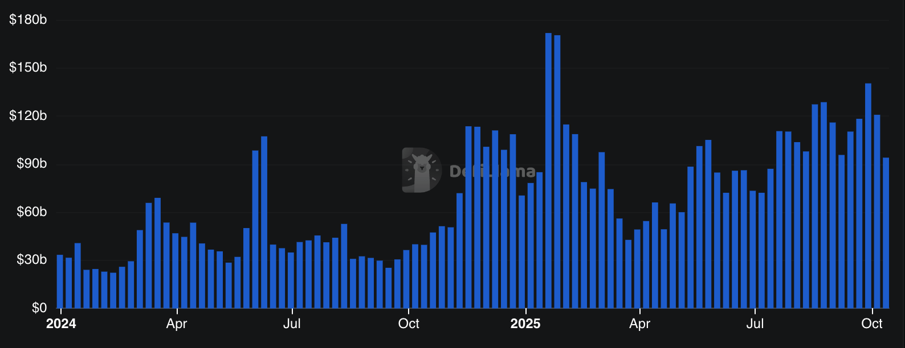{style="transform: translate(20%, 3%); width: 680px"}

- DEX efficiency actively influences discussions on blockchain design

---

# Blockchain protocol
### The blockchain protocol determines the lifecycle of transactions

* Transactions are sent to the network continuously, and stored in a memory pool
   

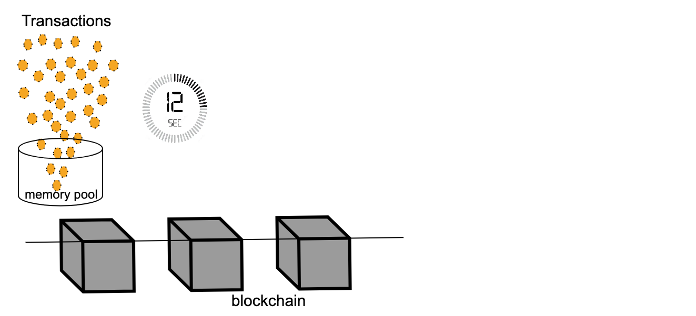{style="transform: translate(30%, 0%); width: 580px"}

---

# Blockchain protocol
### The blockchain protocol determines the lifecycle of transactions

* Transactions are sent to the network continuously, and stored in a memory pool
* At each Epoch, with length block time, a validator is chosen
  

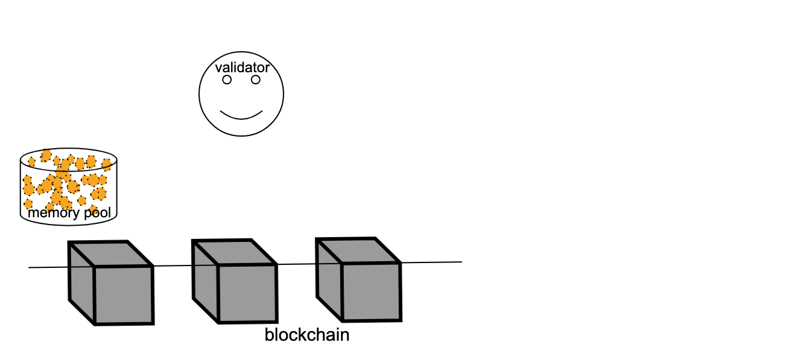{style="transform: translate(30%, 3%); width: 580px"}

<!---

#  Decentralised Exchanges

* Liquidity supply and price of liquidity
* Price dynamics-->

---

# Blockchain protocol
### The blockchain protocol determines the lifecycle of transactions

* Transactions are sent to the network continuously, and stored in a memory pool
* At each Epoch, with length block time, a validator is chosen
* The validator creates a new block with transactions from the memory pool

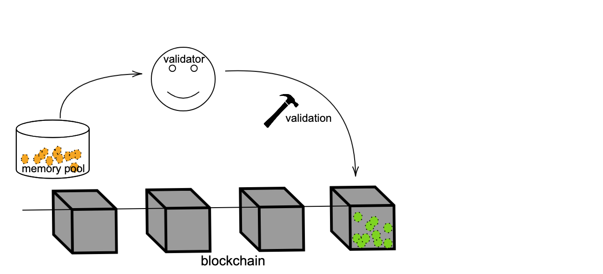{style="transform: translate(30%, 0%); width: 580px"}

---

# Blockchain protocol
#### <u>*Pre-trade transparency*</u>: agents observe pending and unconfirmed transactions
#### <u>*Priority gas auctions*</u>: agents submit/revise priority fees to compete for queue priority
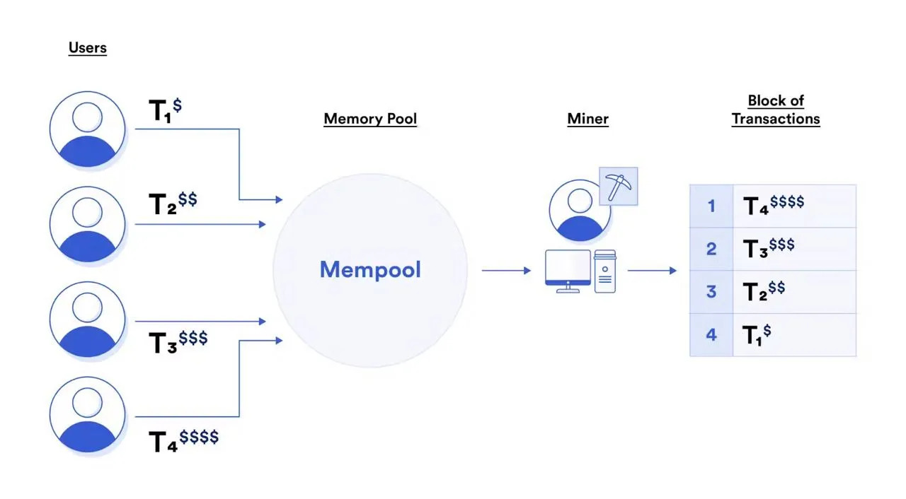{style="transform: translate(25%, 0%); width: 580px"}

---

# Contribution

1. A model to describe the microstructure of DEXs within **blockchains**

2. Charaterise the economic effects of **block time** and **priority fees** 

<!--
section: Preview

# Preview: price discovery

### Slow Information Dissemination in Blockchains

- Information is disseminated at the end of block time, when markets clear  
- In contrast to continuous information flow in traditional exchanges  
  _(Kyle, 1985; Huddart, Hughes, and Levine, 2001)_

# Preview: block time and market efficiency

### Longer block time increases speculative rewards
   
   $\implies$  incentive to acquire private information 
   
   $\implies$ prices are more efficient

# Preview: block time and liquidity

### Longer block time increases risk and rewards for liquidity providers

   $\implies$ **--** defensive liquidity supply
   
   $\implies$ **+** increased competition for priority / mitigation of adverse selection
   
   $\implies$ **+** incraesed noise trading

* There is a threshod for block time beyond which adverse selection costs outweigh the benefits of priority fees 

    $\implies$ liquidity freeze

-->
---
section: Microstructure of blockchains
---

# The market

- A DEX for a risky security $Y$ and a reference security $X$

<v-clicks>

- $V_0 = 0$: initial  price in the DEX of security $Y$ in units of $X$
-  $V$: future (random) liquidation value
- $\kappa$: liquidity supply in the DEX

</v-clicks>

---

# Execution prices in the DEX

- Execution price to **buy** a quantity $\delta$:
$$V_0 + \delta / \kappa + \pi = \delta / \kappa + \pi$$

<v-clicks>

- Cost to **buy** a quantity $\delta$: 
$$\quad \delta\left(\delta / \kappa + \pi\right)$$
- New DEX price after a buy of quantity $\delta$: 
$$V_0 + 2\,\delta / \kappa = 2\,\delta / \kappa$$
- Equivalent for sells

</v-clicks>

---

# The model: three-stage game
- <u>**stage 0**</u>: $M< L$ traders acquire information for a fixed cost $C$
  
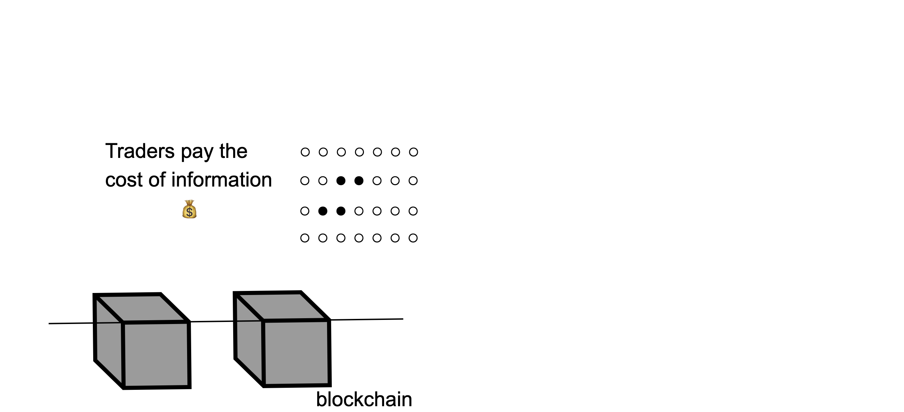{style="transform: translate(10%, 9%); width: 600px"}

---

# The model: three-stage game
- <u>**stage 0**</u>: $M< L$ traders acquire information for a fixed cost $C$
- <u>**stage 1**</u>: liquidity supplier sets the AMM’s reserves ($\equiv$ setting $\kappa$)
 
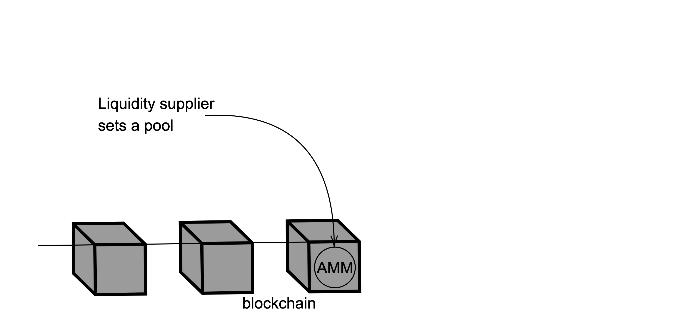{style="transform: translate(10%, 9%); width: 600px"}

---

# The model: three-stage game
- <u>**stage 0**</u>: $M<L$ traders acquire information for a fixed cost $C$
- <u>**stage 1**</u>: liquidity supplier sets the AMM’s reserves ($\equiv$ setting $\kappa$)
- <u>**stage 2**</u>: $M$ informed traders compete with priority fees (only revised upward)
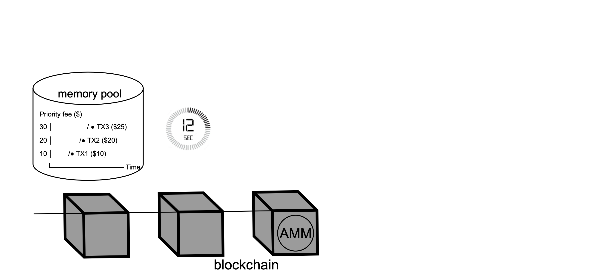{style="transform: translate(10%,0%); width: 600px"}

---

# The model: three-stage game
- <u>**stage 0**</u>: $M<L$ traders acquire information for a fixed cost $C$
- <u>**stage 1**</u>: liquidity supplier sets the AMM’s reserves ($\equiv$ setting $\kappa$)
- <u>**stage 2**</u>: $M$ informed traders compete with priority fees (only revised upward)
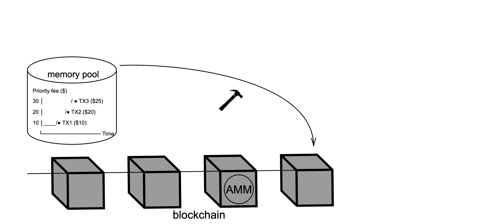{style="transform: translate(10%, 0%); width: 600px"}

---

<!--
      

<h1>
The model is solved by backward induction </h1>

      

<h1>
Stage two  
priority fees and trading volumes </h1>

-->

# <ins>Stage two</ins>: assumptions
- Number of traders $M$ and liquidity supply $\kappa$ are known
<v-clicks>

- $T$ is block time
- <u>Informed traders all are either buyers or sellers</u> (buyers in this talk)
- Competition throughout $[0, T]$: <u>English auction with a hard close</u>
- At $T$:  final opportunity to update (upward) the priority fee and trading volumes  (<u>first-price sealed-bid auction</u>)
- $v_i=\mathbb{E}_{i}\left[V\right]\in[\underline v, \overline v]$ is the <u>private</u> and <u>independent</u> signal of trader $i \in \{1,\dots,M\}$ at time $T$
- <u>In equilibrium of stage two</u>; traders set 
    * **priority fee $\varphi_i$**
    * **trading volume $\delta_i$** 

</v-clicks>

---

# <ins>Stage two</ins>: optimisation problem

- If trader $i$ wins the auction, i.e., if $\varphi_{i}>\varphi_{-i}$, the buy order is executed at $V_0 + \delta_i/\kappa + \pi$
$$\small
\mathbb E_i[W_{i}\left(\text{win}\right)]=-\varphi_{i}-\underbrace{\delta_{i}\,\left(\delta_{i}/\kappa + \pi\right)}_{\text{initial trade}}\ \ \ +\underbrace{\delta_{i}\,\mathbb E_i[V]}_{\text{inventory}}-\underbrace{C}_{\text{information cost}}
$$

<v-click>

- If trader $i$ loses, the order is placed randomly among the $M-1$ losing bids
$$\small
\mathbb E_i[W_{i}\left(\text{lose}\right)]=-\underbrace{\delta_{i}\,\left(\frac{M}{2}\times\frac{2\,\delta_{i}}{\kappa} + \delta_{i}/\kappa + \pi\right)}_{\text{initial trade}}\ \ \ +\underbrace{\delta_{i}\,\mathbb E_i[V]}_{\text{inventory}}-\underbrace{C}_{\text{information cost}}
$$

<v-click>

- The expected utility of the risk-neutral trader is
$$\small\begin{split}
\mathbb{E}_i\left[W_{i}\right]= \mathbb E_i\left[ W_{i}\left(\text{lose}\right) \right]  + \,\underbrace{p_{i}}_{\text{win prob}}\times (\underbrace{-\varphi_{i}+M\,\delta_{i}^{2}/\kappa}_{\text{surplus}})
\,,
\end{split}$$

<v-click>

- Trader $i$ solves the problem
$\quad\qquad
\sup_{\delta_i}\,\sup_{\varphi_i}\mathbb{E}_i\left[W_{i}\right]
$

- $\partial_{\delta_{i}v_{i}}\mathbb{E}_{i}\left[W_{i}\right]\ne 0,\quad \partial_{\varphi_{i}v_{i}}\mathbb{E}_{i}\left[W_{i}\right]\ne 0 \implies$ in equilibrium $\delta_i = \delta(v_i) \quad \text{and} \quad \varphi_i = \varphi(v_i)$

</v-click>
</v-click>
</v-click>

---

# <ins>Stage two</ins>: equilibrium priority fees
### FPSB auction at $T$
* The Bayesian-Nash equilibrium priority fee is
    $$
    \varphi(\delta_i)=\bigg(\underbrace{\frac{M}{\kappa}\delta_{i}^{2}}_{\text{reservation priority fee}} - \underbrace{2\,\frac{M}{\kappa}\frac{\int_{\widetilde{\delta}}^{\delta_{i}}x\,G\left(x\right)^{M-1}dx}{G\left(\delta_{i}\right)^{M-1}}}_{\text{discount}}\bigg)\,\mathbf 1_{\delta_{i} \geq \widetilde{\delta}}\,,\quad \widetilde{\varphi} = \varphi(\tilde\delta) \text{ largest bid from the online auction}
    $$

* Priority fee increasing in volume $\delta_i$, decreasing in  depth $\kappa$, increasing in number of informed traders $M$

<v-click>

 

### Online auction $[0, T]$
* Priority fee  increasing in $\widetilde \varphi$, expected payoff  decreasing in $\widetilde\varphi$
$$
\partial_{\widetilde{\varphi}}\varphi_i=\frac{4\,\widetilde{\delta}}{\kappa}\,\frac{H\left(\widetilde{\varphi}\right)}{H\left(\delta_{i}\right)} > 0\,
\qquad\qquad
\partial_{\widetilde{\varphi}}\mathbb E[W_i]=-\frac{4\,\widetilde{\varphi}}{\kappa}\,H\left(\widetilde{\varphi}\right) < 0\,
$$
* <u>**In equilibrium, traders delay bidding until the last moment**</u>

</v-click>

---
layout: two-cols-header
---

# <ins>Stage two</ins>: equilibrium priority fees
### Late bidding is observed in practice
* large priority fees are typically associated with informed trading  (Capponi, Jia, Yu 2023)
::left::

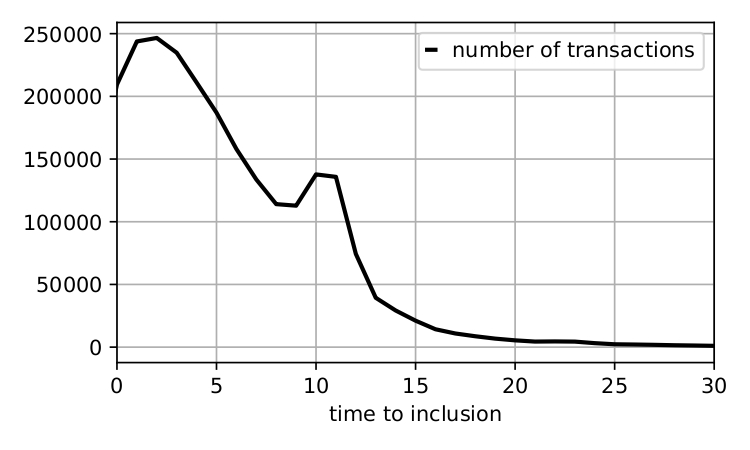{style="transform: translate(10%, -20%); width: 280px"}
$\qquad\quad$ Number of transactions.  
$\qquad\quad$ Ethereum memory pool transaction data  $\qquad\quad$ $10-16$ December $2022$ 

::right::

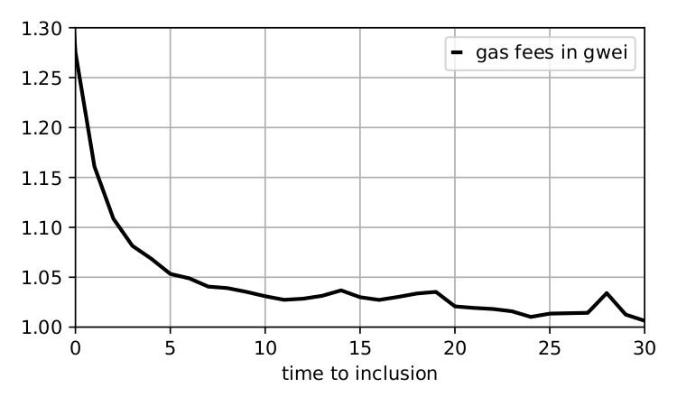{style="transform: translate(20%, -20%); width: 280px"}
$\qquad\qquad$ Level of priority fees. 
$\qquad\qquad$ Ethereum transaction data  $\qquad\qquad$ $10-16$ December $2022$ 

---

# <ins>Stage two</ins>: equilibrium volumes

$$
\delta(v_i)=\kappa\times \,\tilde{\delta}(v_i)=\underbrace{\kappa}_\text{available liq}\,\ \ \times \ \ \underbrace{\frac{v_i-\pi}{2\,\left(1+M\left(1-F\left(v_{i}\right)^{M-1}\right)\right)}}_\text{fraction transacted}\,
$$

<!--*  Signal dispersion, for fixed $v_i$ increases the probability $1-F(v_i)^{M-1}$ to lose the auction-->
<v-clicks>

* The fraction $\tilde\delta(v_i)$ increases in  signal (expected liquidation value, likelihood of winning)
* $\delta(v_i)$ decreases to zero when $M\rightarrow\infty$
* The equilibrium priority fee $\varphi(\delta(v))$, **accounting for strategically adjusted trading volumes** is
    $$
    \varphi(\delta_i) = \varphi(\delta(v_i))
    $$
    $\varphi(\delta(v_i))$ decreases to zero when $M\rightarrow\infty$

</v-clicks>

---

# <ins>Stage two</ins>: equilibrium volumes

- Higher values of private signals correspond to larger trading volumes

- They are also associated with higher priority fees and better queue positions. 

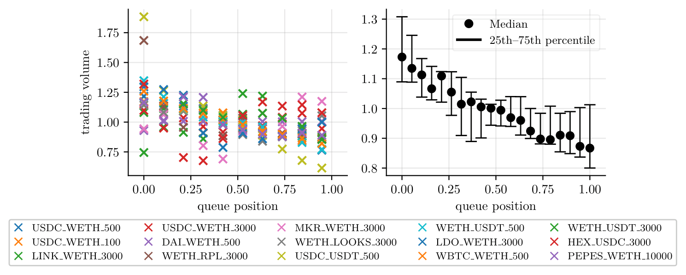{style="transform: translate(20%, 0%); width: 600px"}

Average absolute trading volume of transactions across multiple Uniswap v3 pools as a function of their queue position within the block

---

# <ins>Stage one</ins>: liquidity supply

- A risk-neutral liquidity supplier sets the supply $\kappa$ by balancing
    1. expected losses to informed traders 
    $$
     - M\, \mathbb{V}\left[{\delta}_{i}\right] \big/\kappa   =  - M\, \mathbb{V}[\tilde{\delta}_{i}]\,
    $$
    2. fee revenue from uninformed elastic demand (Garman (1976); Ho and Stoll (1981); Hendershott and Menkveld (2014))
$$\pi\,{N}\,\left(1-\theta/\kappa\right)\,$$

<v-click>

-  The equilibrium supply increases in the profitability of the uninformed trading flow, decreases in the variance of signals
$$
\kappa=\sqrt{\frac{\pi\,N\,\theta}{M\,\mathbb{V}[\tilde{\delta}_i]}} \qquad \text{and}\qquad \pi\,N-2\,\sqrt{M\,\pi\,N\,\theta\,\mathbb{V}[\tilde{\delta}_{i}]}
$$

<v-click>

* There is a limit to block time above which markets shut down (Glosten and Milgrom (1985))
$$
M\,\mathbb{V}[\tilde{\delta}_{i}] \le \frac{\pi\,N}{4\,\theta}\,
$$

</v-click>

</v-click>

---

# <ins>Stage one</ins>: liquidity supply
$$
\kappa=\sqrt{\frac{\pi\,N\,\theta}{M\,\mathbb{V}[\tilde{\delta}_i]}}
 \qquad\text{and}\qquad \tilde\delta(v_i)=\frac{v_i-\pi}{2\,\left(1+M\left(1-F\left(v_{i}\right)^{M-1}\right)\right)}
$$

- The liquidity supply **increases in the number of competing informed traders**
* The equilibrium payoff of liquidity provision
$$\pi\,N-2\,\sqrt{M\,\pi\,N\,\theta\,\mathbb{V}[\tilde{\delta}_{i}]} \underset{M\rightarrow\infty}{\longrightarrow} \pi\,N$$
<!--* For fixed signal variance, there exists $\overline M$ such that for all $M>\overline M$, markets do not shut down-->

---

<!--
# Stage one: liquidity supply
$$
\kappa=\sqrt{\frac{\pi\,N\,\theta}{M\,\mathbb{V}[\tilde{\delta}_i]}}
 \qquad\text{and}\qquad \tilde\delta(v_i)=\frac{v_i-\pi}{2\,\left(1+M\left(1-F\left(v_{i}\right)^{M-1}\right)\right)}
$$

$\implies$ Block time has two opposing effects
1. Block time increases the variance of signals $\rightarrow$ drive liquidity levels down 
2. liquidity demand accumulates $\rightarrow$ drive liquidity levels up

-->

# <ins>Stage zero</ins>: information acquisition

* As number of informed traders $M$ who pay the cost of acquiring information  grows (Grossman–Stiglitz)
    1. (weak-form) price efficiency improves
    $$
    \mathbb V[\hat V \mid \{v_1, \dots, v_M\}] = \frac{L - M}{L^2}\, \mathbb V[v] + \sigma^2,
    $$  
    2. prices are more informative, and uninformed traders trade at prices closer to the fundamental price
    $$
    \text{price impact = } M\,\mathbb{E}\left[\frac{v_{i}-\pi}{1+M\left(1-F\left(v_{i}\right)^{M-1}\right)}\right] \underset{M\rightarrow\infty}{\longrightarrow} \mathbb E[V] - \pi   \,,
    $$
<!-- Similar goal to that in Grossman and Stiglitz (1980) for traditional markets-->

---

# <ins>Stage zero</ins>: information acquisition

* The number of traders is constrained by the profitability of informed trading and the cost $C$
<v-click>

* The equilbrium $M$ is the integer part of the solution to 
$$
C=H(M)=\underbrace{\sqrt{\frac{\pi\,N\,\theta}{M\,\mathbb{V}[\tilde{\delta}\left(v_{i}\right)]}}\,\left(\frac1M \left(\mathbb{E}_{0}\left[M\, \tilde{\delta}\left(v_{(M)}\right)^{2}\right]-\mathbb{E}_{0}\left[M\,\tilde{\delta}\left(v_{(M-1)}\right)^{2}\right]\right)\right)}_\text{trading profits net of execution costs and priority fees}
$$
The function $H$ decreases to zero as $M$ goes to infinity

<v-click>

* Equilibrium number of informed traders
    * $M$ increases in the profitability of uninformed demand
    * $M$ decreases in the  information cost $C$ 

</v-click>
</v-click>

---
section: Numerical example
---

#  Effect of block time and priority fees

* CDF of the equilibrium fraction $\tilde\delta$ is uniform over $[0, D/M]$ with probability $1/2$ and $[-D/M, 0]$ with probability $1/2$
* $D=D(T)$ increasing in $T$ $\rightarrow$ longer block times $\equiv$ more variance in signals and volumes
* The equilibrium number of informed traders is such that
$$
C = \frac{\sqrt{24\,\pi\,\theta\,N\,M}}{M\left(2 + 3\,M + M^{2}\right)}\, D + \frac{\beta}{M}\,R \implies M(D) \sim D^{2/5}
$$
* The condition for markets to remain open is
$$
D^2 \leq \underbrace{\frac{3\,\pi\,N\,M}{\theta}}_{\sim D^{2/5}}\,
$$
* The equilibrium liquidity supply is
$$
\kappa^{\star}=\frac{12}{D}\,\pi\,M\,N\,\theta \sim D^{-3/5}
$$

---

# illiquid markets, expensive information
* $N = \$ 10000,  \pi =  0.3\%, \theta=0.1, R = \$ 10, C = \$ 10$

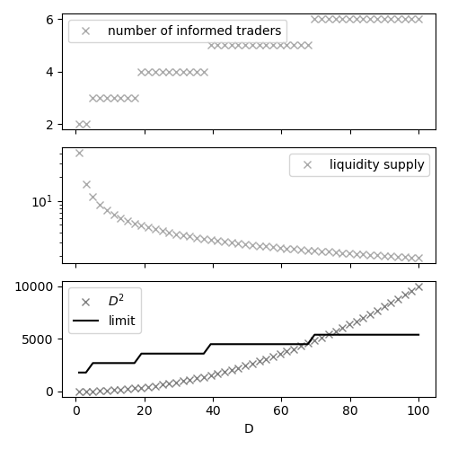{style="transform: translate(70%, 0%); width: 380px"}

---

# Liquid markets, cheap information
* $N = \$ 100000,  \pi =  0.3\%, \theta=0.05, \beta=1, R = \$ 10, C = \$ 5$

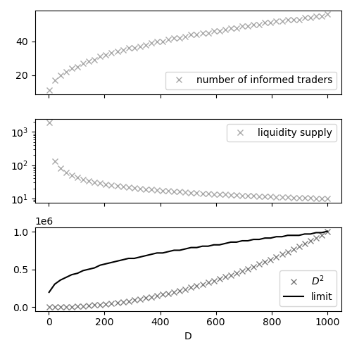{style="transform: translate(70%, 0%); width: 380px"}

---

# Effect of block time and priority fees
* If $N$ grows linearly with block time (i.e. with $D$)
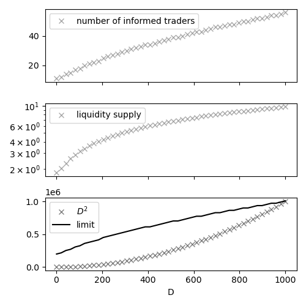{style="transform: translate(55%, 0%); width: 400px"}

---
layout: end
---
Thank you !

[faycaldrissi.com](https://www.faycaldrissi.com/)

---
section: Appendix
---

# The literature

Studies AMMs in isolation
* Lehar and Parlour (2021); Capponi and Jia (2021); Barbon and Ranaldo (2021); Cartea, Drissi, and Monga (2022); John, Kogan, and Saleh (2023)

Studies empirics of blockchain infrastrcuture
* Capponi, Jia and Yu (2024)

Studies specific aspects of blockchain infrastrcture
* private and public order flow: Capponi, Jia, and Wang (2024)
* Just-in-time liquidity attacks: Capponi, Jia, and Zhu (2024)

---

# Stage two: the online auction

* Our results are related to pre-opening and closing auctions
    * Preopening sessions are uniform price auctions (clearing prices maximise trading volume) 
    * Blockchains: discriminatory pricing subject to queue ordering
* Our findings support the *pure-noise hypothesis* of Biais, Hillion, and Spatt (1999)
* Empirical support
    * No information before the FPSB auction: Medrano and Vives (2001), Cao, Ghysels, and Hatheway (2000); Davies (2003)
    * Late bidding: Roth and Ockenfels (2002); Yang and Kahng (2006)

---

# Market frictions in Automated Market Makers

* A liquidity pool for securities $X$ and $Y$
* Available *reserves* $x$ and $y$

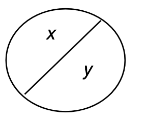{style="transform: translate(165%, 20%); width: 200px"}

---

# Automated Market Makers

### Two types of participants

* **Liquidity takers (LTs)** trade with the pool

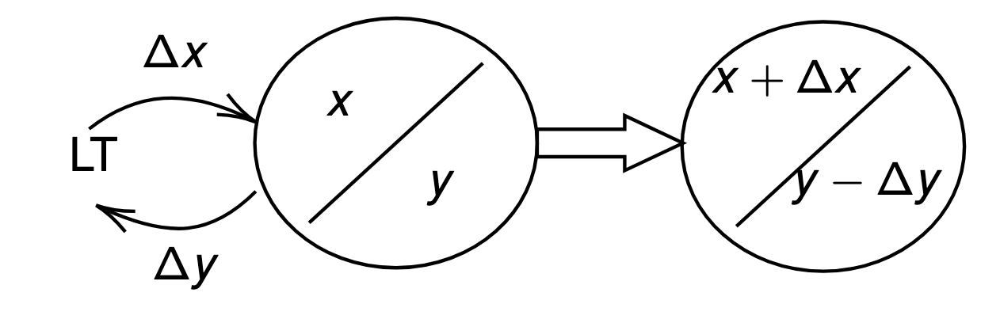{style="transform: translate(30%, 50%); width: 500px"}

---

# Automated Market Makers
### Two types of participants
* **Liquidity providers (LPs)** *deposit* assets in the pool or *withdraw* assets from the pool

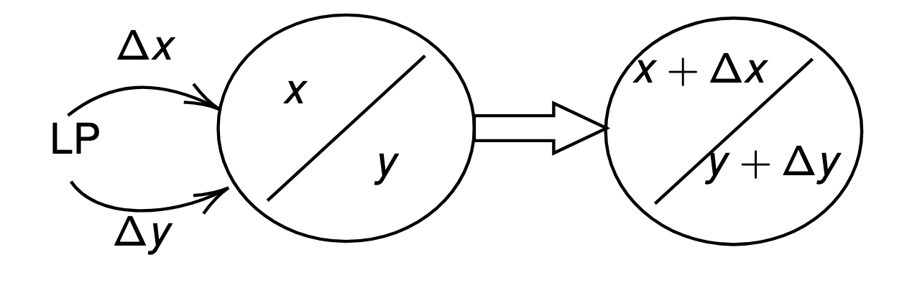{style="transform: translate(31.5%, 51%); width: 500px"}

---

# Automated Market Makers
### Economic principle: bonding curves

*  Iso-liquidity curve or indifference curve (points of same level of liquidity)
$$
\qquad
$$

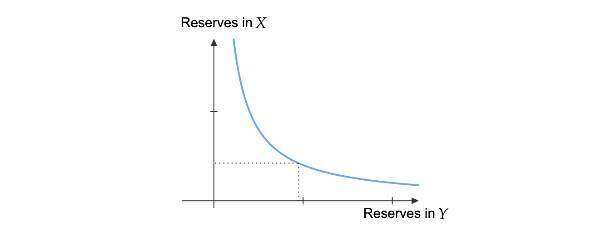{style="transform: translate(18%, 10%); width: 630px"}

---

# Automated Market Makers
### Liquidity takers

* To buy a quantity $\Delta y$, one pays
$$
\frac{\Delta x}{\Delta y} = \frac{\Phi(y-\Delta y) - \Phi(y)}{\Delta y}
$$

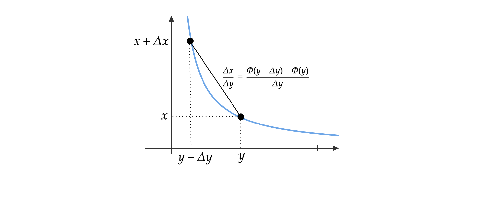{style="transform: translate(18%, 10%); width: 630px"}

---

# Automated Market Makers
### Liquidity takers

* To sell a quantity $\Delta y$, one receives
$$
\frac{\Delta x}{\Delta y} = \frac{\Phi(y) - \Phi(y+\Delta y)}{\Delta y}
$$

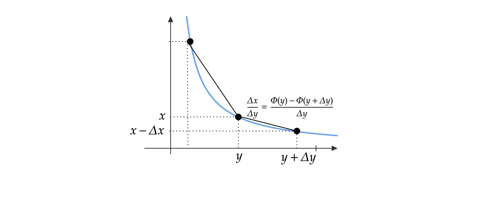{style="transform: translate(18%, 10%); width: 630px"}

---

# Automated Market Makers
### Liquidity takers
* Let $\{x, y\} = \{\Phi(y), y\}$ be the state of the pool.
* **Marginal Price** and **slippage**
$$
\underbrace{\frac{\Phi(y)-\Phi(y+\Delta y)}{\Delta y}
    }_{\text{Price to sell }\Delta y}  \xrightarrow{\Delta y \longrightarrow 0} \underbrace{Z=-\Phi'(y) }_{\text{marginal price}}\xleftarrow{0\longleftarrow \Delta y} \underbrace{\frac{\Phi(y-\Delta y)-\Phi(y)}{\Delta y}}_{\text{Price to buy }\Delta y}
$$
* **Price impact**
$$
-\Phi'(y+\Delta y)
    \xleftarrow{\text{after a sell}}  \underbrace{Z=-\Phi'(y) }_{\text{marginal price}}\xrightarrow{\text{after a buy}} -\Phi'(y-\Delta y)
$$
* Approximations
$$
\begin{cases}
\text{slippage} & \approx \frac12 \Phi''(y) \Delta y  \\
\text{impact} & \approx  \Phi''(y) \Delta y
\end{cases}
$$

---

# Automated Market Makers
### Liquidity takers
.png){style="transform: translate(30%, 0%); width: 600px"}

Scatter plots of the execution cost and the price impact of 2.622 million LT transactions against approximations. The transactions  are between January 2023 and December 2023 in 38 different Uniswap v3 pools.

---

# Automated Market Makers
### Transaction costs

* Change in wealth of LPs
$$
-\left(\Phi(y) - \Phi(y-\Delta y) - \Phi'(y)\,\Delta y\right) \approx - \frac12\, \Phi''(y)\, \Delta y^2
$$

* LPs earn proportional fees $\pi$

---

# Automated Market Makers
### Transaction costs

* Convexity determines transaction costs

* Convexity is inversely proportional to the size of the pool

$$ \kappa = 2 / \Phi''(y) $$

* Liquidity providers set the size of the pool

$$ \text{Slippage } = \delta /\kappa  $$

$$  \ \ \ \, \  \text{Impact }= 2 \, \delta /\kappa  $$

$$ \quad \ \ \, \text{LP loss } = - \delta^2 / \kappa  $$

