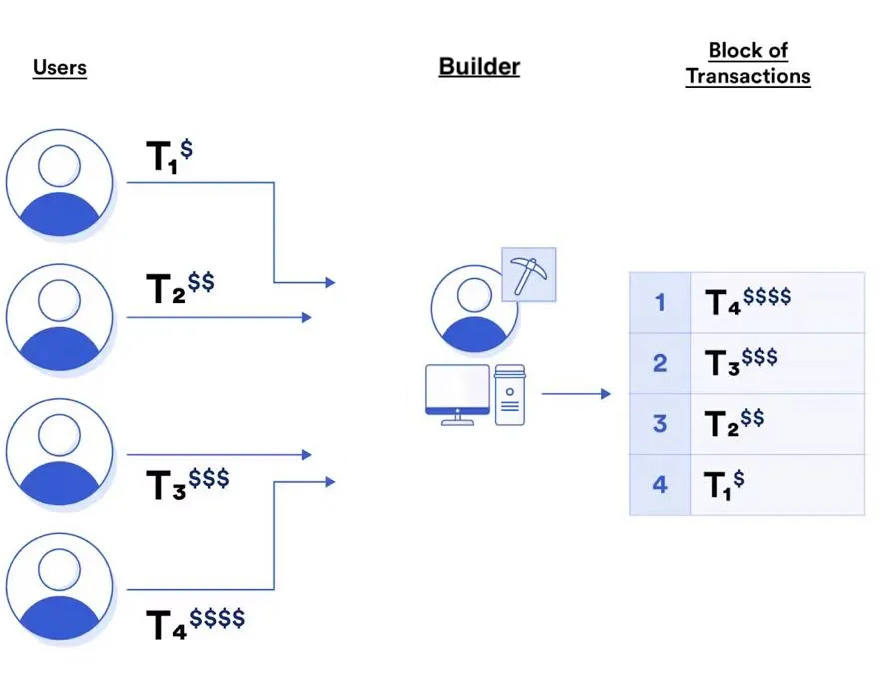
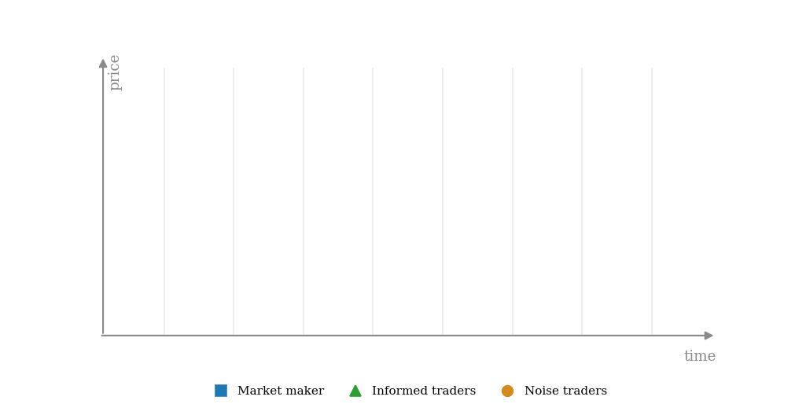
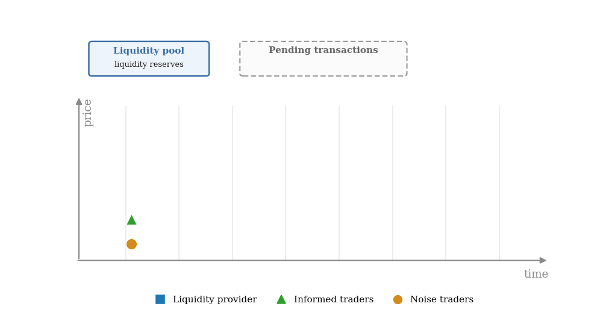
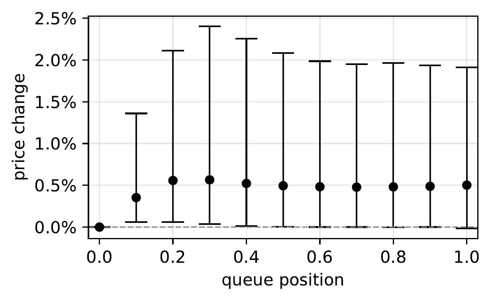

# Viability of blockchain markets

 
 

### Agostino Capponi, Álvaro Cartea, and Fayçal Drissi

 

###  NBER Summer Institute 2026 -- Financial Market Structure 

    

#### [https://www.faycaldrissi.com/mempools-talk](https://www.faycaldrissi.com/mempools-talk)

---
section: Blockchain markets
---

# Blockchains

### A distributed, digital, permissionless, tamper-resistant ledger: stores and executes transactions
- blockchains replace *institutional trust* with consensus: *algorithmic, publicly verifiable rules*

<v-click at="1">

- consensus requires **time** to secure the chain $\implies$ **block time**

</v-click>

<v-switch at="0">
<template #1>

{style="height: 250px;"}

</template>
<template #2>

{style="height: 250px;"}

</template>
<template #3>

{style="height: 250px;"}

</template>
<template #4>

{style="height: 250px;"}

</template>
<template #5>

{style="height: 250px;"}

</template>
</v-switch>

  

---

# Blockchains

### A distributed, digital, permissionless, tamper-resistant ledger: stores and executes transactions
- consensus requires economic **incentives** to compensate validators $\implies$ **priority fees**

{style="height: 300px;"}

---
layout: two-cols-header
---

# Consensus shapes microstructure 

::left::

- <u>Traditional markets</u>: continuous trading, cleared over multiple short rounds

{style="height: 250px;"}

::right::

<v-click>

- <u>Blockchain markets</u>: liquidity is in a smart contract, orders are sequenced by priority fee

{style="height: 250px;"}

 
 

</v-click>

---

# Motivation

### Blockchains promise to coordinate economic activity at scale *without intermediaries*
- trust in institutions replaced by trust in **consensus**

 
<v-click>

### Financial markets are a fundamental test

 
<v-click>

### This paper
- Can the blockchain host *viable* markets?
- consensus imposes two frictions: **discrete clearing** (block time) and **paid-priority** 
$\implies$ what does **consensus** imply for on-chain markets ?  
$\implies$  is the blockchain a good **venue for price formation**?

 
<v-click>

- how ? 
$\implies$ a model of a trading round within a **block**

</v-click>
</v-click>
</v-click>

---

# Literature

Blockchain &amp; DEX microstructure

<b style="color:#1e293b;">Equilibrium liquidity provision</b>

Park (2023, <i>MS</i>) · Malinova–Park (2024) · Hasbrouck–Rivera–Saleh (2026, <i>MS</i>) · Lehar–Parlour (2025, <i>JF</i>)

<b style="color:#1e293b;">LP losses &amp; other markets</b>

Milionis et al. (2022) · Hasbrouck–Rivera–Saleh (2023) · Cartea–Drissi–Monga (2023, 2024, <i>SIAM</i>)

<b style="color:#1e293b;">Informed liquidity provision</b>

Klein et al. (2023)

<b style="color:#1e293b;">Blockchain infrastructure (gas fees)</b>

Capponi–Jia–Yu (2024, <i>RFS</i>)

<b style="color:#1e293b;">Others</b>

Angeris–Evans–Chitra (2021) · Capponi–Iyengar–Sethuraman (2023, <i>F&amp;T</i>)

Classical microstructure

<b style="color:#1e293b;">Information monopolist</b> — Kyle (1985, <i>Econometrica</i>)

<b style="color:#1e293b;">Competition on information</b> — Holden–Subrahmanyam (1992, <i>JF</i>), Foster–Viswanathan (1996, <i>JF</i>)

<b style="color:#1e293b;">Multi-stage inventory models</b> — Biais (1993, <i>JF</i>), De Frutos–Manzano (2002, <i>JF</i>)

<b style="color:#1e293b;">Compete for queue position (not speed)</b> — O'Hara (1998, <i>book</i>)

<b style="color:#1e293b;">Information processing costs</b> — Grossman–Stiglitz (1980, <i>AER</i>), Verrecchia (1982, <i>Econometrica</i>), Kyle (1989, <i>RES</i>), Baldauf–Mollner (2020, <i>JF</i>)

<b style="color:#1e293b;">DEX ≈ parametrized price schedule in electronic markets</b> — Glosten (1994, <i>JF</i>), Biais–Martimort–Rochet (2000, <i>Econometrica</i>)

<b style="color:#1e293b;">Dealer markets / market making</b> — Ho–Stoll (1983, <i>JF</i>), Glosten–Milgrom (1985, <i>JFE</i>)

Political contests (multi-prize)

<b style="color:#1e293b;">Multi-prize contests</b>  — Lazear–Rosen (1981, <i>JPE</i>), Hillman–Riley (1989), Barut–Kovenock (1998), Klose–Kovenock (2015)

<b style="color:#1e293b;">Multi-prize contests with a fixed prize vector</b> — Moldovanu–Sela (2001, <i>AER</i>)

 

Periodic auctions for markets
 

<b style="color:#1e293b;">Uniform-price batch auctions</b> — Madhavan (1992, <i>JF</i>), Budish–Cramton–Shim (2015, <i>QJE</i>); we use discriminatory pricing, LP absent

 

Opening / closing auctions

<b style="color:#1e293b;">Information revelation accelerates toward the close</b> — Medrano–Vives (2001, <i>RAND J. Econ</i>)

<b style="color:#1e293b;">Transparency &amp; ending times of call auctions</b> — Van Bommel–Hoffmann (2011)

<b style="color:#1e293b;">Preopening price discovery &amp; learning (pure-noise hypothesis)</b> — Biais–Hillion–Spatt (1999, <i>JPE</i>)

---
section: Empirical facts
class: fact-c
---

# Fact 1 / 4 -- informed flow arrives just before block creation

Traders who submit high priority fees submit **late** 
$\ \implies\,$ Competition among informed traders is effectively **blind**

 

{style="height: 250px; margin-top: 8px;"}

Priority fee distribution as a function of submission time over a blockchain slot. &nbsp; <b>Data</b>: Ethereum public mempool, ≈10 million transactions, 20–21 March 2024 (source: EthPandaOps).

 

---
class: fact-c
---

# Fact 2 / 4 -- the largest trades come first

When price formation happens on-chain:  
absolute volume **decreases** with queue position
$\ \implies\,$ aggressive, high-volume traders secure the earliest positions
  

{style="height: 190px; margin-top: 8px;"}

Distribution of normalized absolute volume as a function of queue position. &nbsp;<b>Data</b>: 75 Uniswap v3 pools whose asset is <i>not</i> on Binance: 317,901 trades in 36,692 blocks, 2021–2026.

 

---
class: fact-c
---

# Fact 3 / 4 -- top of the block is one-sided

- Early trades take the same direction
- Back of block $\to$ two-sided **noise**   
$\implies\,$ informed traders do not hide with noise

  

{style="height: 205px;"}

<v-click>

{style="height: 205px;"}

</v-click>

---
class: fact-c
---

# Fact 4 / 4: prices overshoot on the blockchain

higher standard deviation (all 8 assets) and 99th percentile (most) of the absolute one-block return
  $\implies$ price changes in blockchain markets are more extreme

 

<table class="overshoot-tbl" style="font-size:0.72em;">
<thead>
<tr>
<th style="text-align:left;">Asset</th>
<th colspan="2" class="cmid">Blockchain (bp)</th>
<th colspan="2" class="cmid">Binance (bp)</th>
</tr>
<tr>
<th></th><th>std</th><th>99%</th><th>std</th><th>99%</th>
</tr>
</thead>
<tbody>
<tr><td>ETH/BTC</td><td><b>7.72</b></td><td><b>30.71</b></td><td>6.00</td><td>23.26</td></tr>
<tr><td>ETH</td><td><b>8.71</b></td><td><b>29.86</b></td><td>6.87</td><td>26.10</td></tr>
<tr><td>BTC</td><td><b>24.94</b></td><td><b>89.33</b></td><td>17.83</td><td>69.27</td></tr>
<tr><td>LINK</td><td><b>27.35</b></td><td><b>79.51</b></td><td>13.45</td><td>48.35</td></tr>
<tr><td>UNI</td><td><b>29.41</b></td><td><b>81.29</b></td><td>18.29</td><td>78.74</td></tr>
<tr><td>APE</td><td><b>36.34</b></td><td>99.50</td><td>28.63</td><td><b>108.52</b></td></tr>
<tr><td>MATIC</td><td><b>43.07</b></td><td><b>99.61</b></td><td>18.77</td><td>73.19</td></tr>
<tr><td>1INCH</td><td><b>84.11</b></td><td><b>182.40</b></td><td>34.84</td><td>119.70</td></tr>
</tbody>
</table>

Distribution of absolute one-block returns in bp (1 Jan 2021 – 31 Dec 2023). &nbsp;<b>Data</b>: 8 assets priced both on-chain (Uniswap v3) and on Binance: ETH/BTC 148,624 trades · ETH 1,703,611 · BTC 24,967 · LINK 31,663 · UNI 14,606 · APE 41,902 · MATIC 13,928 · 1INCH 3,751.

 

---
section: Model
---

# Model

### A static, three-stage game

Stage 1 · Entry

M traders pay information cost C

→

Stage 2 · Liquidity

supplier sets reserves L

→

Stage 3 · Trading (PGA)

informed traders set priority fees Φ and volumes Q

  

<v-click>

### Solved backward

① priority fees Φ

→

② volumes Q

→

③ liquidity L

→

④ entry M

</v-click>

---
layout: two-cols-header
---

# Execution prices

::left::

#### <u>**Linear price schedule**</u>: buying a quantity $Q$ executes at

$$ \underbrace{Q/L}_{\text{slippage}} \;+\; \underbrace{\pi}_{\text{fee}}$$
<!--\qquad\implies\qquad\text{cash paid } = Q\,(Q/L + \pi)-->
Larger liquidity $L$ $\implies$ smaller slippage

<v-click>

   

#### <u>**Linear price update rule**</u>: After a buy of size $Q$, the marginal price moves to

$$ 
\underbrace{2\,Q/L}_\text{price impact}
$$

Larger liquidity $L$ $\implies$ smaller impact

  

</v-click>

::right::

<v-click>

#### <u>**Why compete ?**</u>

- Trader 1 buys $Q_1$ first, then trader 2 buys $Q_2$

block

<b>Trader 1</b> buys Q1

<b>Trader 2</b> buys Q2

execution order →

<v-click>

- Trader 1 pays 
$$Q_1/L + \pi\quad\text{per unit}$$

<v-click>

- Trader 2  pays 
$$\underbrace{2Q_1/L}_{\text{impact from trader 1}} \,+\, \underbrace{Q_2/L}_{\text{own slippage}} \,+\, \pi \quad\text{per unit}$$

</v-click>
</v-click>
</v-click>

---
section: Results
layout: two-cols-header
---

# ① priority fees → ② volumes → ③ liquidity → ④ entry <i>M</i>

### <u>Setup</u>
- $M$ buying traders with private volumes $\,Q_i \in [0, \overline  Q] \sim G$
- DEX liquidity $L$

<v-click>
 

###  <u>Expected wealth</u>

$$
\boxed{\mathbb E_i[W_i]=  \underbrace{Q_i\,v_i}_{\text{trading profit}} - \underbrace{Q_i\big(\dfrac{Q_i}{L}+\pi\big)}_{\text{slippage \& DEX fee}} - \underbrace{\Phi_i}_{\text{priority fee}} -\ \ \underbrace{\dfrac{2Q_i}{L}\sum_{j=0}^{M-1}\mathbb E_i\big[\mathbf 1_{\Phi_{(j)}<\Phi_i<\Phi_{(j+1)}}\,\Delta_{(j+1:M-1)}\big]}_{\text{adverse impact of competitors}} - \underbrace{C}_{\text{information cost}}}
$$

<svg viewBox="0 0 600 72" preserveAspectRatio="none" style="width: 100%; height: 70px; display: block;">
  <path d="M 0 64 L 35 64 L 35 51 L 105 51 L 105 39 L 175 39 L 175 28 L 245 28 L 245 18 L 600 18" stroke="#334155" stroke-width="1.6" fill="none" vector-effect="non-scaling-stroke"/>
  <text x="4" y="12" style="font-size: 8px;" fill="#444">price</text>
</svg>

block

  
txn 1 · Φ(1)

  
txn 2 · Φ(2)

  
⋯

  
txn N · Φ(N)

  
fee = 0

</v-click>

---

# ① priority fees → ② volumes → ③ liquidity → ④ entry <i>M</i>

### <u>Trader $i$ chooses the priority fee $\Phi_i$</u>

 

$$\sup_{\Phi_i}\ \Bigg\{\ -\underbrace{\Phi_i}_{\text{priority fee}}\ +\ \underbrace{\dfrac{2Q_i}{L}\,(M-1)\!\int_0^{\,\Phi^{-1}(\Phi_i)}\! x\,dG(x)}_{\text{surplus }=\text{ avoided impact}}\Bigg\}$$

- the surplus grows with volume $Q_i$, with the number of competitors $M$, and with thinner liquidity $L$

<v-click>

  

### Equilibrium fee

1. larger volume $Q$ $\Rightarrow$ larger fee $\Phi^\star(Q)$
2. priority fees increase with **competition** $M$ and **fall with liquidity** $L$

</v-click>

---

# ① priority fees → ② volumes → ③ liquidity → ④ entry <i>M</i>

### <u>Setup</u>
- $M$ buying traders with private valuations $\,v_i \in [0, \overline  v] \sim F$
- DEX liquidity $L$

 
 

<v-click>

### <u>Trader $i$ chooses volume $Q_i$, anticipating the fee </u>
 

$$\sup_{Q_i}\ \Bigg\{\underbrace{Q_i(v_i-\pi)}_{\text{profit}}-\underbrace{Q_i^2/L}_{\text{slippage}}-\underbrace{\Phi^\star(Q_i)}_{\text{priority fee}}-\underbrace{\dfrac{2Q_i}{L}(M-1)\!\int_{v_i}^{\overline v}\! x\,dF(x)}_{\text{impact of trades with better queue positions}}\ \Bigg\}$$

- profit incentivises **higher** volume $Q_i$
- slippage, fees, and impact incentivise **lower**  $Q_i$

</v-click>

---

# ① priority fees → ② volumes → ③ liquidity → ④ entry <i>M</i>

#### Equilibrium volume

- increasing in valuation $v$ and liquidity $L$
- decreasing in number of traders $M$

 

  

<v-click>

#### Endogenous selection

- Only aggressive traders trade: there is a participation cutoff $\underline v(M)$

- the cutoff **rises with competition** and $\ \lim_{M\to\infty}\underline v(M)=\overline v$

</v-click>

---

# ① priority fees → ② volumes → ③ liquidity → ④ entry <i>M</i>

### <u>Consequences</u>
- Information is **truncated** as competition increases

 
<v-click>

- end-of-block price is pushed to extremes as competition increases 
$$\quad \lim_{M\to\infty}\underbrace{\dfrac{M(\underline v(M)-\pi)}{M-1}}_{\text{end-of-block price}\ }\ \ =\ \ \overline v-\pi$$

</v-click>

---

# ① priority fees → ② volumes → ③ liquidity → ④ entry <i>M</i>

### <u>Liquidity provision is competitive</u>

$$\underbrace{\pi N\,\dfrac{L}{L+\theta}}_{\text{fee revenue from noise demand}}\qquad=\qquad \underbrace{L\,A(M)}_{\text{adverse-selection}}$$

- deeper liquidity $L$ earns more fees 
- deeper liquidity $L$ scales up  informed positions → more adverse selection
- more informed traders  → more adverse selection

---

# ① priority fees → ② volumes → ③ liquidity → ④ entry <i>M</i>

### Equilibrium liquidity

$$L^\star(M)=\underbrace{\frac{\pi N}{A(M)}}_{\text{noise revenue / adverse selection}}\ -\ \underbrace{\theta}_{\text{demand price-sensitivity}}$$

- $L^\star(M)$ decreases in $M$ $\rightarrow$ competition **reduces liquidity** (Holden–Subrahmanyam, 1992, JF)

- market viability condition (Glosten–Milgrom, 1985, JFE) 

$$A(M)\ \le\ \dfrac{\pi N}{\theta}$$

---

# ① priority fees → ② volumes → ③ liquidity → ④ entry <i>M</i>

### Before seeing valuations, a trader pays $C$ iff expected profit covers it

$$\boxed{\underbrace{H(M)}_{\text{ex-ante profit per informed trader}}=L^\star(M)\!\int_{\underline v(M)}^{\overline v}\!\tilde Q(v)^2\,\underbrace{\big[\,1-2(M-1)(1-F(v))\,\big]}_{\text{own profit}\ - \ \text{losses due to competitors}}\,dF(v)}$$

  

### Equilibrium number of traders
- $M^\star$ increases in noise $N$ 
- $M^\star$ decreases in information cost $C$

---

# ① priority fees → ② volumes → ③ liquidity → ④ entry <i>M</i>

### The information paradox

$$\underbrace{C\downarrow\ \ }_{\text{cheaper info}}\ \Rightarrow\ \underbrace{M\uparrow}_\text{more traders}\ \Rightarrow\ \underbrace{\underline v(M)\uparrow\ }_\text{higher cutoff} \Rightarrow\ \underbrace{\text{less information revealed, prices more biased}}_{\text{efficiency deteriorates}}$$

---

# Block time

### <u>Block time $T$: length of a trading round</u>
- time needed to run **consensus** (Ethereum $\approx 12$s)
- a primitive **specific to blockchains**

 

<v-click>

### <u>A longer block reshapes two primitives</u>
- **valuations dispersion** 
  - more time $\Rightarrow$ larger price moves $\Rightarrow$  extreme valuations  more likely
  - execution over a long block is riskier for the uninformed $\Rightarrow$ **noise trading thins**

</v-click>

---

# Block time

### <u>A longer block amplifies every friction</u>
- the participation cutoff $\underline v(T)$ **rises**: information is more truncated 
<v-click>

- the end-of-block price is pushed **further to the extreme**
<v-click>

- **liquidity** and **entry** $M^\star$ both fall
<v-click>

- **beyond a critical block time the market shuts down**

 

<v-click>

### <u>Security vs. market efficiency</u>
- longer blocks **secure consensus** and preserve **decentralization**
- yet they **undermine the market**

</v-click>
</v-click>
</v-click>
</v-click>

---
section: Conclusion
layout: end
---

**Takeaway:** The features that secure decentralization (**block time** and **paid priority**) undermine the blockchain as a venue for **price formation**.

<v-click>

Thank you !

 

Capponi, Cartea, and Drissi (2025), *The Viability of Blockchain Markets under Discrete Clearing and Paid Priority*

 

These slides: [www.faycaldrissi.com/mempools-talk](https://www.faycaldrissi.com/mempools-talk)

</v-click>
