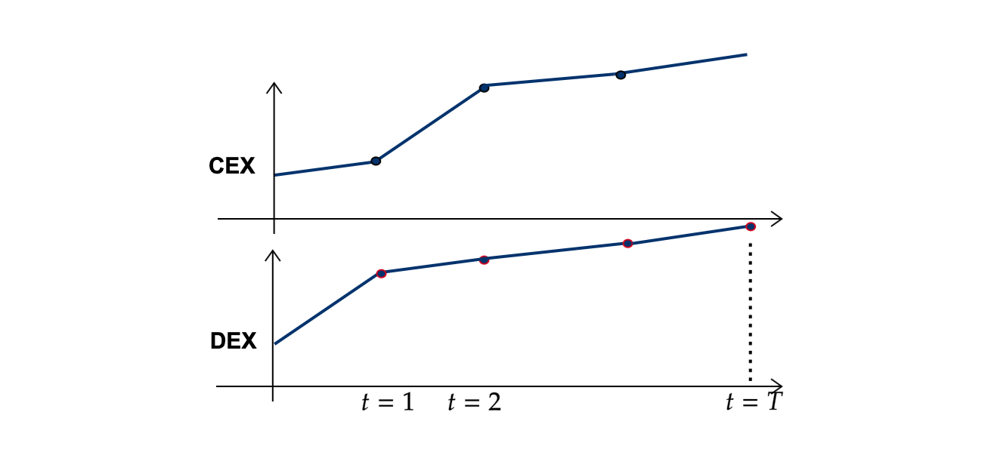

# Price Formation in Memory Pools

Alvaro Cartea, Agostino Capponi, **Fayçal Drissi**

*University of Oxford*

**6 January 2025**

---

# Table of Contents
 

1. [Price formation in DeFi](#defi)
 

2. [Priority Gas Auctions](#PGA)  
<!---    1. [Sub paragraph](#subparagraph1)--->
3. [Proof-Of-Stake blockchains](#paragraph2) 

4. [Proof-Of-Work blockchains](#paragraph2)

---

      

<h1>
Price formation in DeFi </h1>

---

# Price formation in blockchains: two levels
 

### Decentralised exchanges

* Liquidity depth and price of liquidity

 
 

### Blockchains and memory pools

* Information dissemination and infrastructure costs

---

# Decentralised Exchanges
 

### Trading venues *running* on blockchains

* Extremely expensive to run LOBs.
* Solution: Automated Market Makers (AMMs).
 
 

---

# Decentralised Exchanges
 

### Trading venues *running* on blockchains

* Extremely expensive to run LOBs.
* Solution: Automated Market Makers (AMMs).
 
 

### Automated Market Makers

* A liquidity pool for Security $X$ and $Y$.
* Available liquidity of *reserves*: $x$ and $y$.
* Two types of participants: liquidity takers (LTs) and liquidity providers (LPs).

---

# Decentralised Exchanges
 

### Liquidity takers trade with the pool

---

# Decentralised Exchanges
 

### Liquidity providers *deposit* assets in the pool or *withdraw* assets from the pool

---

## Blockchains
 

### Memory pools
* Memory pool: a repository for unconfirmed transactions
* After an agent initiates a new transaction, it is broadcast to the network and stored in the mempools of various nodes
* Transactions wait to be selected by a miner and included in a block

---

## Blockchains
 

### Memory pools
* Memory pool: a repository for unconfirmed transactions
* After an agent initiates a new transaction, it is broadcast to the network and stored in the mempools of various nodes
* Transactions wait to be selected by a miner and included in a block
 
 

### Trading frictions and gas fees (EIP-1559, Ethereum London fork)
* **Base fee**: based on congestion. prerequisite for inclusion
    * burned
* **Tip (priority fee)**: to incentivise a miner / encourage special treatment
    * transferred to miner

---

## Memory pools

* **Block time**: window during which users submit to transactions before a miner is chosen to create the block

---

## Consequences
 

### Pre-trade transparency
* Agents observe pending but unconfirmed transactions
* Competitive agents enter “priority gas auctions” (PGAs)
    * Traders submit/revise priority gas fees to obtain better prices.

---

## Consequences
 

### Pre-trade transparency
* Agents observe pending but unconfirmed transactions
* Competitive agents enter “priority gas auctions” (PGAs)
    * Traders submit/revise priority gas fees to obtain better prices.
 
 

### Price discovery
* Additional vehicle for price discovery in blockchains:  priority fees

---

# Illustration of trading mechanisms

---

# Illustration of trading mechanisms

---

# Illustration of trading mechanisms

---

# Research questions
   

1. What is the impact of pre-trade transparency on price discovery ?  
2. What are the effects on infrastructure costs ?  
3. Are current memory pools a good design for markets ? Can we improve price efficiency and reduce infrastructure costs ?

---

      

<h1>
Priority Gas Auctions: a first model </h1>

---

## Assumptions and market
* Trading is conducted in an AMM for a pair of securities $X$ and $Y$ 
    * Trading function $\Phi$
    * Initial liquidity supply $y_0$

---

## Assumptions and market
* Trading is conducted in an AMM for a pair of securities $X$ and $Y$ 
    * Trading function $\Phi$
    * Initial liquidity supply $y_0$

## Execution prices
* For a volume $\delta$, the execution price is
$$
\tilde V(\delta) = \frac{\Phi(y_0-\delta)-\Phi(y_0)}{\delta}
$$
* Marginal price
$
\qquad \qquad \qquad \qquad V_0 = \lim_{\delta\rightarrow 0}\tilde V(\delta) = -\Phi'(y_0)
$
* Slippage
$$
\tilde V(\delta)-V_0 =  \frac{\Phi(y_0-\delta)-\Phi(y_0)}{\delta} + \Phi'(y_0) \approx \frac12 \,\delta\, \Phi''(y_0) = k\,\delta
$$

---

## Execution prices
  

* Following a trade with volume $\delta$, the price impact on the marginal price is
$$
-\Phi'(y_0-\delta) + \Phi'(y_0)  \approx 2\,\delta\, k.
$$
* Execution price for a subsequent trade with volume $\delta$
$$
V_0 + 2\,k + k = V_0 +3\, k
$$
 

---

## Competition for execution priority
 

#### Assumptions on the market

* Two informed traders $i$ and $j$ compete to buy $Y$
* They receive private information $v_i>0$ and $v_j>0$ about the liquidation value
* They wish to buy volumes $\delta_i = \delta(v_i)$ and $\delta_j = \delta(v_j)$
* The demand function $\delta$ is continuously differentiable and increasing.
* They submit priority fees $\varphi_i$ and $\varphi_j$ **per unit of security traded** at the end of block time
* They employ price limits: if denied priority, priority fee is zero
  

---

## Competition for execution priority
 

#### Assumptions on information
* The signals are independently drawn from an interval $[0, \overline{v}]$ according to a density $f$.
* The volumes $\delta_i$ are drawn from $[\delta(0),\delta(\overline v)]=[\underline \delta,\overline \delta]$ according to  $g(x) = f\left(\delta^{-1}\left(x\right)\right)\Big/\delta^{'}\left(\delta^{-1}\left(x\right)\right).$
  

#### Competition
* The order of the trader with priority in the block is executed at a price $V_0 + k\,\delta$
* The order of the other trader will be executed at a price $V_0 + 3\,k\,\delta$

---

## Competition for execution priority
  

* If trader $i$ wins the auction, i.e., if $\varphi_{i}>\varphi_j$, their wealth is
$$
W_{i}\left(\text{win}\right)=-\delta_{i}\,\varphi_{i}\,\underbrace{-\delta_{i}\,\left(V_{0}+k\,\delta_{i}\right)}_{\text{initial trade}}\underbrace{+\delta_{i}\,V}_{\text{liquidation value}}
=-\delta_{i}\,\varphi_{i}\,-k\,\delta_{i}^{2}+\delta_{i}\,V
$$
  

* If trader $i$ loses the auction, i.e., if $\varphi_{i}<\varphi_j$, their wealth is
$$
W_{i}\left(\text{lose}\right)=\underbrace{-\delta_{i}\,\left(v_{0}+3\,k\,\delta_{i}\right)}_{\text{initial trade}}\ \underbrace{+\delta_{i}\,V}_{\text{inventory value}}
 =-3\,k\,\delta_{i}^{2}+\delta_{i}\,V
$$

---

## Competition for execution priority
  

* Let $V_i = \mathbb E[V\mid v=v_i ]= V(v_i)$ denote the expected value of $V$ from the perspective of trader $i$.
* The expected wealth is 
$$
\mathbb{E}\left[W_{i}\right]= P_{i}\,\mathbb E[W_{i}\left(\text{win}\right)] + (1-P_{i})\,\mathbb E[W_{i}\left(\text{win}\right)] = P_{i}\,\delta_i\,\left(-\varphi_{i}+2\,k\,\delta_{i}\right)-3\,k\,\delta_{i}^{2}+\delta_{i}\,V_{i}
$$
 $\qquad\qquad\qquad\qquad\qquad\qquad\qquad\text{where } P_i=\mathbb E_i\left[\varphi_i>\varphi_j\right]$
  

* The optimisation problem of trader $i$
$$
U_{i}=\sup_{\varphi_{i}}\left\{ P_{i}\,\left(-\varphi_{i}+2\,k\,\delta_{i}\right)\right\} \,,
$$
  

---

## Competition for execution priority
  
* The equilibrium priority fee 
$$
\varphi^\star_i=2\,k\,\left(\delta_{i}-\frac{\int_{\underline{\delta}}^{\delta_{i}}G\left(x\right)\,dx}{G\left(\delta_{i}\right)}\right)=2\,k\,\left(\delta\left(v_{i}\right)-\frac{\int_{0}^{v_{i}}\delta^{'}\left(x\right)\,F\left(x\right)\,dx}{F\left(v_{i}\right)}\right)\,
$$
 

---

## Competition for execution priority
  
* The equilibrium priority fee 
$$
\varphi^\star_i=2\,k\,\left(\delta_{i}-\frac{\int_{\underline{\delta}}^{\delta_{i}}G\left(x\right)\,dx}{G\left(\delta_{i}\right)}\right)=2\,k\,\left(\delta\left(v_{i}\right)-\frac{\int_{0}^{v_{i}}\delta^{'}\left(x\right)\,F\left(x\right)\,dx}{F\left(v_{i}\right)}\right)\,
$$
 

* Priority fees are increasing in  
the signal value and the trading volume
{style="transform: translate(-10%, 10%); width: 600px"}

* For fixed demand functions,   priority fees are decreasing in the depth  of liquidity
  

---

## Trading volume of informed traders

* Trader $i$ solves the following problem
$$
J_{i}=\sup_{\delta_{i}}\Bigg\{P_{i}\,\left(-\delta_{i}\,\varphi_{i}^\star+2\,k\,\delta_{i}^{2}\right)-3\,k\,\delta_{i}^{2}+\delta_{i}\,V_{i}\Bigg\}\,.
$$

---

## Trading volume of informed traders

* Trader $i$ solves the following problem
$$
J_{i}=\sup_{\delta_{i}}\Bigg\{P_{i}\,\left(-\delta_{i}\,\varphi_{i}^\star+2\,k\,\delta_{i}^{2}\right)-3\,k\,\delta_{i}^{2}+\delta_{i}\,V_{i}\Bigg\}\,.
$$
* In equilibrium, the volume is
$$
\delta^\star\left(v_{i}\right)=\frac{V\left(0\right)\sqrt{3}+6\,\int_{0}^{v_{i}}\frac{V(x)}{\sqrt{3-2\,F(x)}}dx}{6\,k\,\sqrt{3-2\,F(v_{i})}}\,
$$
{style="transform: translate(-10%, 25%); width: 500px"}
 
* The trading volume is **increasing** in   the **signal** and  in **the liquidity depth**  (similar to traditional markets)

---

## Total priority fees of informed traders
  

* The total priority fee is 
$$
\delta_{i}^{\star}\times\varphi_{i}^{\star}=2\,k\,\left(\delta^{\star}\left(v_{i}\right)^{2}-\delta^{\star}\left(v_{i}\right)\frac{\int_{0}^{v_{i}}\delta^{'}\left(x\right)\,F\left(x\right)\,dx}{F\left(v_{i}\right)}\right)
$$

* The depth of liquidity drives market frictions of informed traders up

$$
\partial_{k} \{\delta_{i}^{\star}\times\varphi_{i}^{\star}\}<0.
$$
 

---

## When signals are uniform and $V=v_i + v_j$
  

* The trading volume

$$
\delta^{\star}\left(v_{i}\right)=\frac{\overline{v}}{2\,k}\left(\frac{7\sqrt{3\,\overline{v}}}{6\sqrt{3\,\overline{v}-2\,v_{i}}}-1\right)\in\left[\frac{\overline{v}}{12},\frac{\overline{v}}{2}+0.01\,\overline{v}\right]
$$

* The total priority fee

$$
\varphi^{\star}\left(v_{i}\right)=\frac{\overline{v}^{2}}{2\,k}+\frac{7\,\overline{v}^{2}}{24\,k\,v_{i}}\left(\frac{\sqrt{3\,\overline{v}}}{\sqrt{3\overline{v}-2\,v_{i}}}\left(13\overline{v}-6v_{i}\right)-13\,\overline{v}\right)
$$

* The total priority fee is **increasing in the signal variance**

* **In practice:** cryptocurrencies are volatile, large price fluctuations observed in Binance provide large signals, and liquidity supply is significant (noise LPs).
---

      

<h1>
Liquidity depth </h1>

---

# Liquidity depth
  

### Assumptions

*  A risk-neutral liquidity supplier provides liquidity with a transaction sent in the preceding block

* The fee rate in the pool is $\pi$

*  The LP does not have information about $V$ and assumes $v_i$ and $v_j$ are drawn from $[-\overline v, \overline v]$

* The LP balances losses to informed traders from adverse selection with fee revenue from noise traders

* Noise traders submit transactions with an absolute total volume $N$ which nets to zero

* Let $\kappa = 1/k$ denote the depth of liquidity

---

### Losses to informed traders

$$
\text{IL} \approx - \frac{1}{\kappa}\, \mathbb E[(\delta^\star(v_i) + \delta^\star(v_j))^2]
= \kappa \, I(\overline v)
$$

* IL is increasing the liquidity depth

 

---

### Losses to informed traders

$$
\text{IL} \approx - \frac{1}{\kappa}\, \mathbb E[(\delta^\star(v_i) + \delta^\star(v_j))^2]
= \kappa \, I(\overline v)
$$

* IL is increasing the liquidity depth

 

### Price-sensitive noise trading 

*  We assume that not all of this flow necessarily reaches the DEX (Uniswap router)

* The fee revenue from noise trading is
$$
\pi\,N\,\frac{1}{1+k\,s}\,,
$$

* ${1}/{1+k\,s}$ is a sensitivity function. $s$ measures the sensitivity  to the price of liquidity.
    * For a fixed noise volume, higher values of $s$ indicate that attracting the volume requires more depth
    * For example, capturing half of the noise volume in the AMM requires a liquidity depth  $1/k = s$.

---

### The optimisation problem

$$\sup_{\kappa}\left\{ \pi\,N\,\frac{\kappa}{\kappa+s}-\frac{1}{2\,k}\,\mathbb{E}\left[\left({\delta}_{i}\left(v_{i}\right)+{\delta}_{i}\left(v_{j}\right)\right)^{2}\right]\right\} $$

### The equilibrium liquidity depth

$$\kappa^\star=\sqrt{\frac{2\,\pi\,N}{\mathbb{E}\left[\left(\tilde{\delta}_{i}\left(v_{i}\right)+\tilde{\delta}_{i}\left(v_{j}\right)\right)^{2}\right]}}-s\,, \quad \text{If signals are unif. }\& \ V=v_i+v_j: \ \ \kappa^\star=\frac{1}{\overline{v}}\sqrt{\frac{3\,\pi\,N}{4}}-s$$

---

### The optimisation problem

$$\sup_{\kappa}\left\{ \pi\,N\,\frac{\kappa}{\kappa+s}-\frac{1}{2\,k}\,\mathbb{E}\left[\left({\delta}_{i}\left(v_{i}\right)+{\delta}_{i}\left(v_{j}\right)\right)^{2}\right]\right\} $$

### The equilibrium liquidity depth

$$\kappa^\star=\sqrt{\frac{2\,\pi\,N}{\mathbb{E}\left[\left(\tilde{\delta}_{i}\left(v_{i}\right)+\tilde{\delta}_{i}\left(v_{j}\right)\right)^{2}\right]}}-s\,, \quad \text{If signals are unif. }\& \ V=v_i+v_j: \ \ \kappa^\star=\frac{1}{\overline{v}}\sqrt{\frac{3\,\pi\,N}{4}}-s$$

* The liquidity depth is increasing in the fee rate $\pi$ and the noise volume $N$, and decreasing in informed trading flow and the sensitivity $s$ 

* Conditions for the viability of liquidity provision: the fee revenue must exceed the losses to informed traders.

    * All else being equal, as the sensitivity parameter $s$ increases, the viability of liquidity provision necessitates either more noise trading flow or higher fee rates.

---

### The optimisation problem

$$\sup_{\kappa}\left\{ \pi\,N\,\frac{\kappa}{\kappa+s}-\frac{1}{2\,k}\,\mathbb{E}\left[\left({\delta}_{i}\left(v_{i}\right)+{\delta}_{i}\left(v_{j}\right)\right)^{2}\right]\right\} $$

### The equilibrium liquidity depth

$$\kappa^\star=\sqrt{\frac{2\,\pi\,N}{\mathbb{E}\left[\left(\tilde{\delta}_{i}\left(v_{i}\right)+\tilde{\delta}_{i}\left(v_{j}\right)\right)^{2}\right]}}-s\,, \quad \text{If signals are unif. }\& \ V=v_i+v_j: \ \ \kappa^\star=\frac{1}{\overline{v}}\sqrt{\frac{3\,\pi\,N}{4}}-s$$

* Competition in memory pools reduces informed volume $\implies$  cheaper liquidity for noise traders.

* As we will see: this is at the cost of decreased price efficiency and increased infrastructure costs. 

--- 

### The optimisation problem

$$\sup_{\kappa}\left\{ \pi\,N\,\frac{\kappa}{\kappa+s}-\frac{1}{2\,k}\,\mathbb{E}\left[\left({\delta}_{i}\left(v_{i}\right)+{\delta}_{i}\left(v_{j}\right)\right)^{2}\right]\right\} $$

### The equilibrium liquidity depth

$$\kappa^\star=\sqrt{\frac{2\,\pi\,N}{\mathbb{E}\left[\left(\tilde{\delta}_{i}\left(v_{i}\right)+\tilde{\delta}_{i}\left(v_{j}\right)\right)^{2}\right]}}-s\,, \quad \text{If signals are unif. }\& \ V=v_i+v_j: \ \ \kappa^\star=\frac{1}{\overline{v}}\sqrt{\frac{3\,\pi\,N}{4}}-s$$

* **In practice:** validators have priority in the block without competition and extract MEV
    * Depth of liquidity should decrease

--- 

### The optimisation problem

$$\sup_{\kappa}\left\{ \pi\,N\,\frac{\kappa}{\kappa+s}-\frac{1}{2\,k}\,\mathbb{E}\left[\left({\delta}_{i}\left(v_{i}\right)+{\delta}_{i}\left(v_{j}\right)\right)^{2}\right]\right\} $$

### The equilibrium liquidity depth

$$\kappa^\star=\sqrt{\frac{2\,\pi\,N}{\mathbb{E}\left[\left(\tilde{\delta}_{i}\left(v_{i}\right)+\tilde{\delta}_{i}\left(v_{j}\right)\right)^{2}\right]}}-s\,, \quad \text{If signals are unif. }\& \ V=v_i+v_j: \ \ \kappa^\star=\frac{1}{\overline{v}}\sqrt{\frac{3\,\pi\,N}{4}}-s$$

* **In practice:** the permissionless nature of blockchains facilitates easier entry into the liquidity provision business, particularly by less sophisticated liquidity suppliers. 
    * Strategic LPs do not set the price for liquidity
    * Let the liquidity provided by noise LPs be $\kappa'$. The strategic LP either reaches the target depth when $\kappa^\star > \kappa'$, or refrains from LP'ing if $\kappa^\star < \kappa'$.

--- 

      

<h1>
Priority fees in Proof-of-Stake blockchains </h1>

<!--- # A general model
 

### The game

1. The liquidity supplier chooses the liquidity depth by balancing fee revenue from noise LTs and adverse selection costs from informed traders.
    * In the block preceding that of traders
2. Informed traders receive  information about the liquidation value $V$ of the asset
    * At the start of the block time
3. The informed traders determine their priority fee bidding strategies and trading volumes
    *  Two-round two-trader game under uncertainty

4. A new block is created and the final liquidation value of the security is realised--->

---

# $\qquad\qquad\qquad\qquad\qquad\qquad$ The game

{style="transform: translate(10%, 25%); width: 400px"}

{style="transform: translate(-90%, -45%); width: 600px"}

**$\qquad \qquad \qquad \qquad \qquad \qquad \qquad \qquad \qquad\qquad \qquad \qquad$ The equilibrium is solved   
$\qquad \qquad \qquad \qquad \qquad \qquad \qquad \qquad \qquad\qquad \qquad \qquad$ using backward induction**

---

# Two possible equilibria
### When traders do not bid in round one

* The payoff of both traders is 
$$
U_{i}^{\text{nc}}=2\,k\,\int_{0}^{v_{i}}\delta^{'}\left(x\right)\,F\left(x\right)\,dx
$$

---

# Two possible equilibria
### When traders bid in round one

* Both traders know each other's information in round two
* The bidder with the highest signal bids the second highest signal
* Assume $v_i>v_j$. The priority fees are
$$\varphi_i^\star=2\,k\,\delta_{j}\,, \quad \text{and} \quad \varphi_j^\star=0\,.$$
* In this case, the average priority fees are lower and traded volume is higher
$$ \mathbb E[\varphi^\text{c}] < \mathbb E[\varphi^\text{nc}]$$
$$ \delta^\text{c} > \delta^\text{nc}$$

* From round one, the payoff of both traders is
$$ U_{i}^{\text{c}}=2\,k\,\left(\delta(v_{i})\,F\left(v_{i}\right)-\int_{0}^{v_{i}}\delta\left(x\right)\,f\left(x\right)\,dx\right) > U_{i}^{\text{nc}}$$

---

# Deviations from equilibrium
### When only one trade bids in round one

* Let trader $i$ be the more informed trader: she knows $\delta_j$
* The game is asymmetric
* Trader $j$ randomises her bid according to the CDF $R$ across an interval $[\underline \varphi, 2\,k\,\delta_j]$
$$
r(x)=\left[\frac{1}{G^{-1}\left[G(\underline{\varphi})\sqrt{\frac{2\,k\,\delta_{j}-\underline{\varphi}}{2\,k\,\delta_{j}-x}}\right]-x}\right]R(x)
$$

* Trader $i$ employs the pure strategy 

$$
\varphi_i^\star = 2 \, k \, \delta_j - \frac{\left(2 \, k \, \delta_j-\underline \varphi\right)\,G\left(\underline \varphi\right)}{G(\delta_i)}
$$

---

# Deviations from equilibrium
### When only one trade bids in round one

* Trader $i$ benefits from an informational advantage over trader $j$, which should improve her performance. On the other hand, trader $j$ may compensate for her disadvantage by bidding more aggressively.

* It is never profitable to deviate from the equilibrium where both traders do not bid in round one
$$
U_{j}^{\text{dev}} < U_{i}^{\text{nc}}
$$

* It is profitable to deviate from the equilibrium where both traders bid in round one
$$
U_{i}^{\text{dev}} > U_{i}^{\text{c}}
$$

* The profitability of deviating decreases with $\overline v$, and increases with liquidity depth.

---

# Price efficiency

{style="transform: translate(-50%, -55%); width: 800px"}

---

      

<h1>
Priority fees in Proof-of-Work blockchains </h1>

---

# $\qquad\qquad\qquad\qquad\qquad\qquad$ The game

{style="transform: translate(10%, 25%); width: 400px"}

{style="transform: translate(-90%, -45%); width: 600px"}

---

# Two possible equilibria
### When traders do not bid in round one

* The payoff of trader $i$ in PoW blockchains, when both traders bid a priority fee in round one, is
$$J_{i}^\text{nc}=\left(1-\tau\right)\,U_{i}^{\text{nc}}\,.$$

### When traders bid in round one
$$
J_{i}^\text{c}=\tau \,U_{i}^{\text{nc}}+\left(1-\tau\right)\,U_{i}^{\text{c}}
$$

### Profitability of round-one bidding
* For all value of $\tau$, it is more profitable to bid in round one 
$$J_{i}^\text{d}>J_{i}^\text{c}.$$

---

# Deviations from equilibrium

* The only possible deviation for trader $i$ is to conceal information in round one. The payoff is
$$J_i^{\text{dev}}=\left(1-\tau\right)\,U^{\text{dev}}_i\,,$$

where $U^{\text{dev}}$ is the expected payoff when trader $i$ is the informationally advantaged trader

* Bidding in both rounds holds in equilibrium whenever $\tau>\overline \tau,$ where

$$\overline{\tau}=\max_{v_i}\frac{1}{1+\frac{U_{i}^{\text{nc}}(v_i)}{U^{\text{dev}}(v_i)-U_{i}^{\text{c}}(v_i)}}\,.$$

* $\overline \tau$ decreases in $\overline v$ and increases with liquidity depth

* When $\tau > \overline \tau$
    * Priority fees are (significantly) lower
    * Information is disseminated faster
    * Informed trading volumes are higher: prices are more efficient
    * Liquidity is more expensive for noise traders

--- 

# Literature on random opening and ending of auctions

#### Biais, Hillion and Spatt (1999) 
<!-- and Medrano and Vives (2001).-->

* Three hypotheses for the informativeness of preopening prices
    * Full-information hypothesis: preopening prices reflect full-information values

    * Pure-noise hypothesis: preopening prices do not contain any new information. There is no trading during the  period and orders can be canceled. Strategies may obstruct price discovery

    * Learning hypothesis: preopening price discovery is a learning process; information content of prices increases steadily as opening time approaches

---

# Literature on random opening and ending of auctions

#### Medrano and Vives (2001)

* model price discovery for opening call auctions with preopening periods that end at
random times, in markets with and without manipulation. 
*  they show that strategic informed traders have an incentive to manipulate the market from the beginning
of the preopening period
* The reason is that keeping the price uninformative from the
beginning of the period allows them to trade more aggressively later, when the market is
likely to open. They predict that bj,t is always bounded below one, because manipulators
prevent the full revelation of information no matter how long the preopening period is. In
contrast, in a competitive market with no manipulation, the preopening price converges to
the full-information price.
* Prediction: in a market with no manipulation, preopening prices converge to their full information values.

--- 

# Literature on random opening and ending of auctions

#### Bommel, Hoffmann (2011). Transparency and Ending Times of Call Auctions: A Comparison of Euronext and Xetra

* Compare the call auction mechanisms of
    * The French Euronext auctions disclose five levels of limit orders and have fixed ending times. 
    * The German Xetra auctions only disclose the virtual clearing price and volume, and have random ending times. 

* Euronext auctions are more liquid
* Euronext auctions contribute more to price discovery, and are followed by lower bid-ask spreads. 
<!--* Both exchanges see significant reversals after their auctions, implying positive expected profits for liquidity suppliers. -->

---

# Literature on random opening and ending of auctions
#### Hauser, Kamara, Shurki (2012). 

* Study the effects of randomizing the opening time on the     performance of a stock market under stress

* Derivatives settle in cash at opening prices
* Euronext, Xetra, TASE exchanges switched
from opening trade with a call auction that ends at a fixed time to one that ends at a random time  to
    * reduce manipulation from derivatives trading and illiquidity
    * improve price discovery
* How trading rules influence behavior and help to resolve these problems
* the way prices incorporate information
* They find that randomization has significantly reduced manipulation effects on opening stock prices.

---

# Literature on random opening and ending of auctions

#### Stoll and Whaley (1990) 
* find that lack of disclosure and inability to revise orders before NYSE opens resulted in structurally-induced volatility in opening prices and price reversals afterward. 

#### Cao, Ghysels, and Hatheway (2000)

* study preopening on NASDAQ in 1995–1996, when market makers submitted nonbinding bid and ask quotes,
which were disseminated along with their identities. They find that the quotes contained significant information.

#### Davies (2003) 
* studies the preopening process on the Toronto Stock Exchange

#### Barclay and Hendershott (2008) 
* In the late 1990s, investors began trading during NASDAQ preopening period using electronic communication
networks. find that this has improved the informational efficiency of opening
prices. 

---
layout: end
---

[faycaldrissi.com/mempools-talk](https://www.faycaldrissi.com/mempools-talk/41)  
[faycaldrissi.com](https://www.faycaldrissi.com)
